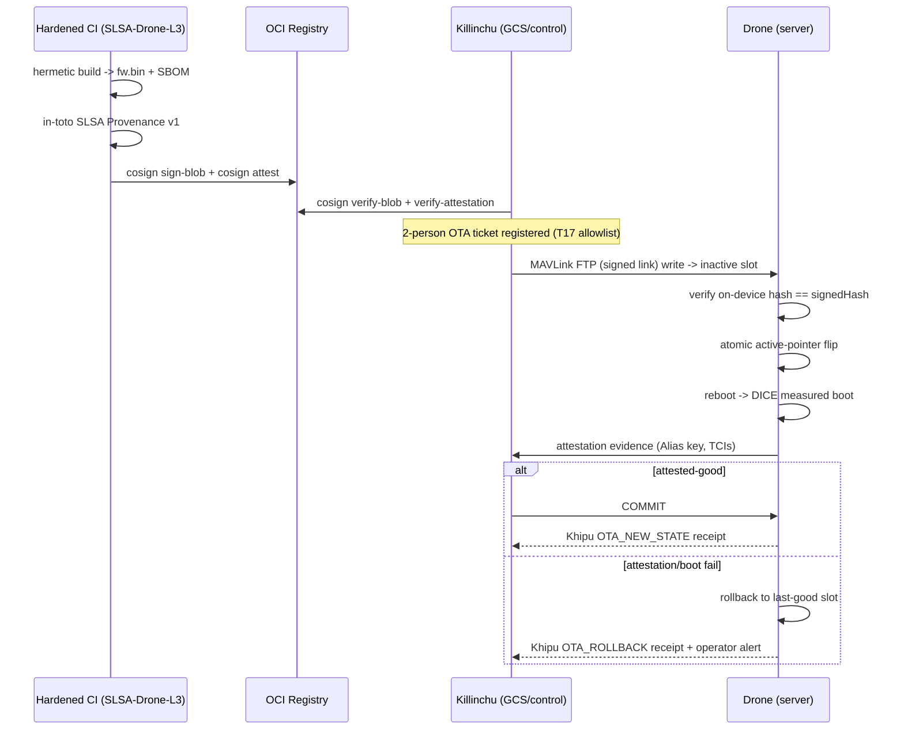

# SECURE_OTA — Over-the-Air Firmware Update Pipeline (SLSA-Drone-L3)

**Layer:** Killinchu · update authority
**Goal (founder):** "Jack in remotely and update."
**Upgrade:** This is the **L3 upgrade** of SZL's existing **SLSA L1** firmware path (Doctrine v11 honestly
records SLSA L1, corrected from a previously mis-claimed L3 — platform PR #235, per
`killinchu_research_notes.md` §7). SECURE_OTA defines the path to genuine SLSA Build L3.
**Sign-off:** Yachay-extension.

> Every stage emits an in-toto attestation; every device-side state change emits a Khipu receipt.
> No unsigned bits ever reach an actuator. A failed boot rolls back atomically.

---

## 0. Pipeline overview

```mermaid
flowchart LR
  SRC["Source\n(git commit, pinned deps)"] --> BUILD["SLSA-Drone-L3 build\n(hardened, isolated, hermetic)"]
  BUILD --> PROV["in-toto provenance\n(SLSA Provenance v1 predicate)"]
  PROV --> SIGN["cosign sign\n(image + attestation)"]
  SIGN --> REG["OCI registry\n(signed fw artifact + .att)"]
  REG --> TICKET["OTA ticket\n(2-person, registered w/ T17)"]
  TICKET --> PUSH["MAVLink FTP push\nFILE_TRANSFER_PROTOCOL"]
  PUSH --> AB["Atomic A/B partition swap\n(write inactive slot)"]
  AB --> BOOT["Boot attestation\n(DICE TCI vs golden, T11)"]
  BOOT -->|verified| COMMIT["Commit slot\n+ Khipu receipt of new state"]
  BOOT -->|failed| RB["Rollback\n(boot last-good slot)"]
  RB --> RBREC["Khipu rollback receipt"]
```



---

## 1. Build → SLSA-Drone-L3

SLSA **Build L3** requires builds to "run on a hardened build platform that offers strong tamper
protection" and to produce **non-falsifiable provenance**
([SLSA v1.1 levels](https://slsa.dev/spec/v1.1/levels)). **SLSA-Drone-L3** is our sub-doctrine
binding of Build L3 to firmware artifacts (full definition in `DRONE_IDENTITY_PROVENANCE.md`):

1. **Isolated, ephemeral builder** — each firmware build runs in a fresh, isolated runner the
   user-defined build cannot influence or persist into (L3 build-isolation requirement).
2. **Hermetic inputs** — all source and dependencies pinned by digest (git commit SHA + locked deps);
   no network fetch during build. Inputs recorded for the provenance `materials`.
3. **Provenance generated by the platform, not the build** — the control plane (not the user build
   step) emits the SLSA Provenance v1 predicate, so the build cannot forge its own provenance
   (non-falsifiable requirement).
4. **Reproducible target** — firmware build is reproducible (PX4/ArduPilot builds are
   deterministic given pinned toolchain), so an independent rebuild can confirm `signedHash`.

Artifacts: `px4_fmu-v6x.bin` (or ArduPilot `arducopter.apj`), its `sha-256`, the toolchain id, and a
CycloneDX 1.5 SBOM of the firmware tree (the `identity.sbomHash`).

---

## 2. in-toto attestation (SLSA Provenance v1 predicate)

The platform emits an in-toto attestation whose subject is the firmware artifact digest and whose
predicate is `https://slsa.dev/provenance/v1`
([in-toto attestation spec](https://github.com/in-toto/attestation/blob/main/spec/predicates/link.md)):

```json
{
  "_type": "https://in-toto.io/Statement/v1",
  "subject": [{ "name": "px4_fmu-v6x.bin",
                "digest": { "sha256": "7c44…" } }],
  "predicateType": "https://slsa.dev/provenance/v1",
  "predicate": {
    "buildDefinition": {
      "buildType": "https://szlholdings.dev/killinchu/slsa-drone-l3@v1",
      "externalParameters": { "git": "github.com/szl/px4-fork@a1b2c3d", "board": "fmu-v6x" },
      "resolvedDependencies": [ { "uri": "pkg:…", "digest": { "sha256": "…" } } ]
    },
    "runDetails": {
      "builder": { "id": "https://szlholdings.dev/ci/hardened-runner" },
      "metadata": { "invocationId": "…", "startedOn": "…", "finishedOn": "…" }
    }
  }
}
```

This is the same in-toto + provenance shape SZL already uses; the L1→L3 jump is in **how** the
provenance is produced (hardened, isolated, platform-generated), not the document format.

---

## 3. cosign signing (matches existing SLSA path; upgraded)

Sign both the firmware artifact and the attestation with
[cosign (sigstore)](https://github.com/sigstore/cosign):

```bash
# Keyed (KMS-backed) signing of the firmware blob
cosign sign-blob px4_fmu-v6x.bin --key awskms://… --bundle px4_fmu-v6x.sigstore.json

# Attach the SLSA provenance as an attestation to the OCI artifact
cosign attest --predicate provenance.json \
  --type slsaprovenance --key awskms://… \
  oci://ghcr.io/szlholdings/killinchu/fw/fmu-v6x@sha256:7c44…
```

Device/ground verification before any push
([cosign verify-blob / verify-attestation](https://docs.sigstore.dev/cosign/verifying/verify/)):

```bash
cosign verify-blob px4_fmu-v6x.bin --bundle px4_fmu-v6x.sigstore.json \
  --certificate-identity ota@szlholdings.dev --certificate-oidc-issuer https://… 
cosign verify-attestation --type slsaprovenance --key kms.pub oci://…@sha256:7c44…
```

A failed verification stops the pipeline and emits a Khipu receipt; an attempt to push without it is
caught device-side by **HUKLLA T17 (unexpected-OTA)** and **T11 (attestation)**.

> **Honest debt:** today SZL receipts carry `PLACEHOLDER` DSSE signatures (Sigstore CI not yet
> wired, Doctrine v11). SECURE_OTA is the doctrine that *retires* that placeholder for the firmware
> path: cosign keyless/KMS signing + transparency-log inclusion (Signed Entry Timestamp) replaces
> the placeholder. Until CI is wired, the pipeline runs in dry-run and the device refuses real OTA.

---

## 4. MAVLink FTP push

The signed artifact is pushed to the airframe over the **MAVLink File Transfer Protocol**
(`FILE_TRANSFER_PROTOCOL` messages; client/server, GCS = client, drone = server; OpenFile →
CreateFile → WriteFile bursts → TerminateSession, with `MAV_PROTOCOL_CAPABILITY_FTP` required)
([MAVLink FTP](https://mavlink.io/en/services/ftp.html)). The link MUST be running MAVLink 2 with
message signing enabled (T13 / [ArduPilot MAVLink2 signing](https://ardupilot.org/copter/docs/common-MAVLink2-signing.html)),
so the transfer itself is authenticated.

The push targets the **inactive** A/B slot's staging path, never the running image.

---

## 5. Atomic A/B partition swap

Two firmware slots (A and B). The OTA writes the **inactive** slot, verifies its on-device hash
against the signed `signedHash`, then flips the active-slot pointer atomically (a single
boot-config write). The running image is untouched until the next boot. This mirrors the way PX4
separates bootloader/firmware and uses a controlled bootloader-update step
(`SYS_BL_UPDATE` / [PX4 Bootloader Update](https://docs.px4.io/main/en/advanced_config/bootloader_update));
ArduPilot's secure bootloader enforces that only signed firmware in the slot will run
([ArduPilot Secure Firmware](https://ardupilot.org/dev/docs/secure-firmware.html), "only firmware
signed with one of the public-private key pairs will run"). Commercial parity: Auterion Skynode
transfers an `.auterionos` image, then "Skynode will automatically reboot, verify and perform the
update" — reboot-verify-commit is the standard pattern
([Auterion Skynode Software Update](https://docs.auterion.com/vehicle-operation/settings-and-maintenance/skynode-software-update)).
Microdrones (mdLRS/mdCockpit) follows the same operator-initiated signed-image flow.

Twin fields updated: `firmware.slot` flips, `firmware.rollbackVersion`/`rollbackHash` record the
now-inactive (previous) slot.

---

## 6. Boot attestation

On first boot of the new slot, the device runs **DICE measured boot** and produces an attestation;
Killinchu checks the reported TCI chain against the golden measurement for the new
`version` (this is HUKLLA **T11**). NIST SP 800-193 frames this as the **Root of Trust for
Detection** verifying firmware integrity during boot
([NIST SP 800-193](https://csrc.nist.gov/pubs/sp/800/193/final)).

- **verified** → commit: persist the active slot, update `firmware.signedHash`, set
  `bootAttestationStatus = "verified"`, re-anchor the firmware Merkle root for T12, update golden
  TCIs, and emit the new-state Khipu receipt.
- **failed** → §7 rollback.

---

## 7. Rollback protocol (failed boot)

A watchdog-bounded boot: if the new slot fails to reach a healthy attested state within N boot
attempts (boot-loop / failed attestation / failed self-test), the bootloader reverts the active
pointer to the **last-known-good slot** and boots it (NIST SP 800-193 **Root of Trust for
Recovery** — "restore code/data … recovery images verified through digital signatures").

```
attempt boot(new) -> watchdog timer
  if attested-good within window:   commit(new); receipt(NEW_STATE)
  else if attempts < N:             reboot(new)
  else:                             activePointer = lastGood; boot(lastGood)
                                    receipt(ROLLBACK); twin.firmware.bootAttestationStatus="failed"
```

The rollback target is exactly `firmware.rollbackVersion`/`rollbackHash` recorded at swap time, and
itself must pass attestation (we never roll back to an unsigned/unattested image). The rollback emits
a Khipu **rollback receipt** and raises an operator alert.

---

## 8. Khipu receipts emitted by the pipeline

| Stage | Receipt | predicateType |
|---|---|---|
| build | `OTA_BUILD` | `https://slsa.dev/provenance/v1` |
| sign | `OTA_SIGNED` | `https://szlholdings.dev/killinchu/ota/signed/v1` |
| ticket | `OTA_TICKET` (2-person ids) | `https://szlholdings.dev/killinchu/ota/ticket/v1` |
| push complete | `OTA_TRANSFERRED` | `…/ota/transferred/v1` |
| swap | `OTA_SLOT_SWAP` | `…/ota/swap/v1` |
| boot verified | `OTA_NEW_STATE` (new signedHash + TCIs) | `…/ota/new-state/v1` |
| boot failed | `OTA_ROLLBACK` | `…/ota/rollback/v1` |

The `OTA_NEW_STATE` cord becomes the twin's new firmware-state anchor and the golden reference for
T11/T12. A missing `OTA_NEW_STATE` after a swap trips T03 (receipt-gap) and T12 (Merkle anchor stale).

---

## 9. End-to-end sequence



---

## Honest status

- The build/sign/attest stages are standard, available tooling (SLSA, in-toto, cosign) — the work is
  wiring the **hardened isolated builder** that earns Build L3 (today: L1).
- A/B atomic swap + DICE boot attestation require board support (Pixhawk-6X-class + secure element,
  or Auterion Skynode). On boards without it, OTA runs to the signed-transfer + hash-verify stage and
  boot attestation is `placeholder` (surfaced, not hidden).
- This document defines the **upgrade path**; it does not claim L3 is already shipped.

## Primary sources

- SLSA v1.1 build levels (L3 hardened/non-falsifiable): <https://slsa.dev/spec/v1.1/levels>
- in-toto attestation framework / predicates: <https://github.com/in-toto/attestation/blob/main/spec/predicates/link.md>
- cosign (sigstore) signing: <https://github.com/sigstore/cosign> · verify: <https://docs.sigstore.dev/cosign/verifying/verify/>
- MAVLink FTP (`FILE_TRANSFER_PROTOCOL`): <https://mavlink.io/en/services/ftp.html>
- PX4 Bootloader Update / SYS_BL_UPDATE: <https://docs.px4.io/main/en/advanced_config/bootloader_update>
- ArduPilot Secure/Tamperproof Firmware: <https://ardupilot.org/dev/docs/secure-firmware.html>
- ArduPilot MAVLink2 signing: <https://ardupilot.org/copter/docs/common-MAVLink2-signing.html>
- Auterion Skynode software update (reboot-verify-commit): <https://docs.auterion.com/vehicle-operation/settings-and-maintenance/skynode-software-update>
- NIST SP 800-193 (RTU/RTD/RTRec): <https://csrc.nist.gov/pubs/sp/800/193/final>

*Signed: Yachay-extension · Doctrine v12 (PURIQ) · 2026-05-31*
