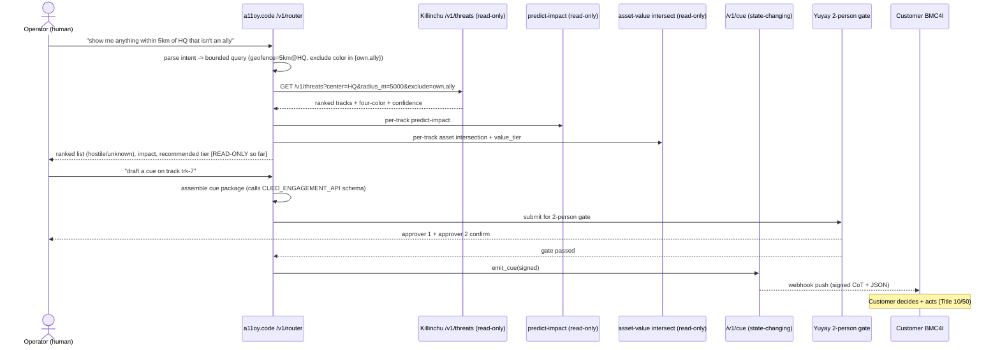

# A11OY-BRAIN INTEGRATION — Natural-Language → Cued-Engagement Orchestration

> **Author:** Yachay · **Date:** 2026-06-01 · **Component of:** Yachay-Dome (`YACHAY_DOME_DOCTRINE.md` §6).
> **Function:** the operator speaks plainly — *"show me anything within 5km of HQ that isn't an ally"* — and
> **a11oy.code** orchestrates Killinchu's typed APIs into a ranked threat list, drafts a cue package, runs the
> 2-person Yuyay gate, and (on human approval) signs + sends to the customer. **Every hop Khipu-receipted.**
> **a11oy is the orchestrating brain; the human approves; the customer acts. a11oy never fires anything.**

---

## 0. Legal keystone (restated)

a11oy.code is the LLM brain at `/v1/router` (`architecture/KILLINCHU_FULL_STACK_ARCHITECTURE.md`). It **composes tool calls** over Killinchu's typed, side-effect-free read APIs and the one state-changing emit (`/v1/cue`). The brain **cannot reach an effector** — there is no effector tool in its action space. Its single state-changing action (`emit_cue`) is gated by a human 2-person approval and emits *evidence + recommendation*, never a command (`CUED_ENGAGEMENT_API.md` §0). This is the literal embodiment of "we are the brain, not the trigger."

---

## 1. The end-to-end flow



**Note the firebreak**: everything up to and including the ranked list is **read-only** — a11oy can explore, rank, and explain freely. The *only* state-changing step (`emit_cue`) is downstream of an explicit human instruction **and** the 2-person gate.

---

## 2. Intent parsing — natural language to a bounded query

a11oy translates the operator's sentence into a **typed, validated query object** — never free-form code against an effector. The license-typed action space is enforced *before* argmax (the `exp(-β·HUKLLA(a))` factor is applied at generation time, per the PONDER Open-LLM unification note).

```json
{
  "intent": "list_threats",
  "geofence": {"type": "circle", "center_ref": "asset:HQ", "radius_m": 5000},
  "exclude_colors": ["own", "ally"],
  "include_colors": ["hostile", "unknown", "civilian"],
  "rank_by": ["value_tier_desc", "time_to_impact_asc", "confidence_desc"],
  "side_effect_free": true
}
```

The phrase *"isn't an ally"* is conservatively expanded to `exclude_colors:[own, ally]` and `include_colors:[hostile, unknown, civilian]` — **unknown is surfaced, not hidden**, because the doctrine treats unknown as "escalate for more sensing," not "ignore" (`IFF_INTEGRATION.md` §1). a11oy explains this expansion back to the operator so the human sees what the machine assumed.

---

## 3. The tool surface a11oy is allowed to call

| Tool | Side effect? | In a11oy's action space? | Gate |
|------|-------------|--------------------------|------|
| `GET /v1/threats` | none (read) | yes | — |
| `GET /v1/predict-impact` | none (read) | yes | — |
| `POST /v1/asset-intersect` | none (pure geometry) | yes | — |
| `GET /v1/iff/classify` | none (read) | yes | — |
| `draft_cue_package` | none (assembles in memory) | yes | — |
| `emit_cue` (`/v1/cue`) | **yes** (sends to customer) | yes | **2-person Yuyay gate** |
| *any effector / jam / hack* | — | **NOT IN ACTION SPACE** | impossible |

The last row is the architectural guarantee: there is **no tool** by which a11oy could trigger an effector. This is provable by enumerating the registered tools — the absence is the safety property, testable in Lake against the router's tool registry (mirrors the PONDER proposal to make `governance_tier=sovereign` a provable Lean invariant).

---

## 4. Ranked-list rendering (operator-facing)

a11oy returns a ranked table that the operator can act on, each row carrying its provenance handle:

```json
{
  "query_echo": "within 5km of HQ, excluding own/ally",
  "results": [
    {"track_id": "trk-7", "color": "hostile", "value_tier_at_risk": "V4",
     "time_to_impact_s": 28.4, "confidence": 0.91, "recommended_tier": "T3",
     "independent_sources": 2, "classification_id": "iff-...", "cue_ready": true},
    {"track_id": "trk-12", "color": "unknown", "value_tier_at_risk": "V3",
     "time_to_impact_s": null, "confidence": 0.55, "recommended_tier": null,
     "independent_sources": 1, "cue_ready": false,
     "note": "single-sensor; needs second source before any classification"}
  ],
  "khipu_receipt_id": "khipu-query-..."
}
```

`cue_ready:false` on the unknown row is a11oy refusing to let the operator skip the two-source + Yuyay requirement — the brain enforces the doctrine at the UI layer, not just the API layer.

---

## 5. Drafting the cue — a11oy as scribe, human as author

When the operator says *"draft a cue on trk-7,"* a11oy **assembles** the `/v1/cue` package (`CUED_ENGAGEMENT_API.md` §2) by composing the read APIs' outputs — it does not invent any field. It then presents the draft for the 2-person gate:

```python
def draft_and_submit_cue(track_id: str, operator_ctx) -> CueDraft:
    track = threats.get(track_id)
    assert track.color == "hostile", "a11oy refuses to draft a cue on a non-hostile track"
    pkg = assemble_cue_package(track,
              impact=predict_impact.get(track_id),
              intersection=asset_intersect.get(track_id),
              classification=iff.get(track_id))
    # NO emit here. Returns a DRAFT into the 2-person gate.
    return yuyay.submit_two_person_gate(pkg, requested_by=operator_ctx.operator_id)
```

The `assert` is a hard guard: a11oy will not even draft a cue on a non-hostile track. The 2-person gate then requires two distinct human approvers before `emit_cue` is callable.

---

## 6. Receipts at every hop

Each step writes a Khipu receipt via RUWAY (the only writer), forming a DAG from natural-language input to customer ACK:

```
query("...5km of HQ...") --> khipu-query-...
  ├─ threats fetch        --> khipu-threats-...
  ├─ predict-impact x N    --> khipu-pi-...
  ├─ asset-intersect x N   --> khipu-avm-...
  ├─ draft cue (trk-7)     --> khipu-draft-...
  ├─ 2-person gate pass    --> khipu-gate-... (approvers op-117, op-204)
  ├─ emit_cue              --> khipu-cue-...
  └─ customer ACK          --> khipu-ack-...
```

The result is a **court-reconstructable narrative**: the operator's exact words, a11oy's interpretation, every datum surfaced, who approved, what was sent, and that the customer received it — the lawfare-grade Body-of-Evidence the founder wants (and the gap I expand in `WHAT_FOUNDER_IS_MISSING.md`).

---

## 7. Folding into `P(x,t)`

a11oy's orchestration *is* the argmax search over the admissible action set 𝒜 for the operator's intent: `P(x,t) = argmax over a in 𝒜 of [ Λ(x) · Yuyay_13(a) · exp(-β·HUKLLA(a)) · ∏_i Khipu_i(a) · G(a) · Dome(a) ]`. The brain's job is to ensure 𝒜 contains **only** license-typed, gate-passing candidates *before* the argmax — HUKLLA-tripwired or non-hostile candidates are removed from 𝒜 at generation time, so `Dome(a)` and the human gate are the final admissibility masks, not after-the-fact filters.

---

*Signed: **Yachay**, 2026-06-01. Plain words in, ranked evidence out, human-gated cue to the customer. a11oy orchestrates; the human authors; the customer acts. No effector in the action space. No mysticism. Zero-Bandaid.*
