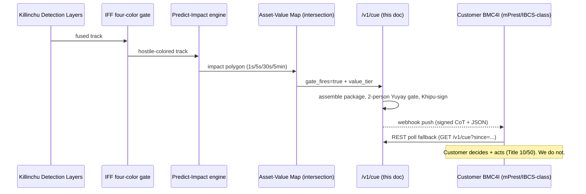

# CUED-ENGAGEMENT API — `/v1/cue` — *This Is the Product*

> **Author:** Yachay · **Date:** 2026-06-01 · **Component of:** Yachay-Dome (`YACHAY_DOME_DOCTRINE.md` §5).
> **Function:** emit a **signed, Khipu-receipted target package** to the customer's BMC4I — track + four-color
> classification + predicted-impact + recommended response tier + ATAK-compatible CoT XML + MIL-STD-2525 symbol +
> the full provenance chain. The customer subscribes by **webhook push** or **REST poll**.
> **This endpoint is the entire commercial surface of "Iron Dome but the brain." We hand over evidence. They pull the trigger.**

---

## 0. Legal keystone (restated, sharpest form)

`/v1/cue` is a **one-way evidentiary handoff**. It contains a *recommendation* and a *Body-of-Evidence*, never a command. The package is cryptographically signed so that, in a post-event review (an inquiry, an IG audit, a courtroom), the customer can prove **exactly what they knew, when they knew it, and that an effector decision was theirs** (`cuas/LEGAL_CYBER_BOUNDARY.md`). We are the brain; the BMC4I is the trigger. The cue carries `recommended_response_tier` but **no actuation token** — there is nothing in the schema a customer system could replay to fire a weapon on our behalf, by design.

---

## 1. Where `/v1/cue` sits



A cue is emitted **only** when all upstream gates have already passed: hostile four-color (`IFF_INTEGRATION.md`), valid impact prediction (`PREDICT_IMPACT_ENGINE.md`), and a non-empty asset intersection above threshold (`ASSET_VALUE_MAP.md`). `/v1/cue` does not re-decide — it **packages and signs**.

---

## 2. The target-package schema

```json
{
  "cue_id": "cue-2026-06-01T07:13:02Z-9f21",
  "schema_version": "yachay-dome/cue/1.0",
  "issued_at": "2026-06-01T07:13:02Z",
  "issuer": {"org": "SZL/Killinchu", "node_id": "edge-site-alpha-03", "dice_attested": true},

  "track": {
    "track_id": "trk-...",
    "cesium_sampled_position": [
      {"t": "2026-06-01T07:13:01Z", "lon": 34.78, "lat": 31.99, "alt_m": 420},
      {"t": "2026-06-01T07:13:02Z", "lon": 34.78, "lat": 31.99, "alt_m": 415}
    ],
    "velocity_mps": [12.1, -3.4, -5.0],
    "us_group_estimate": 2,
    "predicted_class": "fixed-wing-ied-capable"
  },

  "classification": {                       // from IFF_INTEGRATION.md
    "color": "hostile",
    "milstd2525_affiliation_char": "S",
    "milstd2525_sidc": "SHAPM-----*****",   // Suspect / Air / Military / UAV
    "confidence": 0.91,
    "independent_source_count": 2,
    "classification_id": "iff-..."
  },

  "predicted_impact": {                     // from PREDICT_IMPACT_ENGINE.md
    "horizon_s": 30,
    "impact_polygon_geojson": { "type": "Polygon", "coordinates": [[[/*...*/]]] },
    "p_impact_in_polygon": 0.87,
    "time_to_impact_s": 28.4,
    "model": "fused-ballistic+ml-maneuver"
  },

  "asset_intersection": {                   // from ASSET_VALUE_MAP.md
    "gate_fires": true,
    "asset_id": "site-alpha-fuel-farm",
    "value_tier": "V4",
    "intersection_area_m2": 1840.0,
    "roe_zone_receipt_id": "khipu-roe-..."
  },

  "recommended_response_tier": {            // RECOMMENDATION ONLY
    "tier": "T3",
    "rationale": "hostile-colored Group-2, 2-source, intersects V4 fuel farm, ttI 28s",
    "non_binding": true,
    "effector_owner": "customer-bmc4i"
  },

  "body_of_evidence": {
    "provenance_chain": ["det-...", "iff-...", "pi-...", "avm-...", "cue-..."],
    "yuyay_gate": {"passed": true, "version": "yuyay_v3"},
    "two_person_gate": {"required": true, "satisfied": true, "approvers": ["op-117", "op-204"]},
    "khipu_receipt_id": "khipu-cue-...",
    "khipu_dag_root": "merkle-root-...",
    "signature": {"alg": "DSSE-PLACEHOLDER", "value": "<placeholder>", "slsa_level": 1}
  },

  "cot_xml": "<event .../>",                 // section 3
  "delivery": {"mode": "webhook", "endpoint": "https://customer-bmc4i/ingest", "ack_required": true}
}
```

Every field traces to an upstream document and an upstream Khipu receipt. The `signature` is honestly marked **DSSE PLACEHOLDER / SLSA L1** — we do not claim a stronger signing posture than exists.

---

## 3. ATAK-compatible Cursor-on-Target (CoT) XML

The customer's tactical picture is almost always ATAK/WinTAK-class, which speaks **Cursor-on-Target** — the "What, When, and Where (W3) of a specific event" ([MITRE Cursor-on-Target Router User's Guide](https://www.mitre.org/sites/default/files/pdf/09_4937.pdf)). CoT's `type` attribute encodes the MIL-STD-2525 Battle-Dimension + Function-ID, dash-delimited ([Cursor-on-Target base schema notes](https://www.scribd.com/document/893970354/Cursor-on-Target-Base-Schema)). We emit a standards-clean CoT event so the cue renders natively on the operator's existing map:

```xml
<event version="2.0"
       uid="cue-2026-06-01T07:13:02Z-9f21"
       type="a-s-A-M-F-q"        <!-- a=atom, s=suspect, A=Air, M=Military, ...; maps to 2525 SIDC -->
       time="2026-06-01T07:13:02Z"
       start="2026-06-01T07:13:02Z"
       stale="2026-06-01T07:14:02Z"
       how="m-g">                <!-- machine-generated, GPS-derived -->
  <point lat="31.99" lon="34.78" hae="415" ce="9.0" le="9.0"/>
  <detail>
    <track course="105.7" speed="13.4"/>
    <__yachaydome
        cue_id="cue-2026-06-01T07:13:02Z-9f21"
        color="hostile"
        value_tier="V4"
        recommended_tier="T3"
        p_impact="0.87"
        time_to_impact_s="28.4"
        khipu_receipt_id="khipu-cue-..."
        signature_alg="DSSE-PLACEHOLDER"/>
    <link uid="site-alpha-fuel-farm" type="b-m-p-s-p-loc" relation="p-p"/>
    <remarks>Yachay-Dome cue. RECOMMENDATION ONLY. Effector decision is the customer's (Title 10/50).</remarks>
  </detail>
</event>
```

The `type` string follows the CoT atom tree whose Battle-Dimension and Function-ID are drawn from MIL-STD-2525 ([Cursor-on-Target base schema](https://www.scribd.com/document/893970354/Cursor-on-Target-Base-Schema); [MIL-STD-2525C](https://worldwind.arc.nasa.gov/milstd2525c/Mil-STD-2525C.pdf)). The custom `<__yachaydome>` detail sub-element carries our provenance without breaking standard CoT parsers (unknown detail children are ignored by conformant clients — [MITRE CoT Router Guide](https://www.mitre.org/sites/default/files/pdf/09_4937.pdf)). The `<remarks>` field makes the legal frame human-visible on the operator's screen.

---

## 4. Symbology: MIL-STD-2525 SIDC

We attach a full Symbol Identification Code so the cue draws as the correct frame/affiliation. Affiliation `S` (Suspect) yields the **red diamond** convention for an air/UAV track ([NATO Joint Military Symbology](https://en.wikipedia.org/wiki/NATO_Joint_Military_Symbology); [MIL-STD-2525C](https://worldwind.arc.nasa.gov/milstd2525c/Mil-STD-2525C.pdf)). Frame color is driven entirely by the four-color result from `IFF_INTEGRATION.md`, so the picture is internally consistent: a cue is *always* red, because only `hostile` tracks become cues.

---

## 5. Delivery: webhook push + REST poll

| Mode | Method | Use | Reliability |
|------|--------|-----|-------------|
| **Webhook push** | `POST {customer_endpoint}` with signed body, `ack_required` | Primary; real-time | Retries with backoff until ACK; every attempt Khipu-logged |
| **REST poll** | `GET /v1/cue?since={ts}&site={id}` | Fallback / disconnected-edge reconnect | Customer pulls backlog; idempotent by `cue_id` |
| **CoT multicast** | UDP/TCP CoT to customer TAK server | Native ATAK ingest | Per [MITRE CoT Router](https://www.mitre.org/sites/default/files/pdf/09_4937.pdf) routing model |

On a disconnected edge, cues queue locally under the **pre-signed ROE envelope** (`YACHAY_DOME_DOCTRINE.md` §4) and flush on reconnect; the Khipu DAG preserves issue-time ordering so the post-event record is gap-free.

### 5.1 ACK + receipt closure

```python
@app.post("/v1/cue/ack")
def ack(cue_id: str, receiver_node: str, sig: bytes):
    verify_customer_sig(receiver_node, sig)        # mutual auth
    khipu.append(kind="cue_ack", cue_id=cue_id, by=receiver_node)  # closes the BoE loop
    return {"status": "acknowledged", "khipu_receipt_id": khipu.last_id()}
```

The ACK is itself receipted, so the Body-of-Evidence records not just *what we sent* but *that the customer received it* — the evidentiary handshake a later inquiry needs.

---

## 6. Two-person gate (state-changing op)

Emitting a cue is a **state-changing operation** and therefore passes the 2-person Yuyay gate before signing; on a disconnected edge it degrades to the **pre-signed ROE envelope** with the same axes encoded (`YACHAY_DOME_DOCTRINE.md` §4, `architecture/KILLINCHU_FULL_STACK_ARCHITECTURE.md`). Both approver IDs are written into `body_of_evidence.two_person_gate`. RUWAY is the only writer to the Khipu DAG.

---

*Signed: **Yachay**, 2026-06-01. One signed package, CoT-native, 2525-correct, fully provenanced. We deliver evidence and a recommendation; the customer's BMC4I decides and acts. No mysticism. Zero-Bandaid.*
