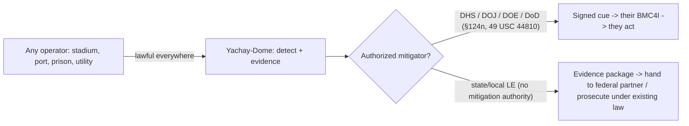

# DOMESTIC ADJACENCY — Critical-Infra Protection & the Authority Map

> **Author:** Yachay · **Date:** 2026-06-01 · **Component of:** Yachay-Dome (deployment-context doc).
> **Function:** map the **domestic** market (power plants, prisons, stadiums, ports, borders, airports) and the
> **legal authorities** that govern who may *mitigate* a drone there — DHS, USCG, FBI/DOJ, DOE/NRC, BOP, USMS,
> state/local. **The authority gaps are exactly why a detection + Body-of-Evidence layer is the durable play:**
> we can sense and evidence everywhere; mitigation authority is narrow, contested, and periodically lapses.

---

## 0. Legal keystone (restated, domestic form)

Domestically the mitigation problem is *harder* than overseas: counter-UAS actions "may be restricted or prohibited by existing federal laws such as the Aircraft Sabotage Act or the Computer Fraud and Abuse Act" ([GAO Counter-Drone Technologies](https://news.usni.org/2022/03/24/gao-report-on-counter-drone-technologies)). Only **four federal agencies — DoD, DOE, DOJ, DHS — are authorized to deploy counter-UAS technologies, and only under certain circumstances** (protecting sensitive facilities, prisons, or providing security at sports championships) ([GAO Counter-Drone Technologies](https://news.usni.org/2022/03/24/gao-report-on-counter-drone-technologies)). **Detection and evidence carry no such restriction.** Yachay-Dome sells the sense-and-evidence layer to *any* operator, and the signed cue package to the *authorized* mitigator. This is the entire reason the legal frame is a feature, not a limitation.

---

## 1. The authority map

| Domain / facility | Primary protective authority | Statutory / policy basis | What Yachay-Dome provides |
|-------------------|------------------------------|--------------------------|---------------------------|
| **Sensitive federal facilities, mass gatherings (NSSE/SEAR)** | DHS + DOJ | [6 USC §124n](https://www.law.cornell.edu/uscode/text/6/124n) — preemption-authority for DHS/DOJ C-UAS | Detection + signed cue to the authorized agency |
| **Airports / National Airspace** | FAA | [49 USC §44810](https://uscode.house.gov/view.xhtml?req=granuleid%3AUSC-prelim-title49-section44810) — FAA C-UAS authority | Track + Remote-ID/ADS-B fusion + evidence |
| **Federal prisons (contraband drops)** | Federal Bureau of Prisons (DOJ) | DOJ C-UAS authority under §124n; GAO names prisons explicitly ([GAO](https://news.usni.org/2022/03/24/gao-report-on-counter-drone-technologies)) | Detection of low-altitude approach + payload-drop pattern evidence |
| **U.S. Marshals / federal facilities** | USMS (DOJ) | DOJ C-UAS authority | Cue package to USMS BMC |
| **Nuclear power plants / DOE sites** | DOE (sites) + NRC (commercial reactors) | DOE is one of the four authorized agencies ([GAO](https://news.usni.org/2022/03/24/gao-report-on-counter-drone-technologies)); NRC regulates commercial reactor security | Detection + evidence; NRC-regulated sites coordinate with DOE/DHS for mitigation |
| **Ports & maritime approaches** | USCG (DHS) | USCG within DHS C-UAS authority; maritime domain | Detection + maritime-adjacency mode (see `WHAT_FOUNDER_IS_MISSING.md` §maritime) |
| **Southern border** | DHS (CBP) + DoD support | DHS authority + JIATF-401 homeland LOE ([HSToday](https://www.hstoday.us/subject-matter-areas/unmanned-vehicles/dozens-of-federal-agencies-initiate-counter-uas-collaboration/)) | Persistent detection + cue to CBP/DoD |
| **Stadiums / large venues (private)** | State/local LE + DHS for designated events | No standalone state/local *mitigation* authority; detection is lawful | Detection + evidence handed to the authorized federal partner |

---

## 2. The authority gap — and why it favors a sense-and-evidence company

The federal C-UAS authorities under §124n are **time-limited and have lapsed**: the counter-UAS authority **expired in October 2025 amid the government shutdown** ([DRONELIFE — C-UAS authority expires](https://dronelife.com/2025/10/02/counter-uas-authority-expires-amid-government-shutdown/)). When *mitigation* authority lapses, **detection and evidence remain fully lawful** — there is no statute restricting passive sensing. A company whose product is the *trigger* is exposed to every reauthorization cliff; a company whose product is the *brain* is not.

GAO further documents that state/local/tribal law enforcement — who guard most stadiums, ports, and infrastructure — largely **lack both authority and Remote-ID access** to act ([GAO Remote-ID in the NAS](https://cuashub.com/en/content/gao-actions-needed-to-support-remote-identification-in-the-nas/)). They can lawfully *detect and document*; they cannot lawfully *mitigate*. Yachay-Dome serves exactly that majority population: **give them court-grade evidence and a cue they can hand to an authorized federal partner.**

---

## 3. The 2025–2026 policy tailwind

Three current developments expand the addressable detection market without expanding *our* legal exposure:

- **Executive direction:** the 2025 White House action on **Restoring American Airspace Sovereignty** signals federal intent to broaden domestic drone defense ([White House — Restoring American Airspace Sovereignty](https://www.whitehouse.gov/presidential-actions/2025/06/restoring-american-airspace-sovereignty/)).
- **JIATF-401:** a 2025 whole-of-government task force prioritizing the National Capital Region, the southern border, and the **2026 FIFA World Cup as a National Special Security Event** ([HSToday — JIATF-401](https://www.hstoday.us/subject-matter-areas/unmanned-vehicles/dozens-of-federal-agencies-initiate-counter-uas-collaboration/)). The task force's stated need — "how sensors from various agencies track threats, how that information passes to decision-makers, and how those with the ability to take threats out of the sky can be given authority" ([HSToday](https://www.hstoday.us/subject-matter-areas/unmanned-vehicles/dozens-of-federal-agencies-initiate-counter-uas-collaboration/)) — **is verbatim the sense → evidence → authorized-mitigator pipeline Yachay-Dome implements.**
- **Interagency coordination questions** raised by CRS — the extent to which DoD coordinates C-UAS with DHS, DOJ, and DOE ([CRS via USNI](https://news.usni.org/2025/04/01/report-to-congress-on-dod-counter-unmanned-aircraft-systems)) — point to a need for a **common, signed, interoperable evidence format** across agency boundaries. That is the `/v1/cue` CoT package (`CUED_ENGAGEMENT_API.md`).

---

## 4. Deployment patterns by facility class

| Facility class | Threat emphasis | Value tiers in play | Sensor mix (from `cuas/DETECTION_LAYERS.md`) |
|----------------|----------------|---------------------|----------------------------------------------|
| Nuclear / DOE | reconnaissance + payload over reactor/spent-fuel | V4–V5 | RF + EO/IR + optional radar; long dwell |
| Prison (BOP) | low-slow contraband drops over yard | V3–V4 | acoustic + EO/IR (low altitude); Remote-ID lookup |
| Port / maritime | drone-boat + aerial over fuel/LNG/cargo | V4–V5 | RF AoA + radar; maritime-adjacency mode |
| Stadium / NSSE | crowd-overflight, swarm | V4 (life-safety) | dense RF + acoustic mesh; Remote-ID heavy |
| Border | persistent cross-border ISR/smuggling | V2–V3 | wide-area RF + EO/IR; long baselines |
| Utility / grid | substation recon + payload | V4–V5 | RF + EO/IR; intersection with critical-node polygons |

Every pattern uses the **same passive-detection keystone** (no transmit, no FCC §333/§302a exposure — `cuas/DETECTION_LAYERS.md`) and the **same asset-value intersection gate** (`ASSET_VALUE_MAP.md`); only the value-tier weighting and sensor density change.

---

## 5. The clean commercial line

- **What we sell to everyone (no authority required):** detection, four-color classification, predict-impact, Body-of-Evidence, signed cue packages.
- **Who consumes the cue and acts:** only the §124n / 49 USC §44810 authorized mitigator (DHS, DOJ, DOE, DoD) ([6 USC §124n](https://www.law.cornell.edu/uscode/text/6/124n); [49 USC §44810](https://uscode.house.gov/view.xhtml?req=granuleid%3AUSC-prelim-title49-section44810); [GAO](https://news.usni.org/2022/03/24/gao-report-on-counter-drone-technologies)).
- **Why this is durable:** mitigation authority lapses and is contested ([DRONELIFE](https://dronelife.com/2025/10/02/counter-uas-authority-expires-amid-government-shutdown/)); detection never does. The brain outlasts every authority cliff.

---

*Signed: **Yachay**, 2026-06-01. We sense everywhere it is lawful, we evidence to court grade, we cue the authorized mitigator. Authority gaps are our moat, not our risk. No mysticism. Zero-Bandaid.*
