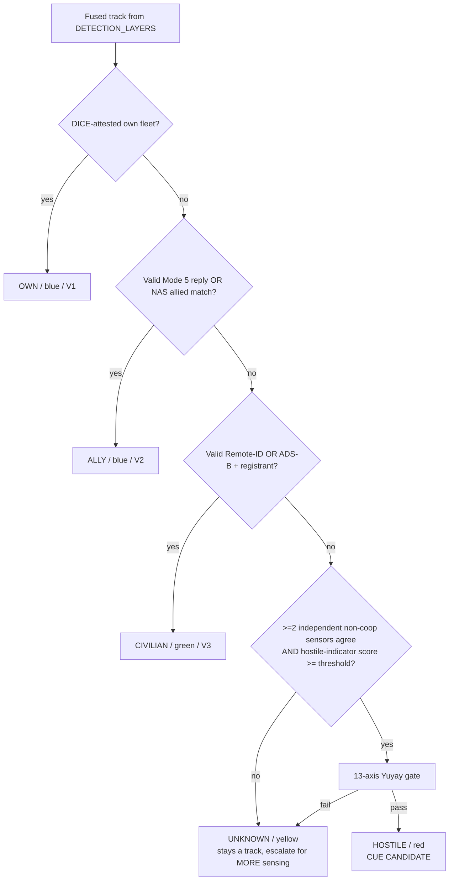

# IFF / IDENTITY INTEGRATION — The Four-Color Classification Gate

> **Author:** Yachay · **Date:** 2026-06-01 · **Component of:** Yachay-Dome (`YACHAY_DOME_DOCTRINE.md` §3, `IADS_DOCTRINE_STUDY.md` §2.4).
> **Function:** fuse every cooperative + non-cooperative identity signal into one **four-color affiliation**
> (`own` / `ally` / `civilian` / `hostile`) with **confidence + provenance**. A `hostile` verdict — the only one
> that can seed a cue — **requires ≥2 independent sensor sources AND a passing 13-axis Yuyay gate.**
> **We classify and evidence identity. We never interrogate with intent to engage — that is the customer's effector.**

---

## 0. Legal keystone (restated)

Yachay-Dome is the **detection + analysis + auditable Body-of-Evidence layer** (`cuas/LEGAL_CYBER_BOUNDARY.md`). The IFF layer **reads** cooperative identity declarations and **fuses** them with passive non-cooperative detections (`cuas/DETECTION_LAYERS.md` — RF AoA, ADS-B/Remote-ID, acoustic, EO/IR). It produces a *classification with provenance*. It does **not** transmit a "lethal interrogation" — that Mode 5 format is reserved for "a weapons-capable platform prior to weapons release" ([DOT&E Mark XIIA Mode 5 IFF report](https://www.dote.osd.mil/Portals/97/pub/reports/FY2013/navy/2013mkxiiaiffmode5.pdf)), which is a **customer effector function**, not ours. When the customer's BMC4I owns a Mode 5 interrogator, we **subscribe to its replies** as one more identity input; we do not emit them.

---

## 1. The four colors and how they map to value tiers

Yachay-Dome collapses NATO's full affiliation set (Pending, Unknown, Assumed-friend, Friend, Neutral, Suspect, Hostile, plus exercise variants — [NATO Joint Military Symbology](https://en.wikipedia.org/wiki/NATO_Joint_Military_Symbology)) into **four operationally decisive colors**, because the only question our gate must answer is *"may this become a cue candidate?"*

| Yachay color | NATO affiliation(s) | MIL-STD-2525 frame color | Maps to value tier | Cue-eligible? |
|--------------|---------------------|--------------------------|--------------------|---------------|
| **OWN** (blue) | Friend (own fleet, DICE-attested) | Blue rectangle | V1 (own asset) | **Never** |
| **ALLY** (blue/cyan) | Assumed-friend / Friend (allied, Mode 5 or NAS lookup) | Blue | V2 (protect, deconflict) | **Never** |
| **CIVILIAN** (green) | Neutral (Remote-ID compliant, ADS-B squawking) | Green square | V3 (civilian, protected) | **Never** |
| **HOSTILE** (red) | Suspect / Hostile | Red diamond | — (cue candidate) | **Only if gate passes** |
| *(latent)* UNKNOWN (yellow) | Pending / Unknown | Yellow quatrefoil | — | No — stays a *track*, not a cue |

The 2525 frame-color convention (blue=friend, green=neutral, red=hostile, yellow=unknown) is the published affiliation scheme ([MIL-STD-2525C, NASA-hosted](https://worldwind.arc.nasa.gov/milstd2525c/Mil-STD-2525C.pdf); [NATO Joint Military Symbology](https://en.wikipedia.org/wiki/NATO_Joint_Military_Symbology)). **UNKNOWN is deliberately not cue-eligible** — an unidentified track is escalated for *more sensing*, never for an effector. This mirrors the IADS doctrine of positive identification before engagement.

---

## 2. Identity sources — cooperative + non-cooperative

### 2.1 Cooperative (the platform declares itself)

| Source | What it is | Authority / standard | Our handling |
|--------|-----------|----------------------|--------------|
| **DICE own-fleet attestation** | Our companion/own drones present a DICE-attested hardware identity (TCG Device Identifier Composition Engine) | TCG DICE | Cryptographic → **OWN**. Highest trust; signed into the track. |
| **Mode 5 IFF reply** | Customer's interrogator gets an NSA-encrypted Mode 5 reply | Mark XIIA Mode 5 ([DOT&E](https://www.dote.osd.mil/Portals/97/pub/reports/FY2013/navy/2013mkxiiaiffmode5.pdf)) | We **subscribe** to the customer's reply event. Valid reply → **OWN/ALLY**. We never transmit the interrogation. |
| **ADS-B** | Civil aircraft broadcast position/ID | ICAO / FAA | Squawking valid ICAO 24-bit + flight plan → **CIVILIAN/ALLY**. |
| **Remote-ID** | Drone "digital license plate" broadcast | ASTM F3411 ([ASTM F3411](https://www.astm.org/f3411-19.html); [FAA Remote ID Final Rule](https://www.faa.gov/sites/faa.gov/files/2021-08/RemoteID_Final_Rule.pdf)) | Valid serial/session ID + registrant lookup → **CIVILIAN**. Absence of Remote-ID is a *negative indicator*, not proof of hostility. |
| **NAS allied lookup** | Customer data-link cross-reference of allied tracks | Link-16 / customer BMC4I | Confirmed allied track → **ALLY**. |

### 2.2 Non-cooperative (we observe; the platform does not declare)

These are the passive layers already specified in `cuas/DETECTION_LAYERS.md` — RF emitter fingerprint (SDR AoA), acoustic motor signature, EO/IR classification, optional radar. They produce a **platform-type estimate** (`us_group_estimate`, `predicted_class`) but **no identity** by themselves. Their role here: **corroboration** and the two-source requirement.

> **Combat-ID doctrine we are copying:** Mode 5 is explicitly described as one component to be "combined with other cooperative and non-cooperative combat identification techniques in order to provide identification of all platforms — enemy, neutral, and friendly" ([DOT&E Mark XIIA Mode 5 IFF](https://www.dote.osd.mil/Portals/97/pub/reports/FY2013/navy/2013mkxiiaiffmode5.pdf)). Yachay-Dome implements exactly that fusion — minus the transmit.

---

## 3. The classification fusion logic



**Ordering is deliberate and conservative**: every cooperative friendly/neutral declaration is checked *before* hostility is even considered. A platform must fail *all* friendly/neutral declarations **and** clear two-source corroboration **and** pass Yuyay before it can be colored red.

### 3.1 The two-source rule (HARD)

```python
def can_classify_hostile(track) -> bool:
    # No cooperative friendly/neutral declaration present
    if track.dice_own or track.mode5_valid or track.nas_ally or \
       track.remote_id_valid or track.adsb_valid:
        return False
    # Require >=2 INDEPENDENT sensor modalities concurring on a hostile-consistent track
    independent = {
        s.modality for s in track.sensor_hits
        if s.modality in {"rf", "acoustic", "eo_ir", "radar"} and s.quality_ok
    }
    if len(independent) < 2:
        return False                      # single-sensor -> UNKNOWN, never hostile
    # Yuyay 13-axis gate (2 sacred >=0.95, 7 structural >=0.90, 4 introspection)
    return yuyay_v3.evaluate(track).passes
```

A **single** sensor — no matter how confident — can never produce a `hostile` color. This is the anti-fratricide invariant, and it is the IADS lesson: positive ID requires fusion, not a lone return.

### 3.2 Confidence + provenance object

```json
{
  "classification_id": "iff-2026-06-01T07:12:44Z-a3f9",
  "detection_id": "det-...",                  // links to DETECTION_LAYERS feature
  "color": "hostile",                          // own | ally | civilian | hostile | unknown
  "nato_affiliation": "suspect",
  "milstd2525_affiliation_char": "S",
  "value_tier_implied": null,                  // null for hostile; V1/V2/V3 otherwise
  "confidence": 0.91,
  "cooperative_signals": {
    "dice_own": false, "mode5_valid": false, "nas_ally": false,
    "remote_id": {"present": false}, "adsb": {"present": false}
  },
  "noncooperative_sources": [
    {"modality": "rf", "emitter_fingerprint": "geran-2-cls", "confidence": 0.88, "khipu_receipt_id": "..."},
    {"modality": "acoustic", "motor_signature": "2-stroke-pusher", "confidence": 0.79, "khipu_receipt_id": "..."}
  ],
  "independent_source_count": 2,
  "yuyay_gate": {"passed": true, "sacred_min": 0.96, "structural_min": 0.91, "version": "yuyay_v3"},
  "provenance_chain": ["det-...", "iff-...", "khipu-..."],
  "khipu_receipt_id": "khipu-...",
  "authored_by": "killinchu.iff",
  "ts": "2026-06-01T07:12:44Z"
}
```

`value_tier_implied` is `null` for `hostile` on purpose: hostility does **not** assign value — the cue-eligibility decision still flows through the asset-value intersection gate (`ASSET_VALUE_MAP.md`). A hostile drone over open ground produces **no cue**, exactly as Iron Dome lets a rocket fall on an empty field ([CSIS Iron Dome](https://missilethreat.csis.org/defsys/iron-dome/)).

---

## 4. Why Remote-ID absence ≠ hostility

The FAA Remote-ID rule is a **safety/identification** mandate — a "digital license plate" so law enforcement can identify operators ([GAO Remote-ID in the NAS](https://cuashub.com/en/content/gao-actions-needed-to-support-remote-identification-in-the-nas/); [FAA Remote ID Final Rule](https://www.faa.gov/sites/faa.gov/files/2021-08/RemoteID_Final_Rule.pdf)). Many lawful drones predate the rule or operate under exceptions; absence of a broadcast is therefore a **weak negative indicator**, never proof of hostility. Yachay-Dome treats a missing Remote-ID as one input to the hostile-indicator score, gated behind the two-source + Yuyay requirement — never as a standalone trigger. GAO itself notes law-enforcement access to Remote-ID data is still immature and unevenly resourced ([GAO Remote-ID report](https://cuashub.com/en/content/gao-actions-needed-to-support-remote-identification-in-the-nas/)), reinforcing that we evidence rather than adjudicate.

---

## 5. Folding into the master formula

The four-color result enters `P(x,t)` through the **value anchor** Λ(x) (own/ally/civilian raise protective value; hostile is the *thing acted upon*) and through `Dome(a) ∈ [0,1]` as a hard mask: `Dome(a)=0` for any candidate action `a` directed at an OWN/ALLY/CIVILIAN/UNKNOWN track. Only a `hostile`-colored, asset-intersecting, gate-passing candidate can carry `Dome(a)>0`. The four-color gate is thus a **provable upstream constraint** on the admissible action set 𝒜, not a post-hoc filter.

---

*Signed: **Yachay**, 2026-06-01. Four colors, two independent sources, one Yuyay gate. We classify identity with provenance; the customer's interrogator and effector act. No mysticism. Zero-Bandaid.*
