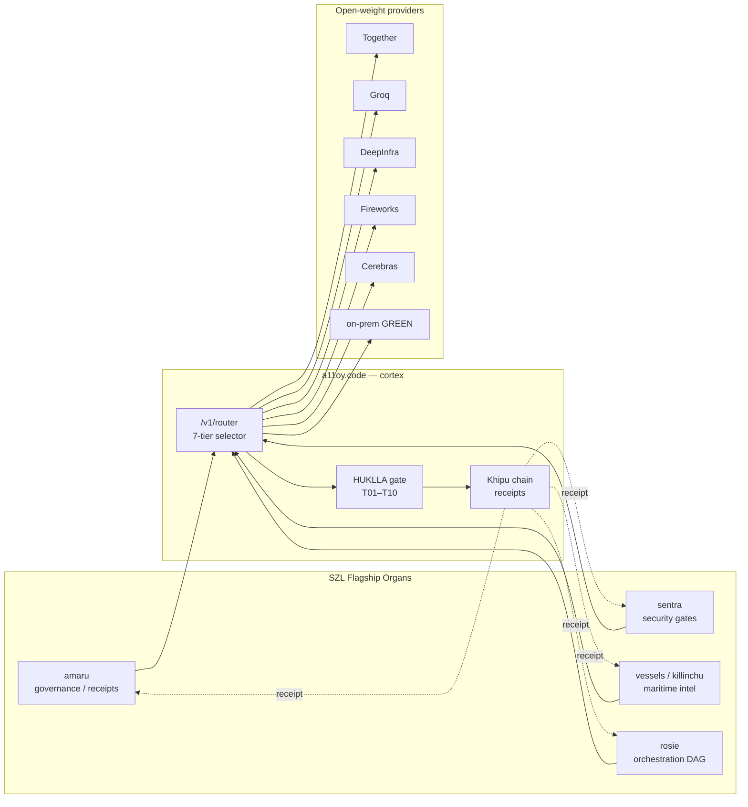
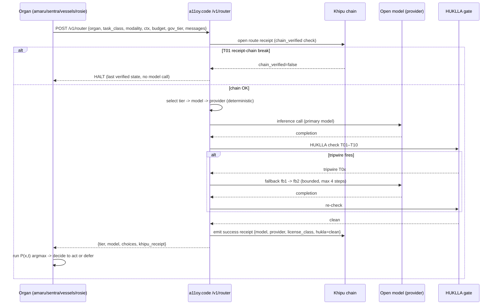
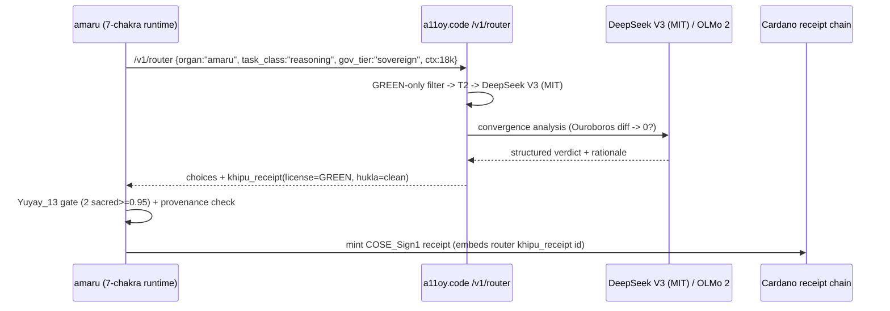
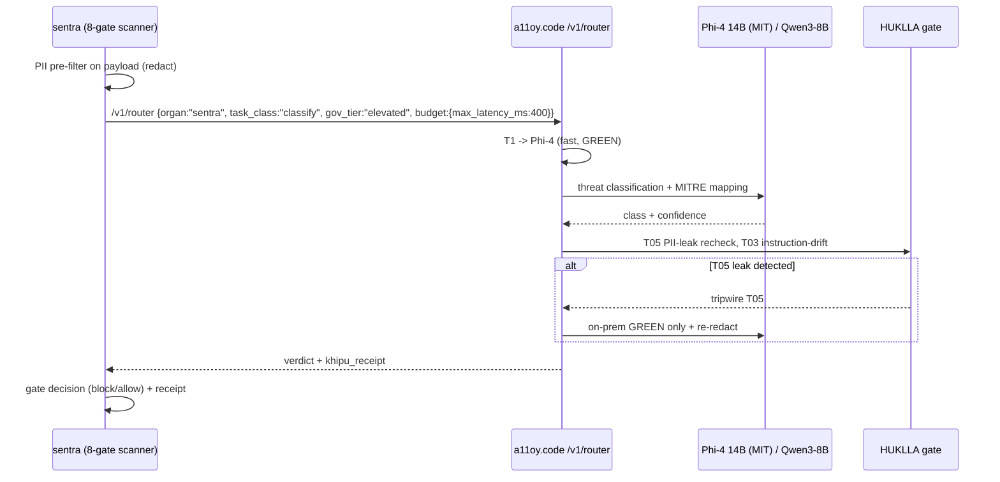
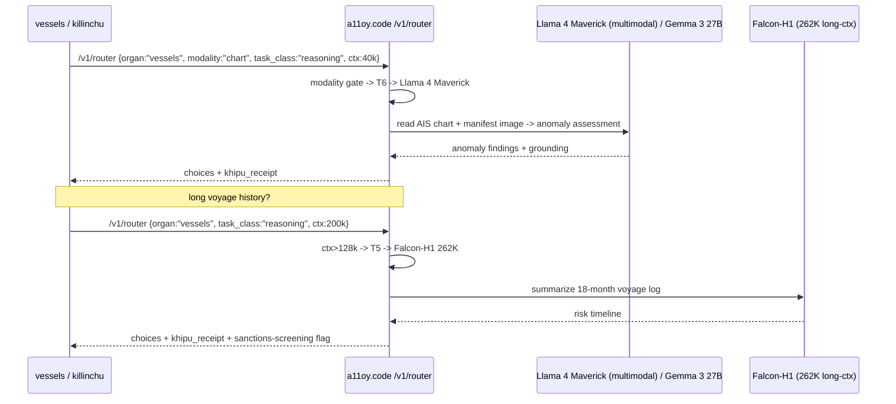
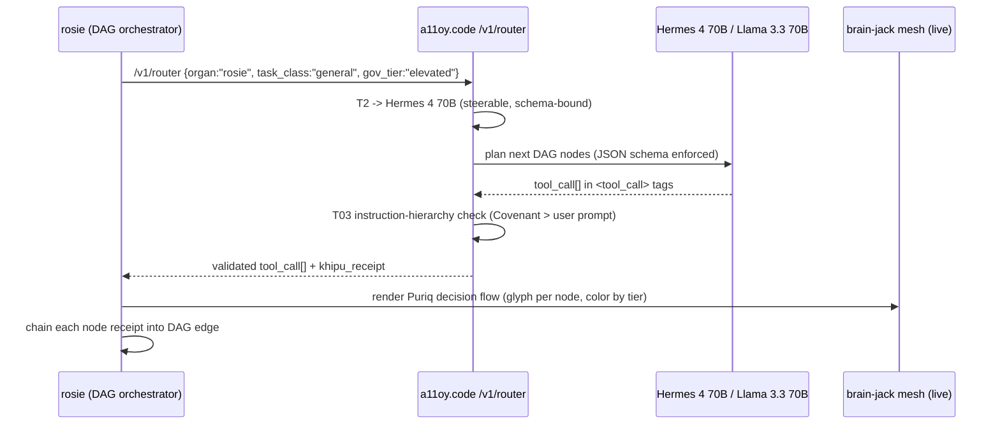

# A11OY_CODE_BRAIN_INTEGRATION

**Layer:** PURIQ → `llms/`
**Author:** Yachay-extension
**Date:** 2026-06-01
**Purpose:** Specify how each SZL flagship calls `a11oy.code` as its reasoning brain through the single `POST /v1/router` endpoint. a11oy.code is the *cortex*; each flagship is an *organ* that delegates its reasoning to the cortex and applies its own organ-specific Yuyay gating + Khipu receipting on the result.

---

## 1. Topology

a11oy.code exposes exactly one cognition entrypoint: `POST /v1/router` (contract in `A11OY_CODE_ROUTER_SPEC.md §6`). Every flagship sends an OpenAI-compatible payload tagged with its `organ`, `task_class`, `modality`, `context_tokens`, `budget`, and `governance_tier`. The router selects tier → model → provider, runs the bounded fallback walk under HUKLLA, and returns the completion **plus a Khipu receipt**. The organ then runs the PURIQ master formula locally to decide whether to *act*.



**Principle.** The router *generates and screens* candidate actions; the organ *decides* via `P(x,t) = argmax_a [ Λ(x)·Yuyay_13(a)·exp(-β·HUKLLA(a))·∏Khipu_i(a) ]`. The cortex never acts on the organ's behalf — it returns options with a verified receipt.

---

## 2. Shared call sequence (all organs)



---

## 3. Per-flagship integration

### 3.1 amaru — governance / receipt minting

amaru mints Cardano-anchored, hash-chained governance receipts (COSE_Sign1) and runs convergent multi-source sync. Its reasoning needs: provenance-clean, MIT/Apache-only models (no AUP exposure on governance text), deterministic structured output. → `governance_tier=sovereign`, license floor **GREEN**, default **T2**, prefer OLMo 2 / DeepSeek (MIT).



**Wire:** amaru's overwatch panel adds a "cortex receipt" field linking each governance receipt to the router's `receipt_id`, so every minted receipt is traceable to the exact model + license that produced its rationale.

### 3.2 sentra — AI security gates

sentra runs an 8-gate scanner with CoT-monitoring and PII-filtering. Reasoning needs: sub-second graduate-grade triage, GREEN license, mandatory PII redaction before any model call. → default **T1** (Phi-4 GPQA 56.1 / Qwen3-8B), `governance_tier=elevated`.



**Wire:** sentra escalates low-confidence triage (logprob < τ) to **T4 DeepSeek R1** for deep adversarial reasoning, exactly once, receipted (the T4 escalation rule in router spec §4).

### 3.3 vessels / killinchu — maritime intelligence

vessels visualizes fleet/AIS data; killinchu is its maritime console. Reasoning needs: multimodal (AIS charts, port document images), multilingual (Arabic/ZH port docs), long context (voyage histories), sanctions screening. → default **T6** for visual, **T2** for text; AMBER allowed.



**Wire:** the public demo uses simulated AIS; the router payload carries `data_provenance: "simulated|live"` so the Khipu receipt records whether a maritime conclusion came from mock or live data — preserving the honest-architecture disclaimer in the vessels README.

### 3.4 rosie — receipt orchestration DAG

rosie orchestrates the DAG of agentic actions across organs and renders the brain-jack mesh / 3D Khipu glyphs. Reasoning needs: reliable schema-bound structured output (it emits DAG nodes), high steerability, instruction-hierarchy compliance. → default **T2** via **Hermes 4 70B** (SOTA RefusalBench steerability, JSON/function-calling), AMBER allowed.



**Wire:** rosie's brain-jack mesh colors each node by the router tier (T0–T6) and annotates with `model` + `license_class`, so the live visualization *is* the audit trail of which open model reasoned each step.

---

## 4. Patch files (written, NOT pushed)

The integration ships to the live a11oy Space via `HfApi.create_commit()`. Patch files are written to `puriq/integration/a11oy_patch/` and a push script is provided but **commented out** for human review. Files:

| Patch file | Target path in Space | Purpose |
|---|---|---|
| `openLlmRouter.ts` | `src/data/openLlmRouter.ts` | typed tier/model/provider/license tables (router spec §3) |
| `routerClient.ts` | `src/lib/routerClient.ts` | typed `POST /v1/router` client |
| `v1_router_contract.md` | `server/routes/v1_router_contract.md` | endpoint contract + Khipu receipt schema |
| `push_a11oy_patch.py` | (not committed) | `HfApi.create_commit()` driver — **commented out** |

`push_a11oy_patch.py` shape (the actual push line is disabled):

```python
from huggingface_hub import HfApi, CommitOperationAdd
api = HfApi()
ops = [
    CommitOperationAdd(path_in_repo="src/data/openLlmRouter.ts",  path_or_fileobj="openLlmRouter.ts"),
    CommitOperationAdd(path_in_repo="src/lib/routerClient.ts",    path_or_fileobj="routerClient.ts"),
    CommitOperationAdd(path_in_repo="server/routes/v1_router_contract.md", path_or_fileobj="v1_router_contract.md"),
]
# DO NOT PUSH until founder/parent review. Uncomment to ship:
# api.create_commit(repo_id="<org>/a11oy", repo_type="space",
#                   operations=ops, commit_message="PURIQ: open-LLM 7-tier router + /v1/router brain endpoint")
print("Patch prepared. Push is intentionally disabled (Zero-Bandaid review gate).")
```

---

## 5. Why this is agentic (not just an LLM call)

Per Yachay's seed insight: *agentic = acts under Λ-bounded, Yuyay-gated, HUKLLA-safe, Khipu-receipted volition.* This integration satisfies all four:

- **Λ-bounded:** the router's cost/latency budget + tier ceiling is the Λ spine aggregator's bound on action cost.
- **Yuyay-gated:** the organ runs 13-axis Yuyay gating on the router's returned candidates before acting.
- **HUKLLA-safe:** the bounded fallback walk removes tripwired candidates from `𝒜` (the `exp(-β·HUKLLA)` factor → 0 for unsafe actions).
- **Khipu-receipted:** every route, every fallback, every success emits a chain-verified receipt; no non-zero score without `chain_verified=true`.

The open-LLM router is therefore the *substrate that makes `𝒜` (the bounded action space) concrete* — it produces real, screened, receipted candidate actions for the master formula to maximize over.

---
*Signed: Yachay-extension — 2026-06-01. One endpoint, four organs, mermaid-traced, receipt-bound. No bandaid.*
