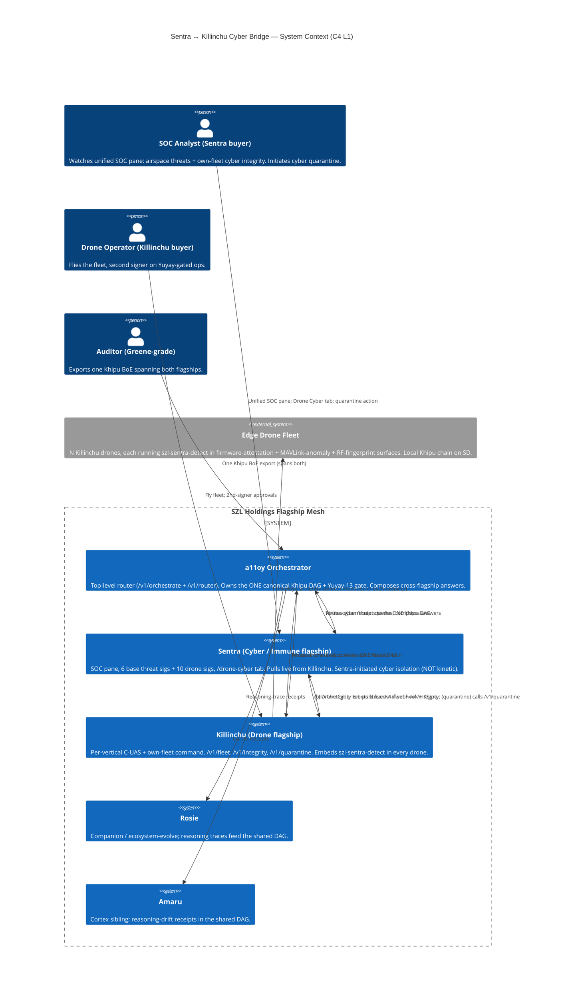
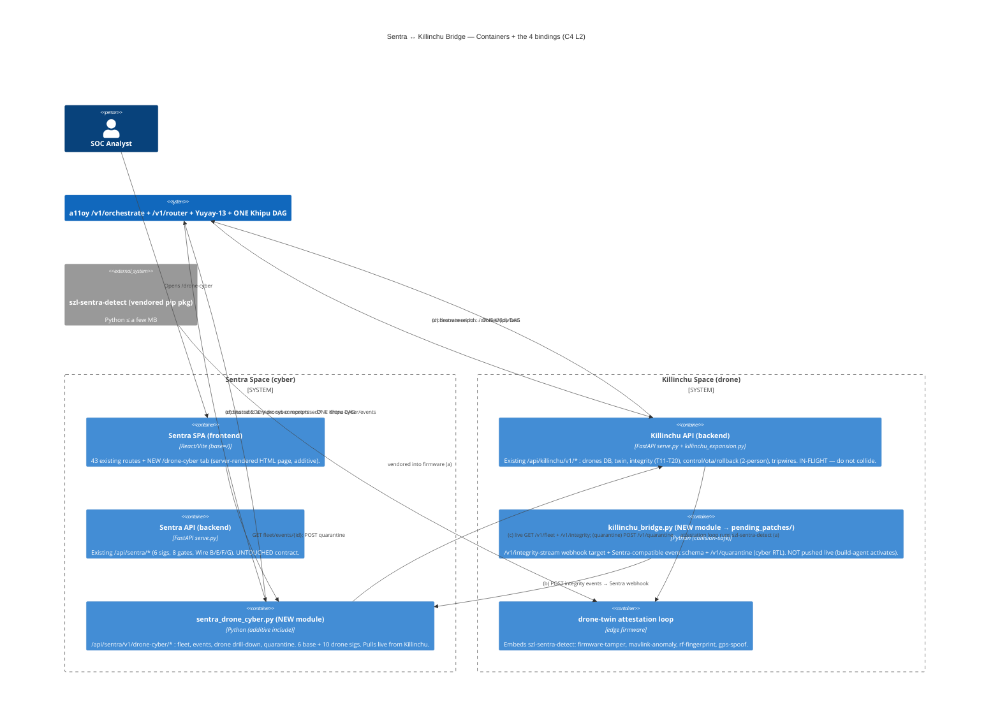
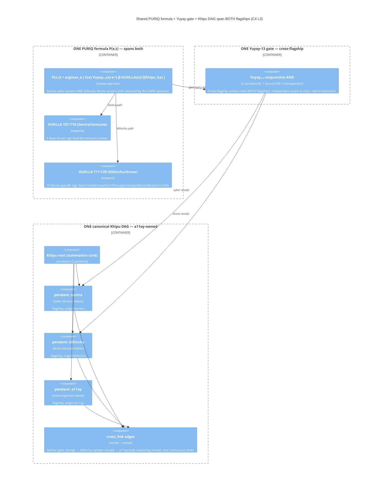
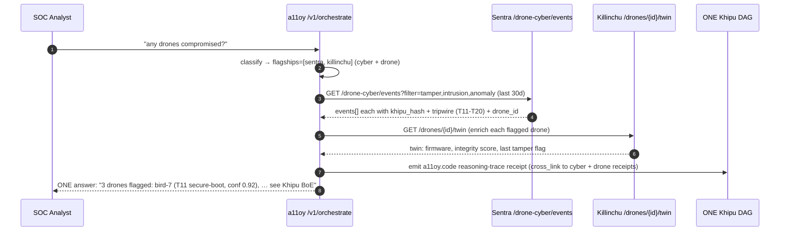
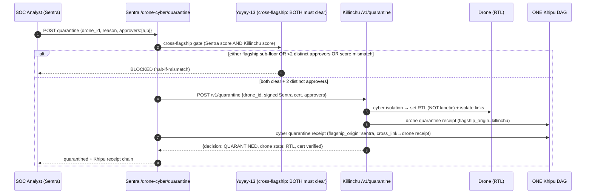

# BRIDGE_ARCHITECTURE — Sentra ↔ Killinchu Cyber Bridge

**Layer:** PURIQ v12 → `sentra_killinchu_bridge/`
**Author:** Yachay (cross-flagship integration agent), under CTO authority
**Date:** 2026-06-01
**Founder decision (2026-06-01 ~02:14 EDT, CTO ratified):** Do **NOT** merge Killinchu into
Sentra (preserve distinct buyer + compliance regimes + Series-A story). **INSTEAD: deep-bind**
them — Sentra gains a "Drone Cyber" view of the Killinchu fleet, every Killinchu drone runs
Sentra detection libs embedded, and one Khipu DAG / Yuyay-13 gate / PURIQ formula spans both.
a11oy orchestrates both.

**Status discipline (Doctrine v11/v12 LOCKED):** this is an *architecture spec + additive
patches* deliverable. Nothing is "merged". v11 LOCKED numbers (**749** declarations / **14**
unique axioms / **163** sorries / **13**-axis `yuyay_v3`, replay-hash `bacf5443…631fc5`) are
preserved verbatim. SLSA remains **L1 (honest)**; the Khipu signature is **DSSE PLACEHOLDER**
until Sigstore CI lands. Sentra **IP-HOLD #45 untouched**. ADDITIVE-only (Sentra 43/43 routes
+ 6 threat sigs preserved; Killinchu in-flight surface preserved).

---

## 0 — The one-sentence shape

> **a11oy orchestrates** (top); **Sentra** (cyber/immune flagship) and **Killinchu** (drone
> flagship) are **siblings, not parent/child**; they share **one Khipu DAG**, **one Yuyay-13
> gate** and **one PURIQ formula** `P(x,t)`; Sentra's detection logic is **vendored into every
> Killinchu drone** as the Python package `szl-sentra-detect`; Killinchu's `/v1/integrity`
> cyber events **stream into Sentra** (webhook + Khipu); and Sentra's UI grows a **Drone Cyber**
> tab that pulls **live** from Killinchu's existing `/drones/*` + integrity surfaces.

The load-bearing claim is **one unified SOC pane**: a Sentra operator watches *both* the
physical airspace (Killinchu C-UAS) **and** the cyber/supply-chain integrity of their **own**
drone fleet from a single Khipu Body-of-Evidence (BoE), with every cross-flagship event
receipted in the same DAG.

---

## 1 — C4 Level 1: SYSTEM CONTEXT — a11oy on top, Sentra + Killinchu as siblings

**Key context facts:**
- **Siblings, not merged.** Sentra and Killinchu keep distinct domains/buyers/compliance
  regimes. The bridge is *plumbing*, not a merge — preserves the Series-A two-product story.
- **a11oy is the only orchestrator + the only Khipu-DAG owner.** Both flagships write to the
  same canonical DAG (per `A11OY_ORCHESTRATION_LAYER.md`).
- The four cross-bindings (a)(b)(c)(d) below are the deliverable.

---

## 2 — C4 Level 2: CONTAINER — the four bridge bindings (a)(b)(c)(d)

**The four bindings (deliverable map):**

| # | Binding | Where it lives | Spec |
|---|---|---|---|
| **(a)** | Sentra-detection-libs vendored as `szl-sentra-detect`, embedded in Killinchu firmware-attestation + MAVLink-anomaly + RF-fingerprint surfaces | edge drone (`drone-twin attestation loop`) | `EMBEDDED_SENTRA_LIB_SPEC.md` |
| **(b)** | Killinchu `/v1/integrity` events streamed to Sentra via **webhook + Khipu** | `killinchu_bridge.py` → Sentra `…/drone-cyber/events/ingest` | `KILLINCHU_INTEGRITY_EVENT_SCHEMA.md` |
| **(c)** | Sentra UI **Drone Cyber tab** pulls live from Killinchu `/v1/fleet` + `/v1/integrity` | `sentra_drone_cyber.py` + `/drone-cyber` page | `SENTRA_DRONE_CYBER_TAB.md` |
| **(d)** | **Shared SOC view** — one Khipu DAG, both flagships' pendants, cross-linked receipts | a11oy canonical DAG | `UNIFIED_KHIPU_DAG.md` |

**Container responsibilities (one line each):**

| Container | Job | Touched? |
|---|---|---|
| Sentra SPA | 43 routes + new `/drone-cyber` page | **ADDITIVE** (page only) |
| Sentra API `serve.py` | existing immune contract | **+1 additive include** (try/except register) |
| `sentra_drone_cyber.py` | NEW bridge module, all drone-cyber endpoints | **NEW file (pushed)** |
| Killinchu API `serve.py` + `expansion.py` | in-flight drone surface | **UNTOUCHED** (collision-safe) |
| `killinchu_bridge.py` | integrity-stream + quarantine | **NEW file → `pending_patches/`** (not live) |
| edge attestation loop | runs `szl-sentra-detect` | spec only (firmware) |

---

## 3 — C4 Level 3: COMPONENT — shared formula, shared gate, shared DAG

- **One formula:** `P(x,t)` is unchanged from Doctrine v12. Cyber actions (Sentra) and drone
  actions (Killinchu) are both `a ∈ 𝒜`, scored by the *same* operator. Killinchu adds the
  geofence factor `G(a)` for physical actions; Sentra adds the immune screen via HUKLLA.
- **One gate:** the canonical 13-axis `Yuyay₁₃`. For a cross-flagship action (e.g. quarantine),
  **both** flagships compute their own score; the gate clears only if **both** clear
  (`YUYAY_GATE_CROSS_FLAGSHIP.md`).
- **One DAG:** a11oy-owned. Sentra and Killinchu are pendants; **every** cross-flagship receipt
  carries `flagship_origin` + `cross_link` (`UNIFIED_KHIPU_DAG.md`).

---

## 4 — DATA FLOW: "any drones compromised?" — the unified SOC answer

Operator types one question; a11oy fans out to Sentra (cyber events) and Killinchu (twin
enrich), composes **one** answer with Khipu citations, and the reasoning step itself is a
receipt cross-linked into the chain. Full logic in `A11OY_ORCHESTRATION_PATCHES.md`.

---

## 5 — DATA FLOW: Sentra-initiated cyber quarantine (2-person Yuyay, NOT kinetic)

**Quarantine is cyber isolation, NOT a kinetic effect:** it sets the **operator's OWN** drone to
RTL + isolates its links under a signed Sentra cert. It honors Killinchu's hard legal boundary
("WE SENSE, WE EVIDENCE" — own-fleet only, never offensive third-party control). The 2-person
Yuyay gate is enforced on **both** sides.

---

## 6 — Invariant + hard-rule traceability

| Bridge element | Preserves | How |
|---|---|---|
| One `P(x,t)` over both flagships | Doctrine v12 master formula | same operator; no new math |
| Cross-flagship Yuyay gate (both clear) | INV-1 + 2-person HARD RULE | halt-if-mismatch; 2 distinct approvers |
| One Khipu DAG, `flagship_origin` + `cross_link` | INV-3 chain integrity | one broken receipt ⇒ U=0; cross-link continuous |
| `szl-sentra-detect` vendored, ≤50MB edge | Anatomy+Rosie+a11oy→Killinchu arch | pure lib, fits squash-fs partition |
| Quarantine = cyber RTL, own-fleet only | CFAA/ITAR/Wassenaar (Killinchu legal) | NOT kinetic; signed cert; own fleet |
| Sentra `serve.py` +1 additive include | ADDITIVE-only, 43/43, IP-HOLD #45 | new module; existing contract untouched |
| Killinchu bridge → `pending_patches/` | coordinate with in-flight build agent | no `serve.py` edit ⇒ no collision |
| LOCKED 749/14/163/13-axis/replay-hash | Doctrine v11 LOCKED | preserved verbatim everywhere |

---

## 7 — What is NOT claimed (honesty, v11 §9 carried)

- The four PURIQ invariants remain **`sorry`-tagged** Lean obligations, not theorems.
- Khipu signature is **DSSE PLACEHOLDER**; cross-links verify the **hash chain + summation
  invariant**, not signatures, until Sigstore CI lands.
- `szl-sentra-detect` edge detectors are **engineering detectors with FA/h targets**, not
  field-calibrated rates (mirrors T11–T20 honesty in `TAMPER_HACK_DETECTION.md`).
- Killinchu twin telemetry is a **deterministic demonstration model** in the live Space;
  production streams real MAVLink/DICE. The bridge consumes whatever the Killinchu surface
  returns honestly.
- This is **spec + additive patches**. The Killinchu-side webhook is delivered to
  `pending_patches/` and is **not live** until the in-flight build agent
  (`opus_killinchu_drone_flagship_build_mpus8anv`) integrates it — no collision.

— Yachay, 2026-06-01. a11oy on top; Sentra + Killinchu siblings; one formula, one gate, one DAG.
Additive over v11 LOCKED. No merge. No mysticism. No bandaid.
