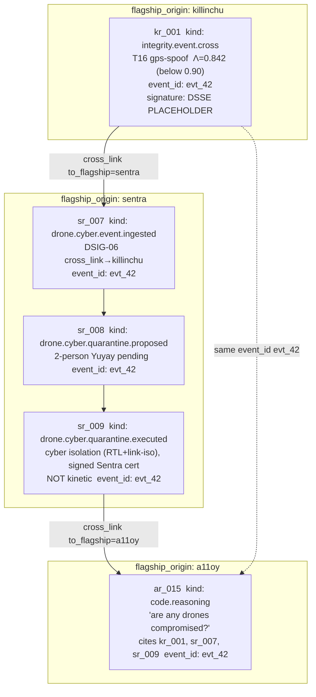

# UNIFIED_KHIPU_DAG — one Khipu DAG spanning Sentra + Killinchu + rosie + amaru + a11oy

**Layer:** PURIQ v12 → `sentra_killinchu_bridge/` (binding **(b)+(d)**: one continuous chain)
**Author:** Yachay, under CTO authority · 2026-06-01
**Honesty:** RUWAY is the only ledger writer (PURIQ charter). Receipts are sha256 hash-chained,
**in-memory** today (cross-Space durable broker NOT wired — labeled honestly, same as Sentra
Wire D). Signature is **DSSE PLACEHOLDER**. SLSA **L1 (honest)**. v11 LOCKED numbers preserved.

---

## 0 — The claim, stated honestly

There is **one logical Khipu DAG**. Each flagship keeps its own append-only receipt log
(Sentra wire F via vessels ingest; Killinchu `_emit_receipt` schema `szl.killinchu.receipt/v1`).
They become **one DAG** because every receipt now carries two new fields —
**`flagship_origin`** and **`cross_link`** — and cross-flagship edges share a common `event_id`.

What is REAL today: in-process hash-chaining within each Space, shared `event_id` correlation,
shared 13-axis Λ + Yuyay-13 gate, RUWAY-only writes.
What is NOT yet wired (honest): a single durable cross-Space ledger store / broker. Today the
"unified" view is **reconstructed by correlation** (shared `event_id`) — exactly how Sentra's
Wire D is "in-process only, cross-Space broker NOT wired."

---

## 1 — Receipt envelope (every flagship, additive fields)

Every receipt — Sentra, Killinchu, rosie, amaru, a11oy — now includes:

```jsonc
{
  "schema": "<flagship-native schema, unchanged>",  // e.g. szl.killinchu.receipt/v1
  "receipt_id": "…",
  "wire": "F",
  "prev_hash": "sha256:…",                          // intra-flagship chain link
  "this_hash": "sha256:…",
  "flagship_origin": "killinchu",                   // NEW — REQUIRED
  "cross_link": {                                   // NEW — present iff cross-flagship edge
    "to_flagship": "sentra",
    "event_id": "evt_…",                            // shared correlation id
    "relation": "integrity_event_consumed_by_drone_cyber"
  },
  "payload": { … },
  "lambda": 0.842,
  "signature": "PLACEHOLDER — Sigstore CI signing not yet wired into CI per Doctrine v11"
}
```

`flagship_origin ∈ {sentra, killinchu, rosie, amaru, a11oy}`.

---

## 2 — The continuous chain (worked example)

The drone-cyber → tamper → reasoning chain the founder asked for, as one continuous DAG path:



Reading the path top-to-bottom: **Sentra cyber receipt** (ingest `sr_007`) → **Killinchu tamper
receipt** (`kr_001`) → **a11oy.code reasoning receipt** (`ar_015`) — one continuous chain joined
by `event_id: evt_42` and explicit `cross_link` edges. rosie / amaru attach the same way (e.g.
rosie SBOM-provenance receipt, amaru ops receipt) when they participate.

---

## 3 — Cross-link edge rules (`-- sorry`-tagged invariants)

- Every cross-flagship edge is **bidirectional by correlation**: both sides write a receipt with
  the **same `event_id`**; each `cross_link.to_flagship` points at the peer. `-- sorry`
- A `cross_link` edge MUST connect two distinct `flagship_origin` values. `-- sorry`
- `this_hash == sha256(canonical_json(receipt_without_signature) ‖ prev_hash)` (intra-flagship
  chain integrity). `-- sorry`
- The DAG is **acyclic by construction**: edges are append-time and carry monotonic
  `emitted_at`; a later receipt may cite earlier ones but never vice-versa. `-- sorry`
- Only **RUWAY** appends. No other component writes the ledger (PURIQ charter). `-- sorry`

---

## 4 — How a consumer reconstructs the unified view

1. Pull each flagship's receipt log (Sentra `/api/sentra/v1/...` Khipu surface; Killinchu
   `/api/killinchu/v1/receipt/ledger`).
2. Index by `event_id`.
3. Join: any set of receipts sharing an `event_id` is **one logical cross-flagship event**;
   `cross_link.relation` labels each edge.
4. Order within a flagship by its `prev_hash`/`this_hash` chain; order across flagships by
   `emitted_at` + `cross_link` direction.

This is what a11oy.code does in A11OY_ORCHESTRATION_PATCHES.md and what the
CUSTOMER_PITCH_STORY's "single Khipu BoE" pane renders.

---

## 5 — Honesty ledger

| property | status |
|----------|--------|
| Intra-flagship hash-chain | REAL (sha256, in-memory) |
| `flagship_origin` on every receipt | REAL (additive field) |
| `cross_link` + shared `event_id` correlation | REAL |
| 13-axis Λ + Yuyay-13 gate shared | REAL (canonical `yuyay_v3`, floor 0.90) |
| RUWAY-only writes | REAL (design) |
| Single durable cross-Space ledger store | **NOT wired** (reconstructed by correlation today) |
| DSSE signature | **PLACEHOLDER** (Sigstore CI pending) |
| Chain invariants Lean-proven | **NO** (`-- sorry`) |

---

*— Yachay, 2026-06-01. ADDITIVE. NO BANDAID. Invariants `-- sorry`-tagged. Cross-Space durable
broker NOT wired (honest). DSSE PLACEHOLDER. SLSA L1. v11 LOCKED numbers preserved.*
