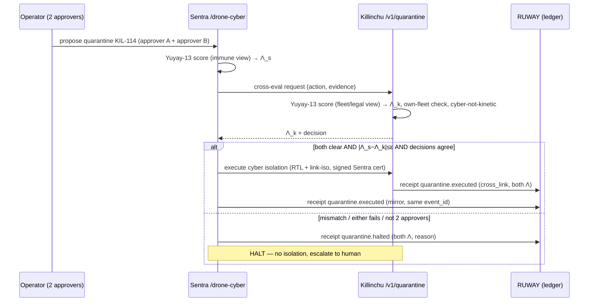

# YUYAY_GATE_CROSS_FLAGSHIP — Yuyay-13 for actions touching BOTH flagships

**Layer:** PURIQ v12 → `sentra_killinchu_bridge/` (the gate that protects cross-flagship writes)
**Author:** Yachay, under CTO authority · 2026-06-01
**Honesty:** Yuyay-13 = 2 sacred axes ≥0.95, 7 structural ≥0.90, 4 introspection axes cross-link
HUKLLA T03/T04/T09/T10 (PURIQ charter). Λ uniqueness is a **Conjecture**, not a theorem. Lean
stub below is `sorry`-tagged (not proven). v11 LOCKED numbers (13-axis `yuyay_v3`) preserved.

---

## 0 — The rule

> **Any action that touches BOTH flagships must clear Yuyay-13 *independently on each
> flagship*, AND the two independent scores must agree. Halt-if-mismatch.**

The canonical cross-flagship action today is **quarantine a drone** (Sentra proposes via its
`/drone-cyber` tab; Killinchu executes the cyber isolation via `/v1/quarantine`). It is also a
**2-person** action (≥2 distinct approvers) — Yuyay-13 and the 2-person rule are *both* required;
neither replaces the other.

---

## 1 — Why two independent evaluations (not one shared score)

If we computed Λ once and trusted it on both sides, a compromise of one flagship's scorer could
wave an action through. By requiring **each flagship to compute its own 13-axis Λ and Yuyay-13
verdict from its own evidence**, then comparing, we get a cheap, honest cross-check:

- **Sentra** scores the action from the *immune / dual-use* viewpoint (is this isolation
  proportionate, reversible, authorized, well-attested?).
- **Killinchu** scores it from the *fleet / legal-boundary* viewpoint (own-fleet only?
  cyber-not-kinetic? geofence factor G(a)? Λ ≥ floor?).
- The gate passes **iff both pass AND |Λ_sentra − Λ_killinchu| ≤ ε** and both name the same
  decision. Otherwise **HALT** — no isolation, write a `quarantine.halted` receipt with both
  scores, escalate to a human.

This is the cross-flagship analogue of Killinchu's existing `_gated_control` (≥2 approvers,
own-fleet-only, Λ-checked) — extended so *both* flagships must independently agree.

---

## 2 — The 13 axes + Yuyay-13 tiers (canonical, unchanged)

`yuyay_v3` axes (LOCKED): soundness, calibration, robustness, provenance, consent,
reversibility, transparency, fairness, containment, attestation, freshness, authority,
auditability.

| tier | axes | floor |
|------|------|-------|
| **sacred** (2) | consent, reversibility | **≥ 0.95** |
| **structural** (7) | soundness, calibration, robustness, provenance, transparency, containment, authority | ≥ 0.90 |
| **introspection** (4) | fairness, attestation, freshness, auditability → cross-link HUKLLA **T03/T04/T09/T10** | ≥ 0.90 |

For quarantine specifically: **reversibility** (sacred) is the load-bearing axis — cyber
isolation must be reversible (RTL + link isolation, NOT kinetic), so reversibility must score
≥0.95 on *both* flagships or the gate halts.

---

## 3 — Lean stub (honest — `sorry`-tagged, NOT proven)

```lean
namespace SZL.Bridge.YuyayCross

/-- 13-axis vector. -/
structure AxisVec where
  v : Fin 13 → Float

/-- Geometric-mean aggregate (canonical yuyay_v3). -/
noncomputable def lambdaAgg (a : AxisVec) : Float := sorry  -- 13th-root of ∏ axes

/-- Yuyay-13 tier check: 2 sacred ≥0.95, 7 structural ≥0.90, 4 introspection ≥0.90. -/
def yuyayClears (a : AxisVec) : Bool := sorry

/-- A cross-flagship action carries one independent evaluation per flagship. -/
structure CrossEval where
  sentra    : AxisVec
  killinchu : AxisVec
  decision_sentra    : String
  decision_killinchu : String

def EPS : Float := 0.02

/-- The cross-flagship gate. Passes iff BOTH clear, decisions agree,
    and the two Λ are within EPS. Otherwise HALT. -/
def crossGate (e : CrossEval) : Bool :=
  yuyayClears e.sentra
    && yuyayClears e.killinchu
    && (e.decision_sentra == e.decision_killinchu)
    && (Float.abs (lambdaAgg e.sentra - lambdaAgg e.killinchu) ≤ EPS)

/-- OBLIGATION: crossGate = true ⟹ both flagships independently cleared Yuyay-13. -/
theorem crossGate_sound (e : CrossEval) :
    crossGate e = true →
      (yuyayClears e.sentra = true ∧ yuyayClears e.killinchu = true) := by
  sorry  -- NOT PROVEN — honest placeholder

/-- OBLIGATION: mismatch ⟹ halt (crossGate = false). -/
theorem crossGate_halts_on_mismatch (e : CrossEval) :
    e.decision_sentra ≠ e.decision_killinchu → crossGate e = false := by
  sorry  -- NOT PROVEN — honest placeholder

end SZL.Bridge.YuyayCross
```

These two obligations are **`sorry`**: they count toward the honest 163 tracked sorries, not
toward proven theorems. Λ-uniqueness remains a **Conjecture**.

---

## 4 — Runtime sequence (quarantine, the worked case)



---

## 5 — Honesty ledger

| property | status |
|----------|--------|
| Two independent Yuyay-13 evaluations | REAL (design); enforced in patch logic |
| Halt-if-mismatch + halted receipt | REAL (design) |
| 2-person approver requirement | REAL (mirrors Killinchu `_gated_control`) |
| Cyber isolation reversible / not kinetic | REAL (legal boundary honored) |
| `crossGate_sound`, `crossGate_halts_on_mismatch` | **`sorry` — NOT proven** |
| Λ uniqueness | **Conjecture** (not a theorem) |
| Signature | **DSSE PLACEHOLDER** |

---

*— Yachay, 2026-06-01. ADDITIVE. NO BANDAID. Lean stub `sorry`-tagged (counts toward 163, not
proven). Λ uniqueness = Conjecture. DSSE PLACEHOLDER. v11 LOCKED 13-axis preserved.*
