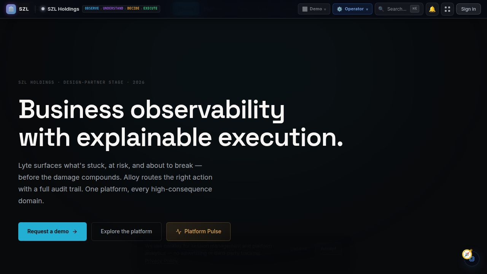
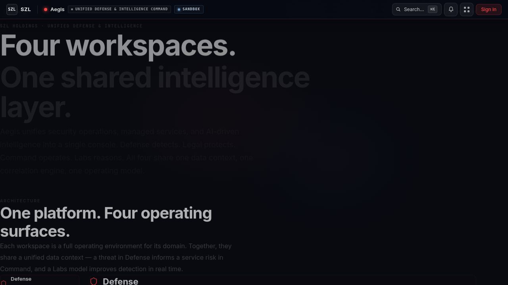
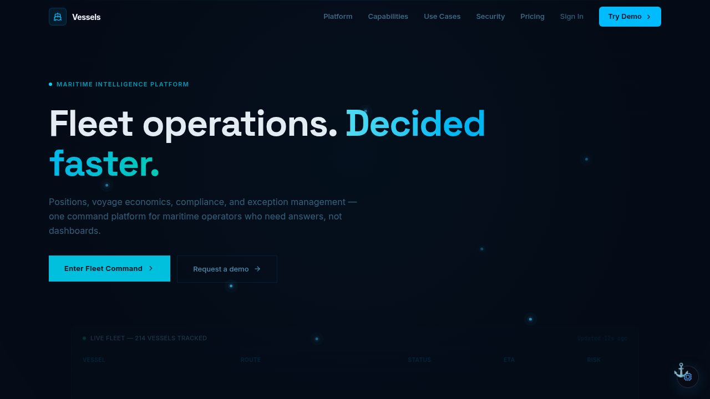

# SZL Holdings — Platform Thesis

**For:** Strategic investors and institutional evaluators  
**Date:** Q2 2026

---

## The Thesis, Stated Plainly

The enterprises that will win the next decade are not the ones with the most data. They are the ones that can reason across their data, connect operational signal to strategic decision, and act with confidence — faster than their competitors, and with more accountability than their regulators require.

SZL Holdings is building the platform that makes that possible. We are doing it in operational domains where the stakes are high enough that the platform's value is undeniable, and with architecture that is explicit enough that it compounds as we scale.


---

## The Category: Governed Decision Infrastructure

Governed Decision Infrastructure is the emerging category at the intersection of operational signal detection, AI-assisted reasoning, and structured action execution — under governance, with full attribution. The term *operating system* is precise: the platform provides shared governance primitives, a cross-domain event kernel (Event Fabric), and policy enforcement infrastructure on which domain-specific intelligence runs.

It is distinct from:

**Business Intelligence (BI):** BI answers "what happened?" The Governed Decision Infrastructure answers "what is happening, what should we do, and can we prove the decision chain?"

**AI Copilots:** Copilots add recommendation volume without governance. This platform enforces human approval gates (Covenant Policy), tracks decision outcomes (Outcome Graph), and records immutable audit trails (Proof Chain).

**AIOps / MLOps:** These optimize specific technical systems. The Governed Decision Infrastructure spans the full operational layer — commercial, logistics, security, people, and financial systems — with structural governance.

**ERP / Workflow Platforms:** These execute processes. The Governed Decision Infrastructure surfaces the signals that should inform whether and how those processes run, adds simulation (Monte Carlo) before action, and records the full decision chain.

The market does not yet have a dominant platform in this category. The tools that come closest — Datadog (infrastructure observability), Splunk (security intelligence), Palantir (government analytics) — serve specific domains without the cross-domain governance architecture that this category requires.

SZL Holdings is building this architecture from the ground up, in operational domains where the cost of ungoverned decisions is quantifiably high.

---

## Why Now

Three forces have converged to make this architecture feasible and valuable:

**1. AI quality has crossed the inference threshold.** Modern LLMs can reason across complex, multi-domain operational data with sufficient reliability to surface meaningful recommendations — not just correlate fields. This wasn't true at scale three years ago.

**2. Observability tooling has proven the category edge.** The success of Datadog, New Relic, and Grafana in DevOps observability demonstrates that organizations will pay for operational clarity when it is delivered with discipline and density. The question is whether that model extends beyond infrastructure — and every signal suggests it does.

**3. Enterprise tolerance for AI black boxes is declining.** Regulatory pressure, high-profile failures, and internal governance demands are pushing enterprises toward AI that is explainable, auditable, and human-in-the-loop by design. The SZL architecture delivers this structurally.

---

## The Governed Decision Loop

Every consequential decision in the platform follows the same loop:

```
Signal → Context → Recommendation → Simulation → Policy → Execution → Proof → Outcome → Learning
```

This loop is powered by six **platform primitives** — architectural abstractions shared by every product surface:

| Primitive | What It Does |
|-----------|-------------|
| **Outcome Graph** | Tracks the full decision lifecycle: recommendation → decision → outcome. Enables closed-loop AI learning. |
| **Proof Chain** | Immutable audit trail with provenance for every action. AI outputs carry model identity, source citations, and confidence scores. |
| **Covenant Policy** | Permission and approval gates. Human-in-the-loop is enforced at the policy layer — AI cannot bypass it. |
| **Monte Carlo** | Probabilistic simulation before action — confidence intervals, sensitivity analysis, scenario comparison. |
| **Workflow Engine** | Durable multi-step process orchestration with agent coordination and checkpoint recovery. |
| **Event Fabric** | Cross-domain signal backbone — normalizes, routes, and correlates events across all domain packs. Enables cross-domain intelligence. |

These are not features. They are the structural abstractions that make the platform fundamentally different from dashboards, copilots, and workflow tools.

## The Operating Wedge: Lyte + Alloy

The primary commercial entry point is **Lyte + Alloy** — the command surface and execution fabric delivered as a unified governed system.

**Lyte** is the command surface — where operators observe signals, review recommendations, and make decisions. Built on the PRISM framework:
- **P**ulse — Business health and operating heartbeat
- **R**isk — Approvals, churn, delays, ownership gaps
- **I**ntelligence — Modeled reasoning with confidence scores
- **S**ignals — Anomalies, changes, event spikes, workflow drift
- **M**otion — Escalations, routing, approvals, interventions

**Alloy** is the execution fabric — when Lyte surfaces a signal, Alloy enforces the governed loop: Workflow Engine orchestrates the process, Covenant Policy checks permission, Monte Carlo simulates risk, Proof Chain records the trail, and Outcome Graph tracks the result.

---

## Current Platform

As of Q2 2026, the SZL Holdings platform consists of command surfaces, an execution fabric, and six domain packs — all sharing the same six platform primitives:


A representative cross-section of the live product surfaces:








**Command surfaces:**
| Surface | Purpose | Status |
|---------|---------|--------|
| **Lyte** | Operator command surface — PRISM framework, signal timeline, action queue, approval chains | Functional Alpha |
| **CORTEX** | Unified mobile command — all domains in one iOS/Android app | Functional Alpha |
| **Command Portal** | Ecosystem hub — cross-domain command surface | Functional Alpha |

**Execution fabric:**
| Surface | Purpose | Status |
|---------|---------|--------|
| **Alloy** | Workflow orchestration, approval gates, immutable audit trail | Functional Alpha |

**Domain packs:**
| Domain Pack | Domain | Status |
|-------------|--------|--------|
| **Aegis** | Security & Defense — SOC command, SOAR, MITRE ATT&CK | Functional Alpha |
| **Sentra** | Cyber Resilience — threat posture, resilience scoring, incident readiness | Functional Alpha |
| **Vessels** | Maritime Intelligence — AIS fleet, sanctions screening, Helmsman agent | Functional Alpha |
| **Terra** | Real Estate Intelligence — NYC distress pipeline, ownership graph, deal flow | Functional Alpha |
| **Counsel** | Legal Matter Command — matter management, AI triage, proof chain audit | Functional Alpha |
| **Carlota Jo** | Premium Advisory — UHNW advisory, client portal | Public Beta Candidate |

### Platform Scale Metrics

| Metric | Current Value |
|--------|--------------|
| Active artifacts | 14 |
| Database tables | 798 across 131 schema files (per-domain namespaced, all org-scoped) |
| pnpm workspace packages | 197 measured in `artifacts/SOURCE_OF_TRUTH.json` |
| Platform primitives | 6 (Outcome Graph, Proof Chain, Covenant Policy, Monte Carlo, Workflow Engine, Event Fabric) |
| AI decision types (schema-validated) | 9 |
| RBAC roles | 11 |
| Supported notification channels | 4 (Slack, Teams, email, WebSocket push) |
| CI gates on every PR | 5 (lint, typecheck, unit tests, dependency audit, build) |

---

## The Expansion Logic

The SZL platform was not designed as a collection of independent products. It was designed as a system that compounds.

**Phase 1:** Build the core architecture and prove it in Lyte. Establish the PRISM framework as a defensible analytical model.

**Phase 2:** Add domain packs that share the same architecture. Each new domain pack (Aegis, Terra, Vessels) demonstrates the compounding leverage — new intelligence, not new infrastructure investment.

**Phase 3:** Cross-domain intelligence. Connect the entity model and event schema across the platform so signals in one domain inform reasoning in another. A vessel delay that creates cargo exposure surfaces as a commercial risk signal. A security incident affecting operations infrastructure propagates to the operational decision layer.

**Phase 4:** Platform generalization. The governed decision loop is generalisable. The same architecture that serves maritime logistics can serve healthcare operations, financial services risk, or government infrastructure. Each new domain pack needs domain-specific signal sources; the governance infrastructure is shared.

---

## Defensibility

SZL Holdings is building governance infrastructure. The defensibility comes from six structural advantages:

1. **Six platform primitives** — Outcome Graph, Proof Chain, Covenant Policy, Monte Carlo, Workflow Engine, and Event Fabric are not features that can be added to a competitor's product. They are architectural abstractions that shape the entire data model and execution layer. Replicating them requires rebuilding from the foundation.

2. **Shared event model (PRISM Bus)** — Signals across the ecosystem conform to a common schema with cross-domain correlation. This is the prerequisite for multi-domain intelligence. It took investment to build; it cannot be replicated quickly.

3. **Alloy — the execution fabric** — The connective tissue of the platform. Agents are coordinated under the Covenant Policy governance framework that maintains accountability across the network.

4. **Closed-loop learning (Outcome Graph)** — The platform records not just what was recommended but what was decided and what happened. This creates a calibration flywheel: more decisions → better simulations → more accurate recommendations.

5. **Structural governance (Covenant Policy + Proof Chain)** — Human-in-the-loop is not a UI pattern. It is an enforced policy gate that AI cannot bypass, paired with an immutable audit trail. This is increasingly a procurement requirement.

6. **Domain pack leverage** — Each new domain pack shares the governance infrastructure and adds domain-specific signal sources and action vocabularies. New domain intelligence, not new infrastructure.

---

*See also: [Product Readiness](product-readiness.md) · [Go-to-Market](go-to-market.md) · [Investor Overview](investor-overview.md) · [Platform Primitives](../architecture/platform-primitives.md) · [Category Positioning](../sales/category-positioning.md)*
