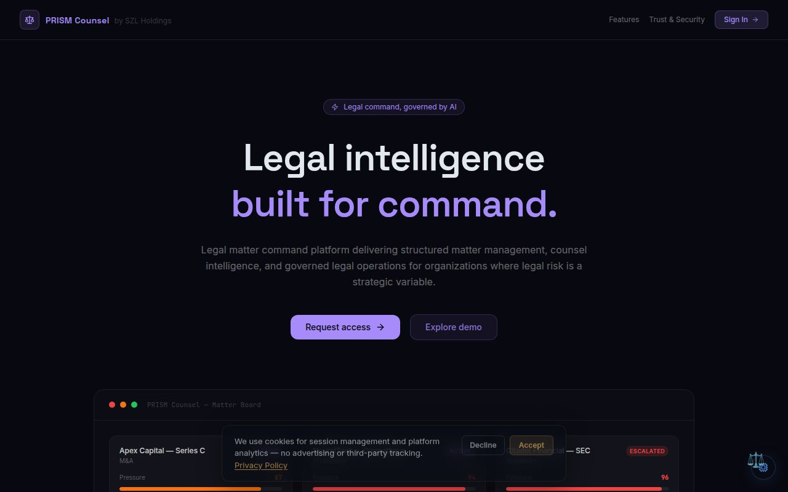
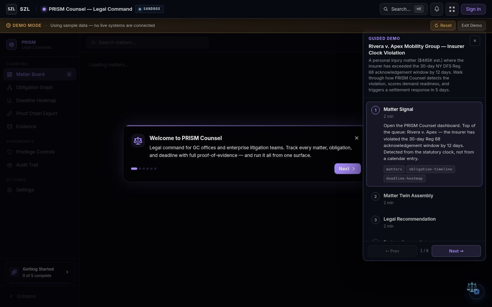
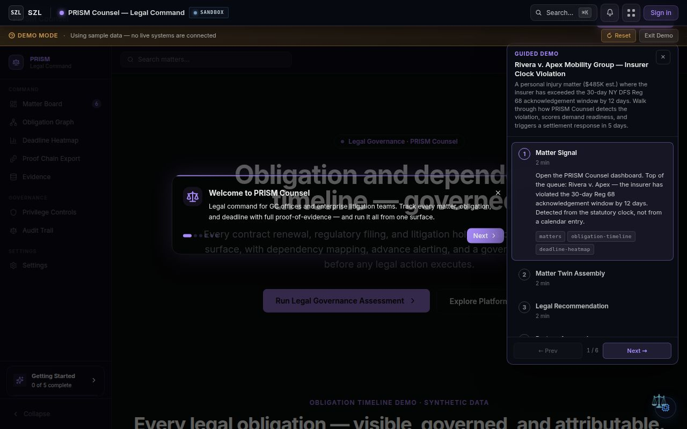

# PRISM Counsel — Platform Story

**For:** Series A investors and strategic evaluators
**Date:** April 2026
**Classification:** Confidential — Investor Distribution Only

---

## What PRISM Counsel Is

PRISM Counsel is the legal-operations domain pack on the SZL governed decision infrastructure. It is the matter command surface for general counsel teams, in-house litigation groups, and compliance leaders operating in environments where every legal decision needs to be defensible at audit.

It is not a document review tool. It is not an e-discovery platform. It is not a generic legal copilot. PRISM Counsel is the surface where legal signal becomes a governed decision — with the same Proof Chain, Covenant Policy, and Outcome Graph primitives that run Aegis, Vessels, and Terra.

---

## The Core Story

Legal teams sit on top of the most consequential decisions a company makes — settlements, regulatory responses, privilege scoping, contract obligations, litigation strategy. And yet the workflow that produces those decisions runs in shared inboxes, spreadsheet trackers, and email threads.

When something goes wrong — a missed deadline, a privilege breach, an unfavorable ruling — there is no audit-grade record of what was known when, who decided what, and why a particular path was chosen.

PRISM Counsel changes the substrate. Every matter is a typed object with a governed lifecycle. Every obligation has a deadline, an owner, and a dependency graph. Every AI recommendation carries Proof Chain provenance — model identity, source citations, confidence score. Every consequential action passes through a Covenant Policy gate that requires explicit human approval before it executes.

The result is the legal decision-making equivalent of what Datadog did for production telemetry: a single surface where the operator can see what is happening, decide what to do, and have the decision written into an immutable record.

---

## What Makes PRISM Counsel Different

**Matter-twin substrate.** Each matter is maintained as a typed digital twin with state — pressure, exposure, deadlines, dependencies. The twin updates as new signal arrives. This is not a CRM record; it is a live operational object.

**Obligation graph.** Contractual and regulatory obligations are first-class entities with dependency relationships, advance alerting, and enforcement attribution. Renewals, filings, and litigation holds surface before they become incidents — not after.

**Proof-chain on every output.** AI-generated triage, drafting, and recommendations carry source citations and confidence scoring. Outputs are defensible at audit because the provenance chain is queryable, not narrative.

**Approval-gated execution.** Privilege reclassification, external disclosure, settlement authorization, and other consequential actions cannot bypass the Covenant Policy gate. Approvals are written to the Proof Chain before any action dispatches.

**Privilege-aware controls.** Access, redaction, and disclosure follow privilege classification — not generic role-based access. The control plane is aware of what attorney-client and work-product privilege actually mean.

---

## Why This Maps to the Platform Thesis

Every domain pack in the SZL portfolio runs on the same six platform primitives: Outcome Graph, Proof Chain, Covenant Policy, Monte Carlo, Workflow Engine, and Event Fabric. PRISM Counsel does not introduce new infrastructure — it inherits the governance substrate built once and shared across Aegis (security), Vessels (maritime), Terra (real estate), and the rest of the portfolio.

This is the compounding architecture: the cost of adding the legal domain pack is domain content (matter types, obligation taxonomies, privilege classes), not new platform plumbing. The same proof-chain capabilities that defend a security incident response also defend a settlement authorization.

For investors, the key implication is that PRISM Counsel is not a separate product bet. It is leverage on the governance investment that already underwrites every other domain pack on the platform.

---

*See also: [Platform Portfolio](platform-portfolio.md) · [PRISM Counsel — Wedge Expansion](prism-counsel-wedge-expansion.md) · [PRISM Counsel — Why Now](prism-counsel-why-now.md) · [ATLAS Spatial Runtime Moat](atlas-spatial-runtime-moat.md)*
