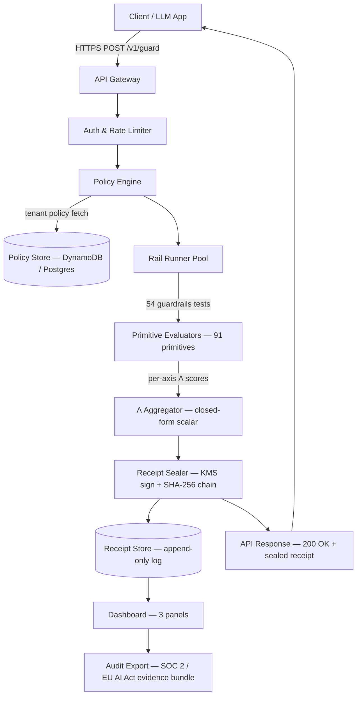

# Lambda-as-a-Service — Hosted Λ-Score Control Plane
**Product:** @szl-holdings/guardrails SaaS Endpoint  
**Entity:** SZL Holdings LLC | **Founder:** Stephen P. Lutar  
**Runtime Base:** Ouroboros v6.1.0 — 91 primitives, 9 Λ axes, 1,372 tests, 54 @szl-holdings/guardrails tests  
**Version:** 1.0 | **Date:** May 2026

---

## 1. Vision

Lambda-as-a-Service (LaaS) is the hosted control plane that turns the @szl-holdings/guardrails runtime into a network-accessible SaaS endpoint. The central proposition is simple: a caller POSTs a guard request to a single authenticated endpoint and receives, within the response, a sealed cryptographic receipt that encodes the Λ trust scalar across all nine axes, the outcome of each active rail runner, and a hash-chained link to the tenant's immutable append-only receipt log. The caller never has to manage audit infrastructure. The receipt is verifiable by any third party without platform access.

Every competitor in the AI governance space — NVIDIA NeMo Guardrails, IBM watsonx.governance, Guardrails AI, Meta Llama Guard — leaves audit responsibility to the caller. Telemetry logs are mutable. Platform records are admin-accessible. None produces a cryptographically bound, per-inference receipt that survives independent verification. LaaS fills that gap by making receipts a first-class API response field, not an afterthought in an observability pipeline.

The architecture mirrors NVIDIA NeMo Microservices in its containerized, API-first approach and its Kubernetes-native deployment model. It differs from every NeMo configuration in one decisive respect: every guard response contains a closed-form Λ scalar backed by a mathematical derivation published at Zenodo ([10.5281/zenodo.19867281](https://doi.org/10.5281/zenodo.19867281) and [10.5281/zenodo.19934129](https://doi.org/10.5281/zenodo.19934129)), not a binary pass/fail from a Colang flow. The receipt is not a log entry. It is an artifact.

The dashboard surfaces the receipt stream as three operational panels — Live, Compliance, and Forensics — enabling security teams, compliance officers, and auditors to work from the same durable data source without platform privilege.

---

## 2. Architecture

### Component Diagram (Mermaid)



### ASCII Representation

```
┌─────────────────────────────────────────────────────────────┐
│  Client (LLM App / CI Pipeline / Human Review Tool)         │
└────────────────────┬────────────────────────────────────────┘
                     │ HTTPS POST /v1/guard
┌────────────────────▼────────────────────────────────────────┐
│  API Gateway  (rate limiting, TLS termination, request ID)  │
└────────────────────┬────────────────────────────────────────┘
                     │
┌────────────────────▼────────────────────────────────────────┐
│  Auth & Policy Engine  (JWT validation, tenant isolation,   │
│  policy hydration from Policy Store)                        │
└────────────────────┬────────────────────────────────────────┘
                     │
┌────────────────────▼────────────────────────────────────────┐
│  Rail Runner Pool  (@szl-holdings/guardrails, 54 tests,     │
│  91 Ouroboros primitives, parallel execution)               │
└────────────────────┬────────────────────────────────────────┘
                     │ per-axis Λ₁–Λ₉ scores
┌────────────────────▼────────────────────────────────────────┐
│  Λ Aggregator  (closed-form scalar, axis weights per policy) │
└────────────────────┬────────────────────────────────────────┘
                     │ Λ composite + per-axis breakdown
┌────────────────────▼────────────────────────────────────────┐
│  Receipt Sealer  (KMS-backed ECDSA sign, SHA-256 chain hash,│
│  timestamp, tenant ID, model fingerprint embedded)          │
└────────┬───────────┴─────────────────────────────────────────┘
         │                        │
┌────────▼──────────┐  ┌──────────▼──────────────────────────┐
│  Receipt Store    │  │  API Response (200 OK)               │
│  (append-only,    │  │  Body: guard result + sealed receipt │
│  tenant-isolated) │  └─────────────────────────────────────┘
└────────┬──────────┘
         │
┌────────▼──────────────────────────────────────────────────┐
│  Dashboard  (Live | Compliance | Forensics panels)        │
└───────────────────────────────────────────────────────────┘
```

---

## 3. API Surface

### 3.1 POST /v1/guard

Evaluates a guard request against the tenant's active policy. Returns a Λ scalar, per-axis breakdown, action directive, and a sealed receipt.

**Request body:**

```json
{
  "request_id": "req_01HWXYZ789ABC",
  "tenant_id": "tenant_acme_prod",
  "model_fingerprint": "sha256:a3f1c2...",
  "context": {
    "role": "assistant",
    "prior_turns": 2,
    "session_id": "sess_8892xk"
  },
  "content": {
    "prompt": "Summarize the patient's risk factors from the uploaded record.",
    "response": "Based on the record, the patient presents elevated cardiovascular risk..."
  },
  "policy_id": "pol_hipaa_v2",
  "rails": ["all"],
  "metadata": {
    "use_case": "clinical_summary",
    "deployment_env": "production"
  }
}
```

**Response body (200 OK):**

```json
{
  "request_id": "req_01HWXYZ789ABC",
  "receipt_id": "rct_01HWXYZ789ABC",
  "action": "PASS",
  "lambda": {
    "composite": 0.847,
    "axes": {
      "lambda_1_accuracy": 0.91,
      "lambda_2_fairness": 0.88,
      "lambda_3_transparency": 0.79,
      "lambda_4_robustness": 0.85,
      "lambda_5_privacy": 0.94,
      "lambda_6_security": 0.82,
      "lambda_7_accountability": 0.88,
      "lambda_8_reliability": 0.83,
      "lambda_9_human_oversight": 0.76
    },
    "threshold": 0.70,
    "threshold_met": true
  },
  "rails_evaluated": 54,
  "rails_failed": 0,
  "primitives_triggered": ["PRIV-03", "EXPLAIN-01"],
  "receipt": {
    "receipt_id": "rct_01HWXYZ789ABC",
    "tenant_id": "tenant_acme_prod",
    "timestamp_utc": "2026-05-06T14:00:00.000Z",
    "policy_id": "pol_hipaa_v2",
    "policy_hash": "sha256:9f4a1b...",
    "model_fingerprint": "sha256:a3f1c2...",
    "lambda_composite": 0.847,
    "chain_hash": "sha256:7e3d9a...",
    "prev_chain_hash": "sha256:2b8f4c...",
    "signature": "ECDSA:3045022100...",
    "key_id": "arn:aws:kms:us-east-1:123456789:key/mrk-abc123"
  },
  "latency_ms": 38
}
```

**Error codes:**

| Code | Condition |
|------|-----------|
| 400 | Malformed request body or missing required fields |
| 401 | Invalid or expired JWT |
| 403 | Tenant quota exceeded or policy not found |
| 422 | Content exceeds token limit for active rails |
| 429 | Rate limit exceeded for tenant tier |
| 500 | Rail runner internal failure — receipt not generated |
| 503 | Receipt sealer KMS unavailable — request rejected, not logged |

**Example curl:**

```bash
curl -X POST https://api.laas.szlholdings.com/v1/guard \
  -H "Authorization: Bearer $LAAS_API_KEY" \
  -H "Content-Type: application/json" \
  -d '{
    "request_id": "req_test_001",
    "tenant_id": "tenant_acme_prod",
    "model_fingerprint": "sha256:a3f1c2",
    "content": {
      "prompt": "What medication adjustments do you recommend?",
      "response": "I recommend consulting a physician before any adjustment."
    },
    "policy_id": "pol_hipaa_v2",
    "rails": ["all"]
  }'
```

---

### 3.2 GET /v1/receipts/:id

Returns a single receipt by ID. Used for forensic lookup and chain verification.

**Response body (200 OK):**

```json
{
  "receipt_id": "rct_01HWXYZ789ABC",
  "tenant_id": "tenant_acme_prod",
  "timestamp_utc": "2026-05-06T14:00:00.000Z",
  "policy_id": "pol_hipaa_v2",
  "policy_hash": "sha256:9f4a1b...",
  "model_fingerprint": "sha256:a3f1c2...",
  "lambda_composite": 0.847,
  "axes": { "lambda_1_accuracy": 0.91, "...": "..." },
  "action": "PASS",
  "rails_failed": 0,
  "primitives_triggered": ["PRIV-03", "EXPLAIN-01"],
  "chain_hash": "sha256:7e3d9a...",
  "prev_chain_hash": "sha256:2b8f4c...",
  "signature": "ECDSA:3045022100...",
  "key_id": "arn:aws:kms:us-east-1:123456789:key/mrk-abc123",
  "verification_status": "VALID"
}
```

**Example curl:**

```bash
curl https://api.laas.szlholdings.com/v1/receipts/rct_01HWXYZ789ABC \
  -H "Authorization: Bearer $LAAS_API_KEY"
```

---

### 3.3 GET /v1/receipts

Returns filtered, paginated receipt list for the authenticated tenant.

**Query parameters:**

| Parameter | Type | Description |
|-----------|------|-------------|
| `from` | ISO 8601 | Start of time range |
| `to` | ISO 8601 | End of time range |
| `action` | string | Filter by action: PASS, ABORT, WARN |
| `policy_id` | string | Filter by policy |
| `min_lambda` | float | Minimum composite Λ |
| `max_lambda` | float | Maximum composite Λ |
| `page` | int | Page number (default 1) |
| `page_size` | int | Results per page (default 100, max 1000) |

**Example curl:**

```bash
curl "https://api.laas.szlholdings.com/v1/receipts?from=2026-05-01T00:00:00Z&action=ABORT&page_size=50" \
  -H "Authorization: Bearer $LAAS_API_KEY"
```

---

### 3.4 POST /v1/policies

Creates or updates a tenant policy. A policy specifies which rails are active, per-axis Λ weights, and action thresholds.

**Request body:**

```json
{
  "policy_id": "pol_hipaa_v2",
  "display_name": "HIPAA Clinical Summary Policy",
  "rails": {
    "enabled": ["all"],
    "disabled": []
  },
  "lambda_weights": {
    "lambda_5_privacy": 1.5,
    "lambda_1_accuracy": 1.2
  },
  "thresholds": {
    "abort_below": 0.50,
    "warn_below": 0.70,
    "pass_above": 0.70
  },
  "metadata": {
    "regulatory_context": ["HIPAA", "NIST_AI_RMF"],
    "version": "2.0"
  }
}
```

**Example curl:**

```bash
curl -X POST https://api.laas.szlholdings.com/v1/policies \
  -H "Authorization: Bearer $LAAS_API_KEY" \
  -H "Content-Type: application/json" \
  -d @policy_hipaa_v2.json
```

---

### 3.5 GET /v1/policies

Returns all active policies for the authenticated tenant.

**Example curl:**

```bash
curl https://api.laas.szlholdings.com/v1/policies \
  -H "Authorization: Bearer $LAAS_API_KEY"
```

---

### 3.6 POST /v1/verify

Verifies a single receipt or walks a receipt chain to confirm integrity.

**Request body:**

```json
{
  "receipt_id": "rct_01HWXYZ789ABC",
  "mode": "chain",
  "depth": 10
}
```

**Response body:**

```json
{
  "receipt_id": "rct_01HWXYZ789ABC",
  "chain_valid": true,
  "chain_depth_checked": 10,
  "earliest_receipt_in_chain": "rct_01HWAAA000001",
  "tamper_detected": false,
  "signature_valid": true,
  "key_id": "arn:aws:kms:us-east-1:123456789:key/mrk-abc123",
  "verification_timestamp_utc": "2026-05-06T14:05:00.000Z"
}
```

**Example curl:**

```bash
curl -X POST https://api.laas.szlholdings.com/v1/verify \
  -H "Authorization: Bearer $LAAS_API_KEY" \
  -H "Content-Type: application/json" \
  -d '{"receipt_id": "rct_01HWXYZ789ABC", "mode": "chain", "depth": 10}'
```

---

## 4. Data Model

### 4.1 Receipt Schema

The receipt schema is defined in the @szl-holdings/guardrails package and extended here for the hosted service. The canonical @szl-holdings/guardrails receipt contains: `receipt_id` (ULID), `tenant_id`, `timestamp_utc` (ISO 8601), `policy_id`, `policy_hash` (SHA-256 of policy JSON at evaluation time), `model_fingerprint` (SHA-256 of model weights or identifier), `lambda_composite` (float 0–1), `axes` object (lambda_1 through lambda_9, each float 0–1), `action` (PASS | ABORT | WARN), `rails_evaluated` (int), `rails_failed` (int), `primitives_triggered` (array of primitive IDs), `chain_hash` (SHA-256 of this receipt's canonical JSON), `prev_chain_hash` (SHA-256 of preceding receipt in tenant log), `signature` (ECDSA over chain_hash using tenant KMS key), `key_id` (ARN or key reference). Receipts are append-only; there is no update or delete operation. The chain_hash/prev_chain_hash linkage makes any gap or substitution in the log cryptographically detectable.

### 4.2 Policy Schema

A policy configures the rail execution environment for a tenant context. Fields: `policy_id` (string, tenant-scoped unique), `display_name`, `version`, `rails.enabled` (array of rail IDs or "all"), `rails.disabled` (array of rail IDs), `lambda_weights` (object mapping axis keys to float multipliers; default 1.0 for all), `thresholds.abort_below` (float), `thresholds.warn_below` (float), `thresholds.pass_above` (float), `regulatory_context` (array of standard IDs: NIST_AI_RMF, EU_AI_ACT, SR_11_7, HIPAA, SOC2), `created_at`, `updated_at`, `created_by`. Policy updates are version-stamped; historical policy versions are retained for audit purposes. The `policy_hash` embedded in each receipt binds the receipt to the exact policy version that was active at evaluation time.

### 4.3 Tenant Schema

A tenant record governs authentication, key management, and data sink configuration. Fields: `tenant_id` (ULID), `display_name`, `plan` (STARTER | PRO | ENTERPRISE), `api_key_hash` (bcrypt of active API key; raw key returned once at creation), `kms_key_arn` (tenant-dedicated KMS CMK ARN; created at tenant provisioning), `receipt_retention_days` (default 365; configurable to 2,555 for 7-year HIPAA and EU AI Act retention), `monthly_receipt_quota` (by plan), `current_month_receipts` (int), `sink_config` (optional: S3 bucket ARN, Splunk HEC endpoint, or webhook for receipt forwarding), `baa_signed` (bool — BAA-eligible tenants flagged for HIPAA), `created_at`, `plan_updated_at`. Tenant data is physically isolated at the storage layer; no cross-tenant queries are possible in the receipt store.

---

## 5. Dashboard

The LaaS dashboard is a web application served at `dashboard.laas.szlholdings.com`. It authenticates via the same API key as the REST API, or via OIDC SSO for Enterprise tenants. It surfaces three panels.

### Panel 1 — Live

The Live panel shows the current operational state of the tenant's guard traffic over the last 24 hours.

1. **Λ Stream Chart** — real-time line chart of composite Λ values, sampled at the last 1,000 receipts; color-coded green (PASS), amber (WARN), red (ABORT); renders within 2 seconds of receipt arrival.
2. **Last 100 Receipts Table** — sortable, filterable table of the 100 most recent receipts; columns: receipt_id, timestamp, action, Λ composite, rails_failed, policy_id; click any row to open receipt detail in Forensics panel.
3. **ABORT Count Widget** — 24-hour rolling count of ABORT actions; threshold alert configurable (email or webhook) when ABORT rate exceeds policy-specified percentage.
4. **Top Failed Primitives** — bar chart of the 10 most frequently triggered primitives across ABORT and WARN receipts in the last 24 hours; surfaces systemic model behavior issues rather than isolated failures.
5. **Throughput and Latency Gauges** — current requests/minute, p50 and p99 guard latency in milliseconds; alert threshold configurable for SLA monitoring.

### Panel 2 — Compliance

The Compliance panel surfaces regulatory coverage status for auditors and compliance officers.

1. **NIST AI RMF Coverage Map** — heatmap of the 19 AI RMF categories across the four functions (GOVERN, MAP, MEASURE, MANAGE); each cell colored by coverage status derived from active primitives and receipt evidence; sourced from the REGULATORY_MAPPING.md clause-primitive table; click any cell to see which primitives cover it and link to supporting receipts.
2. **EU AI Act Article 12 Receipt Completeness Meter** — percentage of requests in the current period for which a complete, signed receipt exists (Article 12 requires automatic logging of events over the system lifetime; [EU AI Act Art. 12](https://artificialintelligenceact.eu/article/12/)); target 100 percent; gaps flagged with receipt IDs.
3. **SR 11-7 Monitoring Streak** — consecutive days with at least one Λ measurement across active deployments; Federal Reserve SR 11-7 requires ongoing model performance monitoring for model risk management; streak resets on any gap day; target unbroken.
4. **Audit Export Button** — generates a signed ZIP bundle of all receipts in a user-specified date range, accompanied by a machine-readable manifest (JSON), a human-readable summary PDF, and the active policy versions at each date in the range; bundle is itself hash-signed; used as primary evidence submission for SOC 2 Type 2 and EU AI Act Article 9 audits.
5. **Regulatory Context Filter** — toggle between NIST_AI_RMF, EU_AI_ACT, SR_11_7, HIPAA, SOC2 views; each view surfaces only the primitives and receipt fields relevant to that standard, reducing auditor navigation time.

### Panel 3 — Forensics

The Forensics panel supports deep investigation of individual receipts and chains.

1. **Receipt Detail View** — full JSON rendering of any selected receipt; displays all nine Λ axis scores, action, policy_hash, model_fingerprint, chain_hash, signature, and key_id; human-readable timestamp and primitive trigger labels alongside raw IDs.
2. **Chain Walk** — starting from any receipt, traverses prev_chain_hash links backward through the receipt store; renders the chain as a scrollable timeline; highlights any gap (missing prev_chain_hash reference) in red; a broken chain indicates tampering or data loss.
3. **Tampering Check** — re-computes the chain_hash of any selected receipt and verifies the KMS ECDSA signature; reports VALID, SIGNATURE_MISMATCH, or HASH_MISMATCH; can be run on any receipt without modifying the log.
4. **Primitive Failure Histogram** — for any time range and policy filter, renders a histogram of primitive trigger counts grouped by primitive cluster (AUDIT, RISK, HUMAN, SECURE, etc.); enables pattern recognition across sessions and model versions.
5. **Axis-by-Axis Λ Trace** — for any selected receipt, renders a radar/spider chart of all nine Λ axes versus the policy threshold; axes below threshold highlighted; annotated with which primitives drove each axis score; exportable as PNG or SVG for inclusion in audit reports.

---

## 6. Deploy Targets

### 6.1 Self-Hosted Docker Compose

A `docker-compose.yml` ships with the LaaS distribution and provisions the full stack locally: API gateway (nginx), policy engine, rail runner pool, Λ aggregator, receipt sealer, receipt store (Postgres with row-level security), dashboard (static Next.js build), and a local KMS stub for development (HashiCorp Vault Transit). Production self-hosted deployments use AWS KMS or Google Cloud KMS via environment variable configuration. The compose file is the reference integration test environment and the basis for the Kubernetes Helm chart.

### 6.2 Kubernetes Helm Chart

A Helm chart (`szl-holdings/laas`) is published to the SZL Holdings Helm repository. It deploys all LaaS components as Kubernetes Deployments with configurable replica counts, resource limits, horizontal pod autoscaling, and liveness/readiness probes. The chart supports external Postgres (RDS, Cloud SQL, Azure Database for PostgreSQL) and external KMS (AWS KMS via IRSA, GCP KMS via Workload Identity). Ingress configuration supports nginx, AWS ALB, and GCP Cloud Load Balancing. All secrets are managed via Kubernetes Secrets or External Secrets Operator integration with AWS Secrets Manager or HashiCorp Vault.

### 6.3 AWS Marketplace SaaS Contract Listing

The LaaS hosted service is listed on AWS Marketplace as a SaaS Contract product. Customers subscribe directly in the AWS Marketplace console; their AWS account ID is used to provision a tenant record and a dedicated KMS CMK in the LaaS AWS account via AWS KMS multi-region keys. Metering uses the AWS Marketplace Metering Service (BatchMeterUsage) to report receipt count per billing period. The listing uses the SaaS Contract pricing model for base tiers and SaaS Subscription overage for receipts beyond the plan quota. The GovCloud listing (us-gov-east-1, us-gov-west-1) requires a separate GovCloud seller account registration and US-person ITAR verification per the [AWS GovCloud Marketplace guide](https://aws.amazon.com/blogs/awsmarketplace/make-software-available-aws-govcloud-us-aws-marketplace/).

### 6.4 Azure Marketplace

The LaaS hosted service is listed in the Azure Marketplace as a SaaS offer via Microsoft Partner Center. Customers subscribe through the Azure portal; SaaS Fulfillment API webhooks handle subscription lifecycle (subscribe, unsubscribe, suspend, reinstate). Metering uses the Azure Marketplace Metered Billing API to report receipt count. The Azure Government listing (Azure Government cloud) requires a separate enrollment in the Government offer category in Partner Center. Azure AD SSO integration enables Enterprise tenants to use their existing Azure AD identity provider for dashboard login.

### 6.5 Google Cloud Marketplace

The LaaS hosted service is listed on Google Cloud Marketplace via the Cloud Commerce Consumer Procurement API. Customers subscribe through the GCP console; the Procurement API handles entitlement lifecycle (create, activate, cancel). Metering uses the GCP Service Control API to report receipt count as a custom metric. GCP Marketplace listing is the third priority after AWS and Azure, to be initiated once those two channels are generating pipeline traction. The GCP listing does not require GCP-hosted infrastructure under the current SaaS-any-cloud policy.

---

## 7. Pricing Tiers

All pricing figures below are marked CONFIRM pending market validation. Metering is per 1,000 receipts generated by the receipt sealer; receipts that result in a 503 (KMS unavailable) are not counted.

| Tier | Monthly Receipt Quota | Additional Receipts | Monthly Base | Annual Prepay | Features |
|------|-----------------------|--------------------|----|----|----|
| **Starter** | 10,000 receipts/month | $CONFIRM per 1,000 | $CONFIRM/month | $CONFIRM/year | Single tenant, single policy, 30-day receipt retention, email support, Docker Compose deployment |
| **Pro** | 100,000 receipts/month | $CONFIRM per 1,000 | $CONFIRM/month | $CONFIRM/year | Single tenant, up to 10 policies, 365-day receipt retention, API support SLA, Kubernetes Helm chart, AWS Marketplace listing, audit export |
| **Enterprise** | Custom capacity reservation | Custom overage rate | Custom quote | Custom quote | Unlimited policies, custom retention up to 2,555 days, dedicated KMS CMK, OIDC SSO, BAA-eligible, FIPS-140-3 mode, private VPC deployment, all marketplace listings, named support contact |

Capacity reservations for Enterprise are available in blocks of 1M receipts/month with a committed annual contract. Burst capacity above the reservation is metered at the custom overage rate. Multi-tenant SaaS reseller arrangements (SI partners deploying LaaS for their own customers) are priced under a separate Partner Program agreement at $CONFIRM wholesale rate per 1,000 receipts.

---

## 8. Security Model

### Key Management

Every tenant is provisioned with a dedicated AWS KMS Customer Managed Key (CMK) or equivalent in GCP Cloud KMS or Azure Key Vault. The KMS key is used to sign each receipt with ECDSA (P-256). Key material never leaves the KMS boundary. SZL Holdings operators have no access to tenant key material; the KMS IAM policy grants signing rights only to the receipt sealer service identity (IRSA role for AWS, Workload Identity for GCP). Key rotation is automatic (annual) or on-demand per tenant request.

### No PII in Training Data

The LaaS service does not train any model on customer content. Guard requests and their content are processed in memory by the rail runner pool and discarded after receipt sealing. The only persistent artifact is the receipt, which contains Λ scores, action outcome, primitive trigger IDs, and cryptographic fields — not raw prompt or response content. Tenants that require content logging for their own purposes can configure a sink (S3 bucket, Splunk HEC) to receive receipt-plus-content payloads; content logging is opt-in and tenant-controlled.

### BAA-Eligible Architecture

The LaaS architecture is designed to support HIPAA Business Associate Agreement execution for Enterprise tenants. Technical safeguards include: encryption at rest (AES-256 for the receipt store via AWS RDS encryption, using tenant-isolated KMS keys), encryption in transit (TLS 1.3 only), access controls (tenant isolation at the row-level security layer; no cross-tenant data access), audit logging of all administrative actions (AWS CloudTrail), and automatic logoff for dashboard sessions (configurable idle timeout, default 30 minutes). The BAA template covers SZL Holdings's obligations as a Business Associate under 45 CFR §164.504(e). Subcontractor BAAs with AWS and the dashboard hosting provider are maintained as a prerequisite for any BAA signing.

### FIPS-140-3 Path

Enterprise tenants requiring FIPS-140-3 validated cryptographic modules (required for some federal deployments and state-level health data contexts) can deploy LaaS in FIPS mode. In FIPS mode, the receipt sealer uses only FIPS-140-3 validated KMS operations (AWS KMS in GovCloud regions provides FIPS-140-3 validated HSMs). The API gateway TLS configuration is restricted to FIPS-approved cipher suites (TLS_AES_256_GCM_SHA384, TLS_CHACHA20_POLY1305_SHA256). FIPS mode is available exclusively on the Enterprise tier and is required for any deployment targeting FedRAMP LI-SaaS or 20x Low authorization.

---

## 9. Build Plan

| # | Milestone | Output | Effort (weeks) | Dependencies |
|---|-----------|--------|----------------|--------------|
| M1 | Core API skeleton | POST /v1/guard stub, JWT auth, tenant provisioning, Postgres schema | 2 | None |
| M2 | Rail runner integration | @szl-holdings/guardrails 54-test suite wired to API; per-axis Λ scores returned | 3 | M1, @szl-holdings/guardrails package stable |
| M3 | Receipt sealer | KMS-backed ECDSA signing; SHA-256 chain hash; append-only receipt store | 2 | M2, AWS KMS setup |
| M4 | Full REST surface | GET /v1/receipts/:id, GET /v1/receipts (filtered/paginated), POST /v1/policies, GET /v1/policies, POST /v1/verify | 2 | M3 |
| M5 | Policy engine | Per-tenant policy hydration; axis weight application; threshold enforcement; policy versioning | 2 | M4 |
| M6 | Docker Compose target | Full local stack (nginx, policy engine, rail runners, Postgres, Vault Transit KMS stub, dashboard stub) | 1 | M5 |
| M7 | Dashboard Live panel | Λ stream chart, last 100 receipts table, ABORT count widget, top failed primitives, throughput/latency gauges | 3 | M3, M4 |
| M8 | Dashboard Compliance panel | NIST AI RMF coverage map, EU AI Act Art. 12 meter, SR 11-7 streak, audit export, regulatory context filter | 3 | M7, REGULATORY_MAPPING.md clause table |
| M9 | Dashboard Forensics panel | Receipt detail view, chain walk, tampering check, primitive failure histogram, axis-by-axis Λ trace | 2 | M7 |
| M10 | Kubernetes Helm chart | szl-holdings/laas chart; HPA; external Postgres/KMS support; ingress configs | 2 | M6 |
| M11 | AWS Marketplace listing | Metering API integration; SaaS Contract + Subscription pricing; GovCloud listing track initiated | 3 | M10, SAM.gov registration complete |
| M12 | Enterprise security hardening | FIPS-140-3 mode; OIDC SSO; BAA template executed with AWS; SOC 2 Type 1 evidence collection begins | 2 | M11 |

Total estimated build time: 27 engineer-weeks. With a single senior full-stack engineer and part-time DevOps support, this maps to approximately 7–9 calendar months from M1 kickoff to M12 delivery. Azure Marketplace and GCP Marketplace listings follow M11 at 2 additional weeks each.

---

## 10. Sources

- [NVIDIA NeMo Guardrails Documentation](https://docs.nvidia.com/nemo/guardrails/)
- [NVIDIA NeMo Guardrails Rail Types](https://docs.nvidia.com/nemo/guardrails/latest/about/rail-types.html)
- [NVIDIA NIM for Developers](https://developer.nvidia.com/nim)
- [IBM watsonx.governance Product Page](https://www.ibm.com/products/watsonx-governance)
- [IBM FedRAMP Authorization Announcement April 2026](https://newsroom.ibm.com/2026-04-01-IBM-Expands-FedRAMP-Portfolio-with-Authorization-of-11-Software-Solutions,-Including-watsonx)
- [EU AI Act Article 12 — Record Keeping](https://artificialintelligenceact.eu/article/12/)
- [NIST AI Risk Management Framework](https://www.nist.gov/itl/ai-risk-management-framework)
- [NIST AI 600-1 Generative AI Profile](https://nvlpubs.nist.gov/nistpubs/ai/NIST.AI.600-1.pdf)
- [AWS GovCloud Marketplace Guide](https://aws.amazon.com/blogs/awsmarketplace/make-software-available-aws-govcloud-us-aws-marketplace/)
- [AWS Private Offers Documentation](https://docs.aws.amazon.com/marketplace/latest/userguide/creating-private-offer.html)
- [Labra AWS Marketplace SaaS Listing Guide](https://labra.io/how-to-list-your-saas-on-aws-marketplace-step-by-step-guide-for-2025/)
- [Azure Marketplace SaaS Offer Creation Guide](https://learn.microsoft.com/en-us/partner-center/marketplace-offers/create-new-saas-offer)
- [GCP Marketplace Partner Get-Started](https://docs.cloud.google.com/marketplace/docs/partners/get-started)
- [FedRAMP 20x Overview](https://www.fedramp.gov/20x/)
- [Ouroboros v1 — Zenodo DOI 10.5281/zenodo.19867281](https://doi.org/10.5281/zenodo.19867281)
- [Ouroboros v2 — Zenodo DOI 10.5281/zenodo.19934129](https://doi.org/10.5281/zenodo.19934129)
