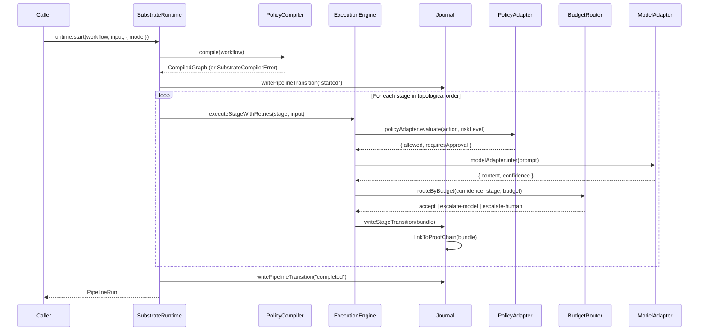

# Sovereign Execution Substrate — Architecture

> Phase 1 — April 2026

## Overview

The Sovereign Execution Substrate is the unified execution runtime for all SZL workflows. Every product surface (Lyte, Aegis, Vessels, Terra, PRISM Counsel, Carlota Jo) calls the substrate the same way: `runtime.start(workflow, input, { mode })`.

The substrate is architecturally distinctive against Temporal, LangGraph, Restate, and Inngest by combining four ideas that none of them ship together:

### 1. Policy-Shaped Graphs

Approval gates and side-effect policies are compiled into the pipeline topology, not enforced beside it. A non-compliant path is unreachable because the compiler refuses to produce a graph for it.

```typescript
// This throws SubstrateCompilerError at compile time, not runtime:
defineWorkflow({
  stages: [
    Decide({ sideEffects: ["financial"], highRiskSideEffects: ["financial"] }),
  ],
  policy: definePolicy({ id: "strict", minimumApprovalTier: "operator" }),
});
// Error: Stage 'decide' has high-risk side effects [financial] but no matching
// ApprovalGate (tier ≥ 'operator') is reachable in its ancestor chain.
```

*Architectural inspiration: LangGraph 1.0 interruptible graphs (interruption points as first-class nodes). No code ported.*

### 2. Evidence-Chained Transitions

Every stage transition writes an `EvidenceBundle` whose hash is linked into the existing proof-chain. The audit log *is* the journal; the journal *is* the audit log.

```
Stage A completes → EvidenceBundle(bundleHash: "abc123", parentHash: null)
Stage B completes → EvidenceBundle(bundleHash: "def456", parentHash: "abc123")
Stage C completes → EvidenceBundle(bundleHash: "ghi789", parentHash: "def456")
```

Identical inputs produce identical hashes — this is the replay identity guarantee.

*Architectural inspiration: Temporal durable execution (deterministic replay from event log). No code ported.*

### 3. Confidence-Budget Routing

Every pipeline runs against a declared confidence budget. Stages that fall below threshold auto-route to a stronger model adapter, a human approver, or a verifier — declaratively, not via ad-hoc if-statements.

```
confidence >= escalateAt (0.5)        → accept
confidence < escalateAt (0.5)         → escalate-model (stronger adapter)
confidence < requireHumanBelow (0.3)  → escalate-human (approval required)
```

*Architectural inspiration: Restate awakeables (durable awaitable events). No code ported.*

### 4. Counterfactual Replay

Replay isn't just "re-run from journal." It supports swapping model adapters, policy profiles, or evidence sources to answer "what would this run have decided under model B / policy v2 / yesterday's data?" — directly powering the Eval Console.

```bash
substrate replay <runId> --counterfactual --model=claude-opus --policy=strict-v2
```

*Architectural inspiration: Inngest typed steps (typed step functions with replay). No code ported.*

---

## Package Structure

```
packages/substrate/
├── src/
│   ├── index.ts               # Public API (defineWorkflow, runtime, stage factories)
│   ├── types.ts               # Zod schemas and TypeScript types (no `any`)
│   ├── stage-primitives.ts    # Reason(), Retrieve(), ToolCall(), Verify(), Decide(), ApprovalGate()
│   ├── compiler.ts            # Policy-shaped graph compiler (topology enforcement)
│   ├── journal.ts             # Evidence-chained journal (hash-stable, proof-chain linked)
│   ├── engine.ts              # Execution engine (hooks, retries, timeout, approval pauses)
│   ├── budget-router.ts       # Confidence-budget routing (escalate-model / escalate-human)
│   ├── adapters.ts            # MCP-shaped adapter registries (Model, Retriever, Tool, etc.)
│   ├── telemetry.ts           # OpenTelemetry spans, metrics, structured logs
│   ├── python-worker.ts       # Typed wire protocol for Python worker channel
│   ├── cli/
│   │   └── replay.ts          # Replay + counterfactual CLI and typed API endpoint
│   └── workflows/
│       └── opportunity-audit.ts  # Phase 1 reference workflow (Lyte domain)
```

## Execution Flow



## Design Constraints

- **No `any` in TypeScript** without an explicit justification comment
- **All API boundaries** validated with Zod schemas
- **Every stage** must emit OTel traces (enforced by engine)
- **No destructive refactor** of existing orchestrator, planner, guardian, or policy-engine
- **Substrate journal** is the single source of truth for substrate runs
- **Inspiration credits**: Temporal (durable execution), LangGraph 1.0 (interruptible graphs), Restate (awakeables), Inngest (typed steps) — no code copied from any of these projects
