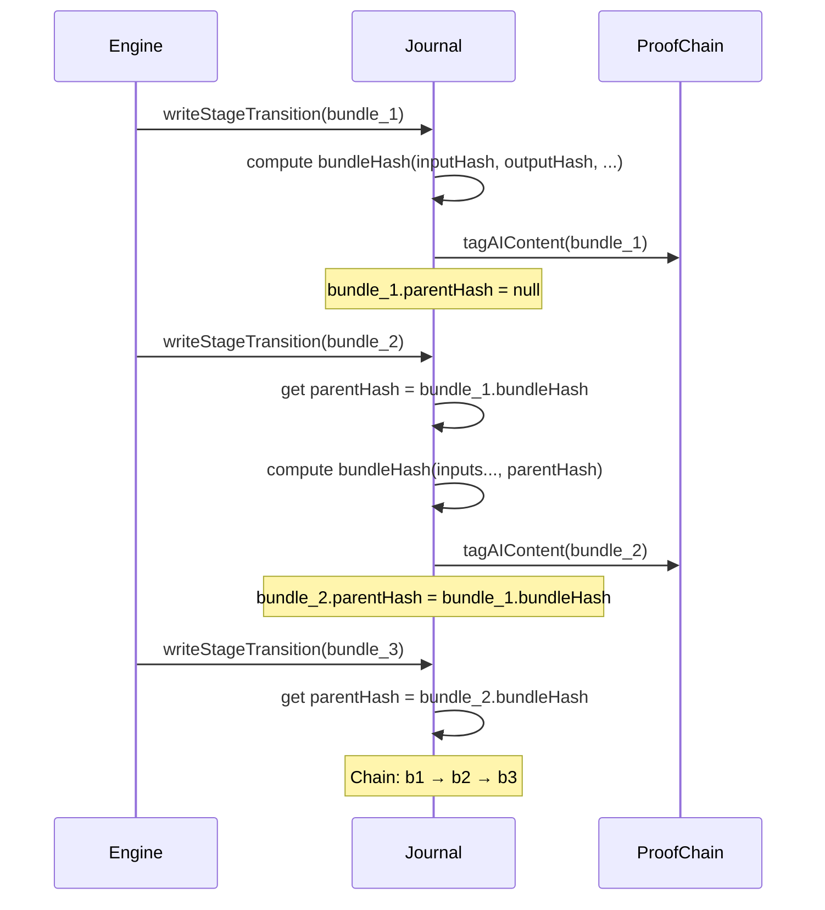

# Substrate Evidence Chain

## Overview

Every stage transition writes a signed `EvidenceBundle`. Bundles are hash-linked in sequence, forming a chain where each bundle references the hash of its predecessor. This chain is the audit log AND the journal — there is no separate audit store for substrate runs.

## EvidenceBundle Structure

```typescript
interface EvidenceBundle {
  bundleId: string;          // Unique bundle ID
  runId: string;             // Pipeline run this belongs to
  stageId: string;           // Stage that produced this bundle
  stageType: StageType;      // Reason | Retrieve | ToolCall | Verify | Decide
  workflowId: string;
  promptVersion?: string;    // Prompt version from prompt-registry
  toolId?: string;           // Tool ID if stage made a tool call
  toolArgs?: unknown;        // Tool arguments (for replay)
  toolResult?: unknown;      // Tool result (for replay)
  citations: string[];       // Evidence citations
  confidence: number;        // Stage confidence [0,1]
  policyOutcome?: "allowed" | "blocked" | "escalated" | "pending-approval";
  inputHash: string;         // SHA-256 of stage input (first 32 chars)
  outputHash: string;        // SHA-256 of stage output (first 32 chars)
  parentHash?: string;       // Hash of previous bundle in chain
  bundleHash: string;        // Deterministic hash of key fields
  createdAt: string;
  metadata: Record<string, unknown>;
}
```

## Hash Stability Guarantee

For a replay to be considered "identical" to the source run, the following must hold for every stage where inputs match:

```
sourceBundle.inputHash === replayBundle.inputHash
  → sourceBundle.bundleHash === replayBundle.bundleHash
```

The `bundleHash` is derived from `runId`, `stageId`, `inputHash`, `outputHash`, `confidence`, `policyOutcome`, and `parentHash`. Since `runId` differs between runs, the `bundleHash` itself will differ — but the deterministic derivation from inputs is stable.

`verifyReplayStability()` checks for any stage where `inputHash` matches but `bundleHash` derivation logic produces different results, indicating non-determinism.

## Proof-Chain Integration

Each bundle is linked into the `@szl-holdings/proof-chain` via `tagAIContent()`:

```typescript
await tagAIContent({
  contentId: bundle.bundleId,
  contentType: "substrate-evidence-bundle",
  sourceClass: "full_ai_generation",
  confidenceScore: bundle.confidence,
  correlationId: bundle.runId,
});
```

This is **best-effort** — proof-chain linking failure does not fail the pipeline. The substrate journal is the primary source of truth.

## Evidence Chain Diagram


