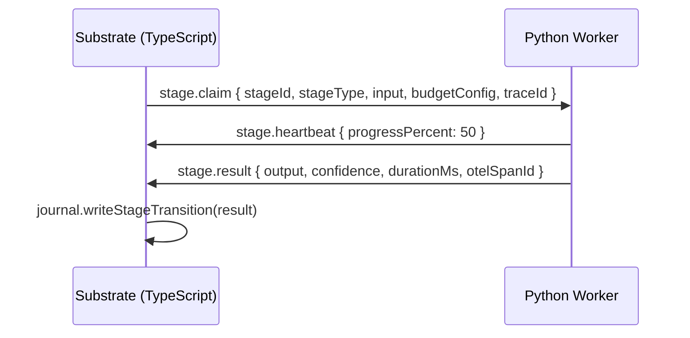

# Substrate Python Worker Protocol

## Overview

The Python worker channel enables stages tagged `runtime: "python"` to be executed by a Python process instead of the TypeScript engine. The TypeScript substrate retains full control of journal, policy, and evidence — only stage execution is federated.

## Wire Protocol

Protocol version: `1.0` (minimal, versioned)

All messages share a base envelope:

```json
{
  "protocolVersion": "1.0",
  "messageId": "uuid",
  "timestamp": "ISO-8601"
}
```

## Message Types

| Type | Direction | Description |
|---|---|---|
| `worker.register` | Worker → Substrate | Worker announces capabilities |
| `stage.claim` | Substrate → Worker | Dispatch a stage for execution |
| `stage.heartbeat` | Worker → Substrate | Keep-alive during long execution |
| `stage.result` | Worker → Substrate | Stage completed successfully |
| `stage.error` | Worker → Substrate | Stage failed (retryable or not) |
| `worker.shutdown` | Worker → Substrate | Worker is shutting down |

## Stage Claim Flow



## Starting the Worker

```bash
cd workers/substrate-python
pip install -r requirements.txt
uvicorn src.main:app --host 0.0.0.0 --port 8001
```

## Stage Types Supported (Phase 1)

| Type | Description |
|---|---|
| `Retrieve` | Heavy corpus retrieval (pgvector, Elasticsearch, S3 + OCR) |

Phase 2 will add: OCR pipeline, geospatial analysis, eval grading.

## Python Worker Health

```bash
curl http://localhost:8001/health
# → { "status": "healthy", "workerId": "...", "capabilities": { ... } }
```

## OTel Integration

Each Python stage creates its own OTel span. The `stage.result` message includes an `otelSpanId` that the TypeScript substrate links to its pipeline span as a child span. W3C `traceparent` propagation is included in `stage.claim` messages.
