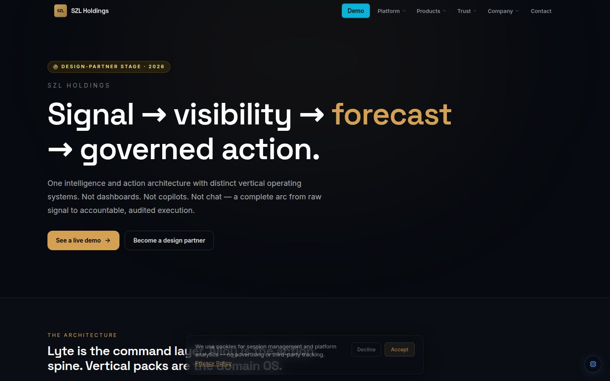
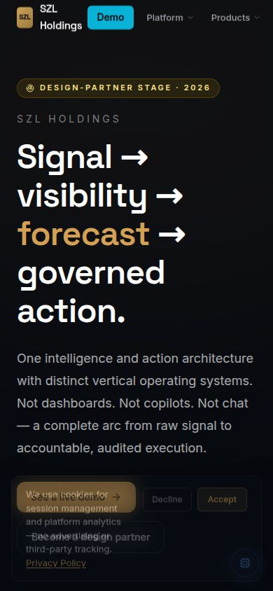
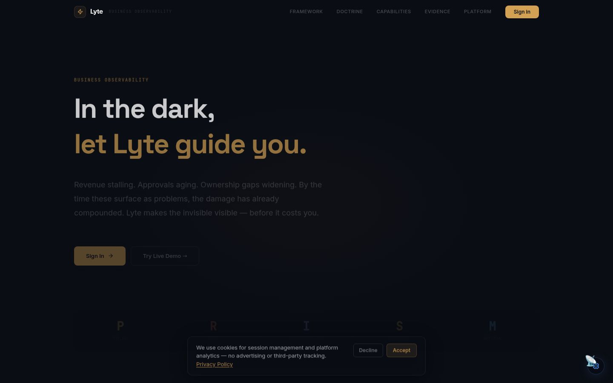
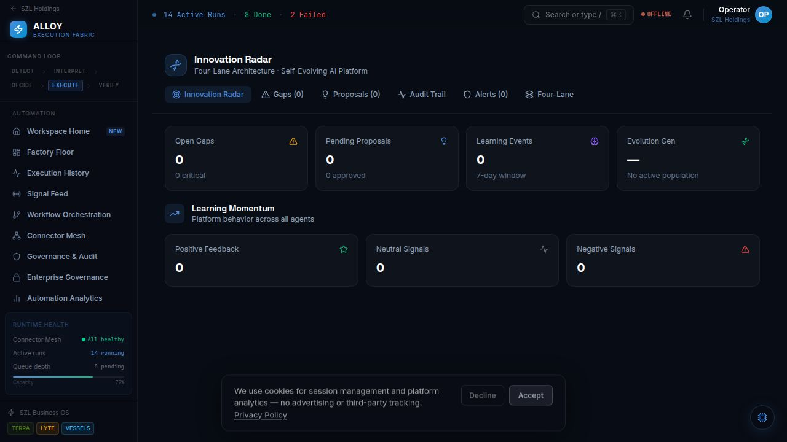
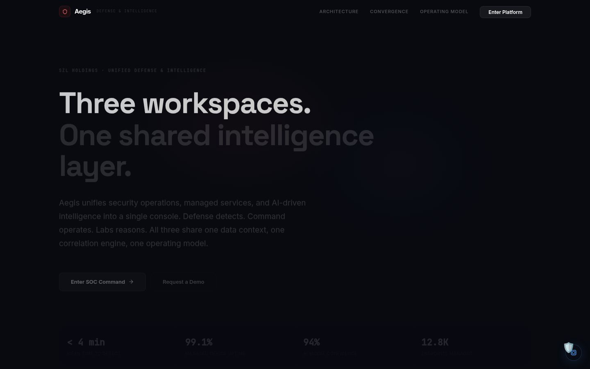
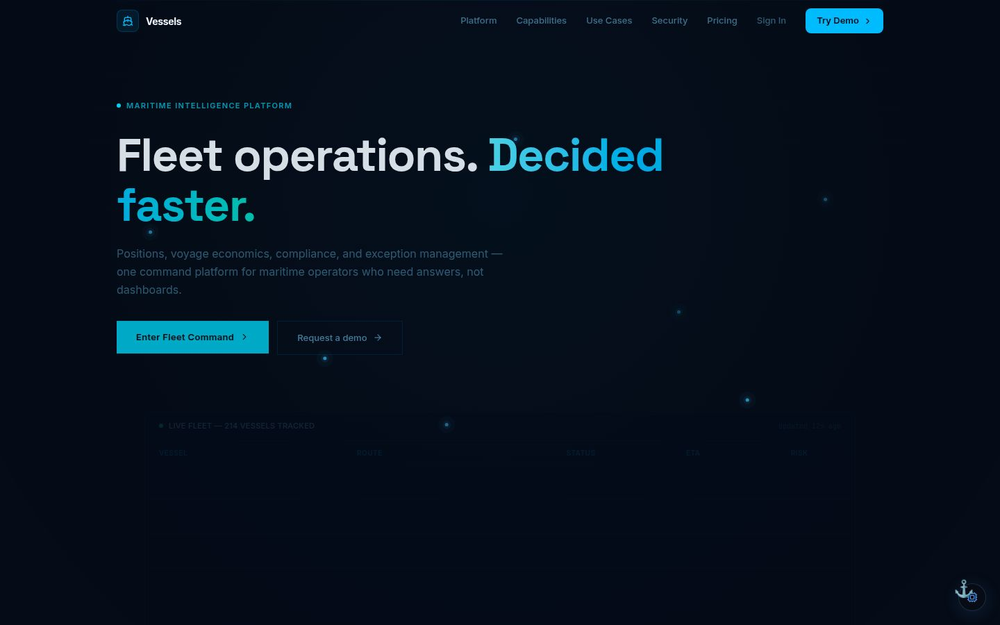
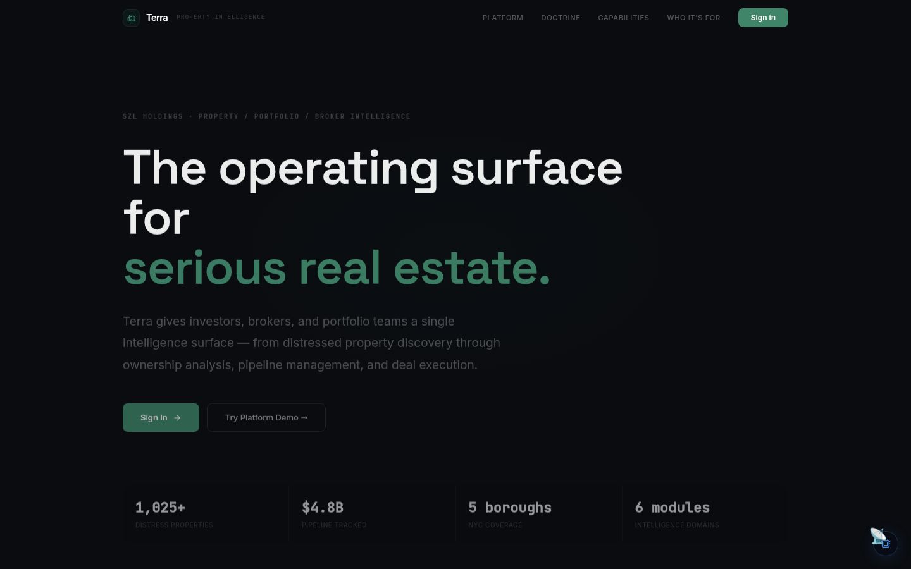
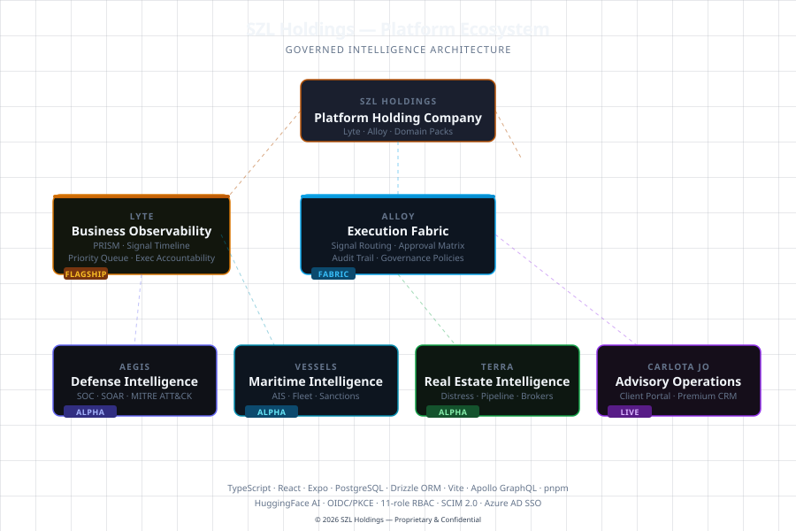

# Screenshots & Demos

**SZL Holdings Platform — Visual Gallery**

This page contains live screenshots and visual assets from all products in the SZL Holdings ecosystem. Screenshots are captured from running applications at 1440×900 (desktop) and 390×844 (mobile) viewports with dark-premium styling.

> Last updated: April 2026 · Version 2.0

---

## Table of Contents

- [SZL Holdings — Corporate Platform](#szl-holdings)
- [Lyte — Business Observability](#lyte)
- [Alloy — Execution Engine](#alloy)
- [Aegis — Defense & Intelligence](#aegis)
- [Vessels — Maritime Intelligence](#vessels)
- [Terra — Real Estate Intelligence](#terra)
- [PRISM Counsel — Legal Command](#prism-counsel)
- [Carlota Jo — Private Advisory](#carlota-jo)
- [Forge — Client & Investor Portal](#forge)
- [Nexus — Cross-Domain Intelligence](#nexus)
- [INCA Lab — AI Model Command](#inca-lab)
- [Stephen Lutar — Founder Site](#stephen-site)
- [Mobile Applications](#mobile-apps)
- [Architecture & Infrastructure](#architecture)
- [Demo Flows & Walkthrough](#demo-flows)
- [Capture Pipeline](#capture-pipeline)

---

## SZL Holdings — Corporate Platform {#szl-holdings}

### SZL Holdings — Platform Landing

Main marketing and corporate landing page. Dark-premium aesthetic with the core thesis: "Signal → visibility → forecast → governed action." Features the full product ecosystem overview, investor intelligence section, and design partner CTA.



**Path:** `/` · **Viewport:** 1440×900

---

### SZL Holdings — Mobile Responsive

Mobile viewport (390px) — responsive layout verification for the platform landing page. Hero section, product nav, and CTA stack correctly on mobile.



**Path:** `/` · **Viewport:** 390×844

---

### SZL Holdings — Hero

Hero section with full-bleed dark background, platform tagline, and primary CTAs. Screenshot used in GitHub org profile README and social preview.


**Path:** `/` · **Viewport:** 1440×900

---

## Lyte — Business Observability {#lyte}

### Lyte — Command Center Overview

Lyte marketing and command surface overview. PRISM framework visualization: People, Revenue, Infrastructure, Security, Market. Primary product showcase screenshot.



**Path:** `/lyte-command-center/` · **Viewport:** 1440×900

---

### Lyte — Hero (Marketing)

Lyte product page hero. "See everything. Govern everything." messaging with PRISM framework and Alloy integration callout.


**Path:** `/` (szl-holdings lyte section) · **Viewport:** 1440×900

---

### Lyte — Demo Flow Screens (Canonical)

Key screens from the Lyte + Alloy canonical demo (8-scene flow). See `docs/buyer/canonical-demo.md` for the full demo script.

| Scene | URL | Description |
|-------|-----|-------------|
| Scene 1 | `/lyte-command-center/signals` | Signal ingestion — Stripe webhook queue critical signal |
| Scene 2 | `/lyte-command-center/prism` | PRISM correlation — three signals as one cascade |
| Scene 3 | `/lyte-command-center/alloy/intelligence` | Evidence retrieval — RAG against org knowledge base |
| Scene 4 | `/lyte-command-center/alloy/intelligence` | Structured decision object — schema-validated output |
| Scene 5 | `/lyte-command-center/approvals` | Approval gate — human-in-the-loop with execution mode |
| Scene 6 | `/lyte-command-center/actions` | Action center — routing with full decision lineage |
| Scene 7 | `/lyte-command-center/alloy/intelligence` | Audit trail — immutable chain from signal to resolution |
| Scene 8 | `/lyte-command-center/` | Dashboard — signal resolved, value at risk updated |

**Demo activation:** `/lyte-command-center/?demo=true`

---

## Alloy — Execution Engine {#alloy}

### Alloy — Intelligence Overview

Alloy intelligence surface showing the RAG retrieval system, structured decision engine, and audit trail viewer.


**Path:** `/lyte-command-center/alloy/intelligence` · **Viewport:** 1440×900

---

### Alloy — Evolution Diagram

Alloy maturity progression diagram: from `observe_only` → `propose_only` → `approval_required` → `approved_execute`. Shows the four execution modes and the human-in-the-loop guarantee at each stage.



**Path:** `/lyte-command-center/alloy/` · **Viewport:** 1440×900

---

### Alloy — Hero (Marketing)

Alloy execution engine marketing surface. "Structured Intelligence. Human Accountability." Primary showcase for the Alloy proof chain concept.


**Path:** `/` (alloy section) · **Viewport:** 1440×900

---

## Aegis — Defense & Intelligence {#aegis}

### Aegis — Unified Defense Command

Aegis marketing and platform overview. SOC command surface, threat correlation engine, managed operations, and intelligence command in one console. Dark-premium command center aesthetic.



**Path:** `/firestorm/` · **Viewport:** 1440×900

---

### Aegis — Hero

Aegis hero section — "Unified Defense Intelligence Command." Full threat surface overview with SOC readiness indicators.


**Path:** `/firestorm/` · **Viewport:** 1440×900

---

### Aegis — Landing

Aegis platform landing with feature matrix: adversary persona modeling, attack replay simulation, blast radius visualization, threat hunting command center.


**Path:** `/firestorm/` · **Viewport:** 1440×900

---

## Vessels — Maritime Intelligence {#vessels}

### Vessels — Fleet Command

Vessels maritime intelligence platform overview. Fleet tracking, voyage economics, AIS analytics, and exception-based operations command surface.



**Path:** `/vessels/` · **Viewport:** 1440×900

---

### Vessels — Hero

Vessels platform hero — "Maritime Intelligence at Scale." Fleet overview with vessel tracking and voyage economics callouts.


**Path:** `/vessels/` · **Viewport:** 1440×900

---

### Vessels — Landing

Vessels detailed feature surface: AIS integration, voyage digital twin, MARPOL compliance monitoring, congestion prediction.


**Path:** `/vessels/` · **Viewport:** 1440×900

---

## Terra — Real Estate Intelligence {#terra}

### Terra — Real Estate Overview

Terra platform overview. Distress signal detection, ownership analysis across NYC's five boroughs, and deal pipeline management with ACRIS + HPD + DOB cross-referencing.



**Path:** `/terra/` · **Viewport:** 1440×900

---

### Terra — Hero

Terra platform hero — "See Distress Before the Market Does." Property genome scoring and distress signal timeline.


**Path:** `/terra/` · **Viewport:** 1440×900

---

### Terra — Landing

Terra detailed feature matrix: property genome engine, deal war rooms, market pulse radar, and investor intelligence.


**Path:** `/terra/` · **Viewport:** 1440×900

---

## PRISM Counsel — Legal Command {#prism-counsel}

### PRISM Counsel — Legal Matter Command

PRISM Counsel platform overview. Litigation intelligence, deadline governance with SLA tracking, evidence chain management, and AI-assisted outcome prediction.


**Path:** `/prism-counsel/` · **Viewport:** 1440×900

---

## Carlota Jo — Private Advisory {#carlota-jo}

### Carlota Jo — Private Advisory Platform

Carlota Jo bespoke advisory platform. Operational command for UHNW household and estate management, AI concierge with discretion mode, engagement timeline management.


**Path:** `/carlota-jo/` · **Viewport:** 1440×900

---

## Forge — Client & Investor Portal {#forge}

### Forge — Client & Investor Command

Forge client portal and investor relations surface. Deal room management, document vault, stakeholder intelligence, and live portfolio tracking.


**Path:** `/forge/` · **Viewport:** 1440×900

---

### Forge — Investor Dashboard

Investor relations view with portfolio performance, capital allocation summary, and deal pipeline overview.


---

## Nexus — Cross-Domain Intelligence {#nexus}

### Nexus — Fusion Intelligence Canvas

Nexus cross-domain intelligence canvas. Connects signal flows from Lyte, Aegis, Vessels, Terra, and PRISM Counsel into a unified intelligence surface. Pattern detection across domain boundaries.


**Path:** `/nexus/` · **Viewport:** 1440×900

---

## INCA Lab — AI Model Command {#inca-lab}

### INCA Lab — AI Governance & Deployment

INCA Lab AI model command and deployment surface. Multi-provider governance (Anthropic, OpenAI, Gemini, Groq), model routing rules, audit log, and latency/cost monitoring.


**Path:** `/inca-lab/` · **Viewport:** 1440×900

---

## Stephen Lutar — Founder Site {#stephen-site}

### Stephen Lutar — Founder Portfolio

Stephen Lutar founder site and investor dashboard. Personal portfolio overview with SZL Holdings platform showcase, design partner CTA, and investor relations access.


**Path:** `/stephen/` · **Viewport:** 1440×900

---

## Mobile Applications {#mobile-apps}

Seven mobile apps cover the core product surface for on-the-go operational command. All built with Expo SDK 53, React Native, and targeting iOS + Android.

| App | Platform | Key Screens |
|-----|----------|-------------|
| SZL Holdings Mobile | `/szl-holdings-mobile/` | Corporate dashboard, investor view, platform nav |
| Lyte Mobile | `/lyte-mobile/` | Signal feed, PRISM scores, approval queue, Alloy decisions |
| Aegis Mobile | `/aegis-mobile/` | Threat feed, SOC status, incident command |
| Vessels Mobile | `/vessels-mobile/` | Fleet map, voyage status, voyage economics |
| Terra Mobile | `/terra-mobile/` | Property search, distress map, deal pipeline |
| Carlota Jo Mobile | `/carlota-jo-mobile/` | Advisory feed, household command, discretion mode |
| Stephen Mobile | `/stephen-mobile/` | Founder dashboard, investor updates |

### Mobile — Hero (Marketing)

Mobile-first responsive layout verification showing the platform's mobile command center aesthetic.


**Viewport:** 390×844

---

### SZL Holdings Mobile

Corporate dashboard with investor view and full platform navigation.


**Path:** `/szl-holdings-mobile/` · **Viewport:** 390×844

---

### Lyte Mobile

Signal feed, PRISM scores, approval queue, and Alloy decision surface for on-the-go business observability.


**Path:** `/lyte-mobile/` · **Viewport:** 390×844

---

### Aegis Mobile

Threat feed, SOC status, and incident command surface for defense operations on mobile.


**Path:** `/aegis-mobile/` · **Viewport:** 390×844

---

### Vessels Mobile

Fleet map, voyage status, and voyage economics for maritime operations on mobile.


**Path:** `/vessels-mobile/` · **Viewport:** 390×844

---

### Terra Mobile

Property search, distress map, and deal pipeline for real estate intelligence on mobile.


**Path:** `/terra-mobile/` · **Viewport:** 390×844

---

### Carlota Jo Mobile

Advisory feed, household command, and discretion mode for private advisory on mobile.


**Path:** `/carlota-jo-mobile/` · **Viewport:** 390×844

---

### Stephen Mobile

Founder dashboard and investor updates — mobile companion for the founder portfolio.


**Path:** `/stephen-mobile/` · **Viewport:** 390×844

---

## Architecture & Infrastructure {#architecture}

### Ecosystem Map

Ecosystem-level view showing how all SZL Holdings products connect through the Alloy execution engine, shared schema, and shared libraries.



---

### Platform Architecture Map

Full platform architecture diagram showing Lyte, Alloy, and all domain intelligence packs. Includes shared library structure and data flow.


---

### Trust Center

Trust center surface showing security posture, compliance controls, known-gap register, and responsible disclosure policy.


**Path:** `/stephen/trust` · **Viewport:** 1440×900

---

### API Server — Endpoint Map

The API server exposes 1,618+ REST endpoints across all domain packs. Organized by domain: core platform, Lyte, Alloy, Aegis, Vessels, Terra, PRISM Counsel, Carlota Jo, Forge, Nexus, INCA Lab.

**API Path:** `/api/`  
**Health check:** `/api/health`  
**Endpoint count:** 1,618+

---

## Demo Flows & Walkthrough {#demo-flows}

### Canonical Demo — Lyte + Alloy (8 scenes, 8–12 minutes)

The primary investor and enterprise buyer demo. Full canonical script at `docs/buyer/canonical-demo.md`.

**Operating loop:**
```
Signal enters Lyte
  → PRISM scores and correlates
    → Alloy retrieves evidence (RAG)
      → Alloy produces structured decision object
        → Approval gate assessed
          → Human approves or revises
            → Action created and routed
              → Audit trail closes the loop
                → Dashboard reflects resolution
```

**Demo URL:** `/lyte-command-center/?demo=true`  
**Duration:** 8–12 minutes  
**Audience pivots:** Enterprise buyer, Investor/LP, Lender, Design partner

### Demo Dataset

| Signal | Source | Severity | Value at Risk |
|--------|--------|----------|---------------|
| Payment pipeline stalled — Stripe webhook queue 14.2k | PagerDuty | Critical | $2.3M |
| RDS replication lag 127s — failover risk | AWS CloudWatch | Critical | $800K |
| auth-service CrashLoopBackOff — Enterprise SSO broken | Sentry | High | $4.2M ARR |
| Q1 revenue forecast drift — 8.3% below plan | Terra | Medium | $800K |
| Northgate contract approval SLA breach — 48h overdue | Terra | Medium | $840K |
| IAM credential exfiltration — prod account | AWS GuardDuty | High | — |

---

## Capture Pipeline {#capture-pipeline}

Screenshots are captured using automated pipeline scripts in `scripts/media/`.

### Current Screenshot Inventory

| File | App | Description |
|------|-----|-------------|
| `szl-holdings-hero.jpg` | SZL Holdings | Hero section, full-bleed |
| `lyte-hero.jpg` | Lyte | Product hero |
| `lyte-overview.jpg` | Lyte | Command center overview |
| `lyte-overview-new.jpg` | Lyte | Updated command center |
| `alloy-hero.jpg` | Alloy | Execution engine hero |
| `alloy-overview.jpg` | Alloy | Intelligence surface |
| `alloy-evolution.jpg` | Alloy | Execution modes diagram |
| `aegis-hero.jpg` | Aegis | Defense command hero |
| `aegis-landing.jpg` | Aegis | Platform landing |
| `vessels-hero.jpg` | Vessels | Maritime hero |
| `vessels-landing.jpg` | Vessels | Platform landing |
| `terra-hero.jpg` | Terra | Real estate hero |
| `terra-landing.jpg` | Terra | Platform landing |
| `prism-counsel-hero.jpg` | PRISM Counsel | Legal command hero |
| `carlota-jo-hero.jpg` | Carlota Jo | Advisory platform hero |
| `stephen-lutar-hero.jpg` | Stephen Site | Founder portfolio hero |
| `investor-dashboard.jpg` | Forge/Investor | Investor dashboard |
| `forge-hero.jpg` | Forge | Deal room and investor portal hero |
| `nexus-hero.jpg` | Nexus | Cross-domain fusion intelligence canvas |
| `inca-lab-hero.jpg` | INCA Lab | AI governance and model routing surface |
| `szl-holdings-mobile-hero.jpg` | SZL Holdings Mobile | Corporate dashboard (390×844) |
| `lyte-mobile-hero.jpg` | Lyte Mobile | Signal feed and PRISM scores (390×844) |
| `aegis-mobile-hero.jpg` | Aegis Mobile | Threat feed and SOC status (390×844) |
| `vessels-mobile-hero.jpg` | Vessels Mobile | Fleet map and voyage status (390×844) |
| `terra-mobile-hero.jpg` | Terra Mobile | Property search and distress map (390×844) |
| `carlota-jo-mobile-hero.jpg` | Carlota Jo Mobile | Advisory feed and discretion mode (390×844) |
| `stephen-mobile-hero.jpg` | Stephen Mobile | Founder dashboard (390×844) |
| `trust-center.jpg` | Platform | Trust center |
| `landing-hero.jpg` | SZL Holdings | Marketing landing |
| `landing-hero-new.jpg` | SZL Holdings | Updated marketing landing |
| `mobile-narrow-hero.jpg` | Mobile | Mobile viewport hero |
| `szl-founder.jpg` | Founder | Founder portrait |

### Quality Standards

- **Viewport:** 1440×900 (desktop), 390×844 (mobile)
- **Format:** JPEG, 85–90% quality, progressive
- **Color scheme:** Dark (forced — all apps use dark-first design)
- **Scale:** 1× device pixel ratio
- **Demo data:** Must be visible and meaningful — no broken states or placeholder content
- **Demo label:** All demo-mode screenshots must show the DEMO badge (visible in header when `?demo=true` is set)

### Asset Placement Policy

| Destination | Purpose |
|-------------|---------|
| `docs/media/screenshots/` | Source originals |
| `docs/wiki/assets/` | Wiki gallery (this page) |
| `profile-readme/assets/` | GitHub profile README |
| `docs/media/social-preview/` | Social preview / OG image |
| `export/linkedin/carousel-assets/` | LinkedIn carousel images |

### Capture Commands

```bash
# Capture all screenshots (requires running apps via workflow system)
npx tsx scripts/media/capture-screenshots.ts

# Optimize and distribute to correct folders
npx tsx scripts/media/optimize-images.ts

# Regenerate this gallery
npx tsx scripts/media/generate-wiki-gallery.ts

# Manual per-app capture (substitute APP and PORT)
PORT=3000 BASE_PATH="/" pnpm --filter @workspace/szl-holdings run dev
# Then take screenshots at http://localhost:3000/

# Demo mode capture (Lyte + Alloy)
# Run Lyte Command Center then navigate to:
# http://localhost:6000/lyte-command-center/?demo=true
```
