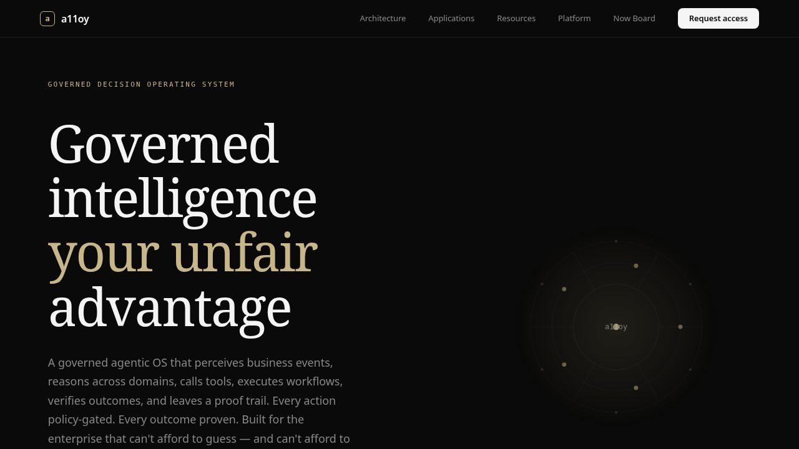
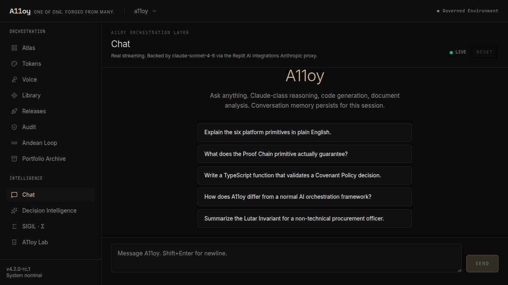
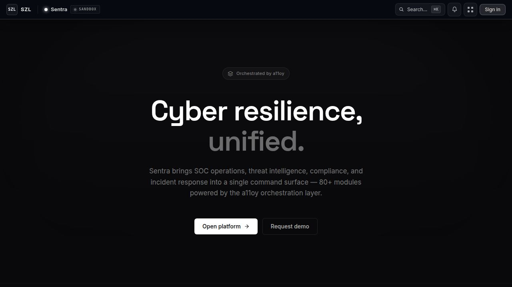
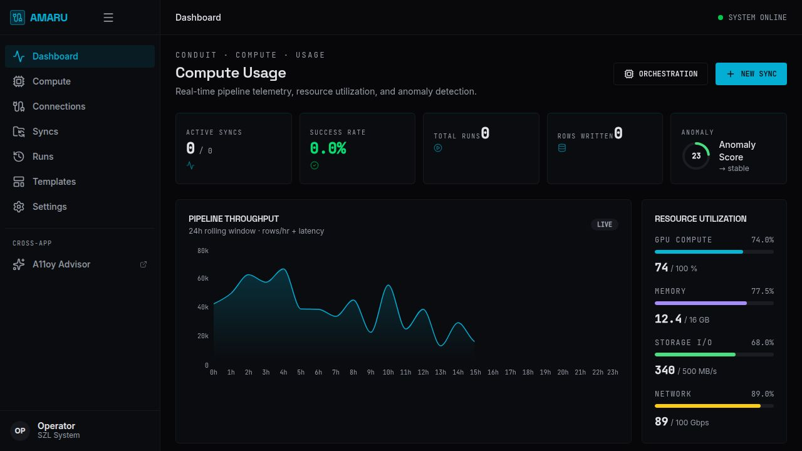
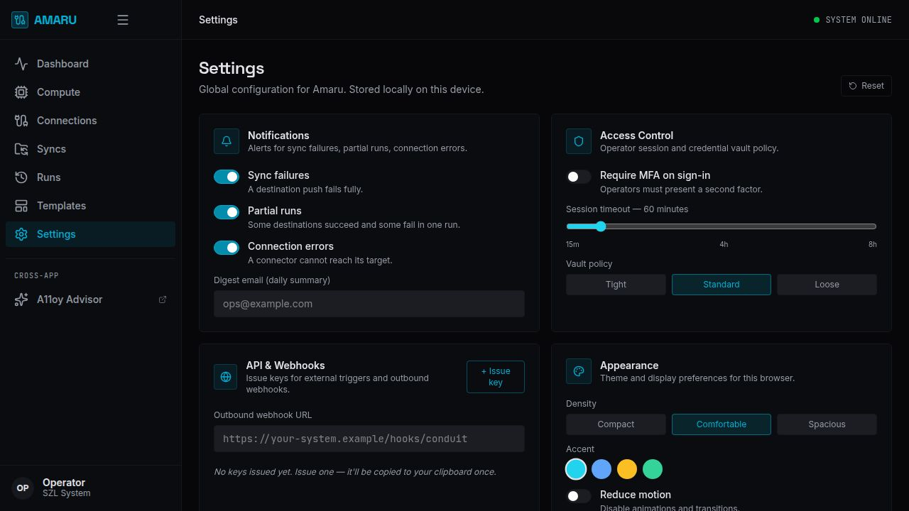
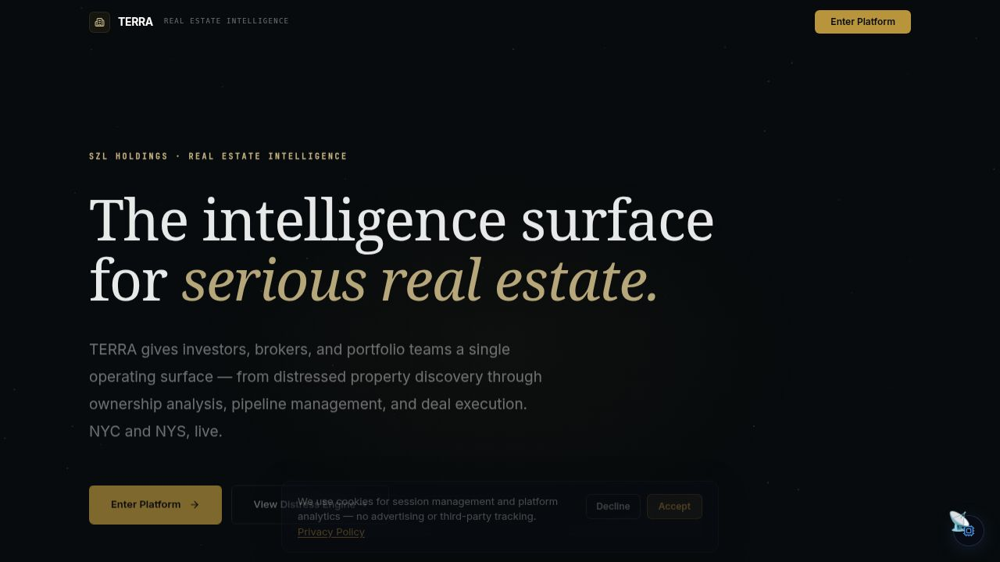
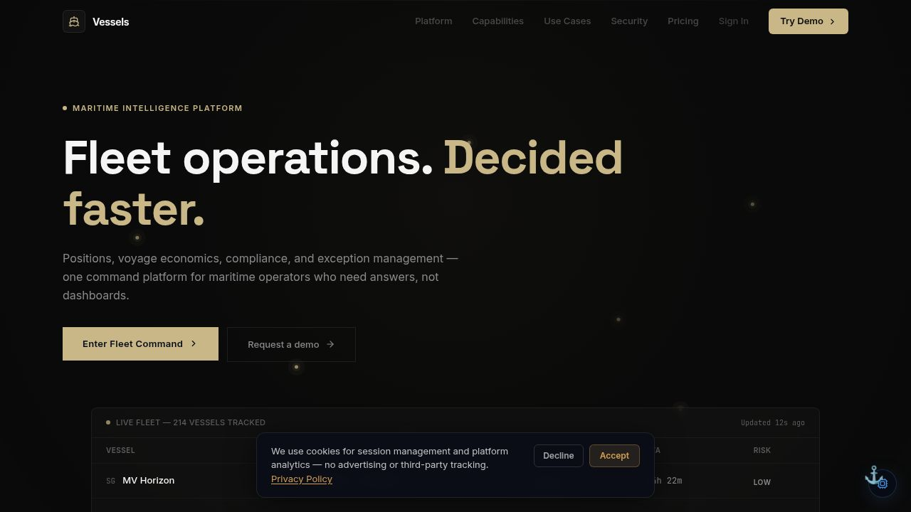
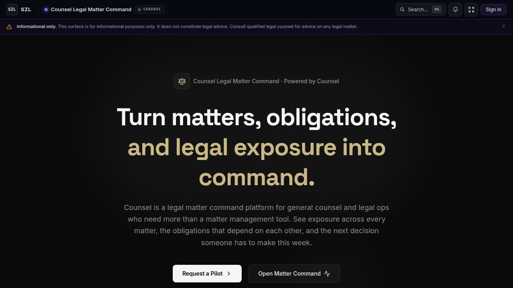
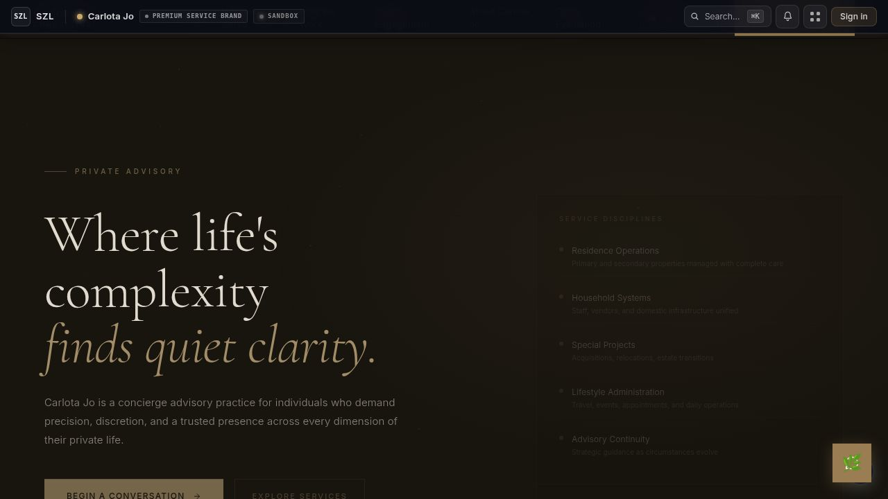

<!-- doctrine-scanner-exempt: legacy live-product surface; rename tracked as separate engineering debt — see scripts/check-doctrine-v6.mjs header. -->
# SZL Holdings — Operational Briefing
## Prepared for Empire APEX Accelerator

**Recipient:** Mercy McInnis, Procurement Counselor — Empire APEX Accelerator
**Meeting:** Tuesday, May 6, 2026 at 10:00 AM (Microsoft Teams)
**Author:** Stephen Lutar, Founder, SZL Holdings
**Author email:** stephenlutar2@gmail.com
**Document date:** May 3, 2026
**Document version:** 1.0

---

## 1. Executive Summary

SZL Holdings is building a unified operational intelligence and governance platform designed for complex, multi-domain environments. The platform bridges data ingestion, risk analysis, decision-making, execution, and auditability into a single continuous workflow.

The work is at the platform-development stage. There is an open-source runtime (Ouroboros) published under the SZL Holdings GitHub organization, a published peer-style thesis with a Zenodo DOI describing the bounded-loop convergence theorem the runtime implements, and a working multi-vertical product surface running in development. SZL Holdings is not currently performing on a federal contract. The purpose of this engagement with Empire APEX Accelerator is to receive procurement-readiness counsel and to identify federal and state contracting pathways where the platform is a credible fit.

This briefing summarizes what exists today, the public-proof artifacts that back it, and the procurement directions where the work appears to align.

---

## 2. The Governed Command Layer

The core architectural model is what the user describes as a governed command layer. Five stages, run as one continuous loop:

1. **Ingest** — Signals are continuously ingested and normalized across systems (operational, security, financial, document, sensor, third-party).
2. **Score** — Risks and opportunities are identified and scored in real time against policy.
3. **Decide** — Decisions are generated with AI support but require human approval where the policy says they must.
4. **Act** — Actions are executed with full traceability — every call recorded, every input hashed, every approver named.
5. **Verify** — Outcomes are verified against the original intent and recorded into an auditable history that can be replayed.

The convergence properties of this loop (when it is guaranteed to terminate, when it is bounded, what its proof-chain has to look like) are formalized in the Ouroboros Thesis paper described in section 6.

---

## 3. Platform Surface — Live Today

The platform runs as seven customer-facing product surfaces orchestrated by a single decision-intelligence layer (A11oy).

### A11oy — Orchestration + Decision Intelligence (the layer everything runs on)

Slug: `/a11oy/`

A11oy is the orchestration control plane and the decision-intelligence surface. It registers agents, applies validator policy, gates approvals, and is where operators monitor and govern bounded-loop runs across every vertical. As of May 3, 2026 the prior KORA (Decision Intelligence) product line has been consolidated into A11oy, so what was two surfaces is now one unified Orchestration + Decision Intelligence layer.

A live Claude-Sonnet-4.6-backed advisory chat is available at `/a11oy/chat`. Conversation memory persists per session, every prompt is rate-limited, and the system prompt cites the canonical SOURCE_OF_TRUTH numbers and the published Zenodo DOI so the model never fabricates platform metrics.

### Sentra — Cyber Resilience Command (codename TENAX)

Slug: `/sentra/`

Continuous threat-posture monitoring, evidence packs, and risk-tier escalation gates wired into the runtime contract.

### Amaru — Convergent Reverse-ETL (codename Conduit)

Slug: `/conduit/` (display name Amaru)

Append-only delta log, hash-verified ingest, and the three-witness reconciliation primitive (Frustum) from the Ouroboros Thesis. The data-convergence surface that feeds every other vertical.

Amaru's operator settings are fully wired — notifications, vault policy, MFA, session timeout, API key issuance with cryptographically random keys, outbound webhook URL, theme density, accent picker, and reduce-motion — all persisted locally per device, no "Coming soon" stubs.

### Terra — Real Estate Intelligence (codename DOMAINE)

Slug: `/terra/`

A single operating surface for investors, brokers, and portfolio teams: distressed-property discovery, ownership analysis, pipeline management, and deal execution. NYC and NYS data live.

### Vessels — Maritime Intelligence (codename SEXTANT)

Slug: `/vessels/`

Positions, voyage economics, compliance, exception management. Sanctions screening, dark-vessel detection, and provenance-bound source citation. Live fleet visibility for maritime operators.

### Counsel — Legal Matter Command

Slug: `/counsel/`

Matters, obligations, and legal exposure surfaced as a command surface. Policy-gated human review, evidence-bound recommendation, and citation-verified output through the runtime.

### Carlota Jo — Concierge Advisory Operations

Slug: `/carlota-jo/`

Premium service brand for individuals who require precision and discretion across every dimension of their private life. Proof-Chain decision-receipts bound to the runtime.

---

## 4. The Six Platform Primitives

Every vertical above is built on the same six primitives. This is what makes the platform a platform, not a portfolio of disconnected apps.

| Primitive | What it does |
|---|---|
| **Outcome Graph** | Every action is a node; every cause is an edge. The graph is the system of record for "what did we actually decide and why." |
| **Proof Chain** | Every output carries a hash chain back to the inputs and the human who approved each gated step. |
| **Covenant Policy** | Declarative policy that decides which actions are auto-allowed, which require human approval, and which are forbidden. |
| **Decision Simulation** | Decisions can be replayed against historical state to test policy changes before they ship. |
| **Workflow Engine** | The bounded-loop scheduler that runs the five stages of the governed command layer. |
| **Event Fabric (PRISM Bus)** | The append-only event spine. Everything that happens publishes here. |

---

## 5. Verified Platform Numbers

Every number below was produced by re-running the documented verification command in `SOURCE_OF_TRUTH.md` on May 3, 2026. No estimation.

| Metric | Verified value |
|---|---|
| Registered artifacts (artifact.toml files) | 9 |
| Customer-facing product surfaces (live) | 7 + the A11oy orchestration layer |
| Database tables (live, provisioned) | 848 |
| API endpoint declarations | 5,524 |
| Industry verticals | 7 |
| Monorepo packages (`packages/` + `lib/`) | 126 |
| DB schema files | 170 |
| CI workflows | 23 |
| Declared environment variables | 213 |
| Platform primitives | 6 |
| RBAC roles | 11 |
| Ouroboros runtime test calls | 133 |
| Codex-kernel test calls | 29 |

Numbers will continue to drift as the platform grows. The discipline here is that they are re-verified by command, not estimated. This is a contracting hygiene point, not a marketing one.

---

## 6. Public Proof — Why This Is More Than A Pitch

Two things are public on GitHub today, both under the `szl-holdings` organization, both with verifiable history:

### Ouroboros Runtime (open source)

Repository: `https://github.com/szl-holdings/ouroboros`
Latest release: **v6.2.0** — "v4 validator FUNCTIONS (runnable)" (May 2, 2026)
Release history: v6.0.0 → v6.1.0 → v6.2.0, each with public release notes.

This is the bounded-loop runtime that the platform is built on. It is not a marketing repo — it is the actual code, with tests, dependabot, CodeQL, and SECURITY.md.

### Ouroboros Thesis (peer-style paper, DOI-pinned)

Repository: `https://github.com/szl-holdings/ouroboros-thesis`
Latest release: **paper-v3-2.0.0** — "The Lutar Invariant (audit-supported rewrite)" (May 2, 2026)
DOI (v3 current): `10.5281/zenodo.19944926`  ·  Concept DOI: `10.5281/zenodo.19944926`  ·  Published: 2026-05-02  ·  Title: "The Loop Is the Product: Measuring Bounded Recursion as a System Primitive for Auditable AI"  ·  Author: Stephen P. Lutar (SZL Holdings), ORCID 0009-0001-0110-4173.  Earlier v2 empirical companion remains at DOI `10.5281/zenodo.19944926`.
License: CC-BY-4.0 (academic distribution)

The paper formalizes the convergence properties of the bounded-loop the runtime implements (the closed-form Λ bound). The May 2, 2026 release was an audit-supported rewrite that explicitly retracted a prior version (paper-v3-1.0.0) after a self-audit identified residual fabrications in announcement materials. That retraction is itself in the public record. This is how the platform's governance discipline shows up in its own publishing record: when something is wrong, it is publicly retracted and replaced.

---

## 7. Government Contracting Alignment

The work appears to align with four areas of increasing federal and state demand. These are alignment statements, not claims of past performance.

### Operational transparency and auditability

The Outcome Graph and Proof Chain primitives are designed to answer the question every IG, every audit committee, and every Congressional oversight letter eventually asks: "show your work." Every action carries its provenance. Every decision carries the policy that authorized it and the human who approved it where required.

### Cybersecurity and risk management

Sentra is the customer-facing surface for this. The deeper architectural fit is that the runtime treats every action as a security event by default — it is logged, it is signed, it is replayable. This is the posture the OMB / CISA Zero Trust and continuous-monitoring directions are moving toward.

### AI governance and responsible automation

The Covenant Policy primitive is the answer to "how do you gate AI outputs?" Decisions that the policy says require human approval cannot be auto-executed; the runtime enforces this. The Decision Simulation primitive lets agencies test policy changes against historical state before they ship — relevant to the OMB M-24-10 family of AI risk-management directions.

### Cross-system interoperability and data lineage

Amaru (the convergent reverse-ETL surface) is the answer to "how do we get a single trusted view of state across N systems?" The three-witness reconciliation primitive (Frustum, formalized in the Thesis paper) gives a defensible answer to that question for environments where regulators ask for it.

---

## 8. What SZL Holdings Is Not Claiming

This is included deliberately, because it is the thing that builds trust with a procurement counselor faster than anything else.

- SZL Holdings is **not currently performing on any federal contract**.
- SZL Holdings has **not received a federal cloud authorization**, an ATO, or any DoD impact-level designation.
- SZL Holdings has **not been audited by an outside firm**.
- SZL Holdings has **no signed customer contracts** for the platform itself at this writing.
- SZL Holdings is **a single-founder operation** (Stephen Lutar). There is no team to misrepresent.
- The numbers in section 5 are **internal platform metrics** — they describe what has been built, not revenue or users.

The strength of the position is the public proof (section 6), not pretended traction.

---

## 9. Suggested Discussion for May 6

The areas where Empire APEX Accelerator counsel would be most useful, in priority order:

1. **Pathway questions.** Given the public-proof posture and the absence of a current contract, what is the most credible NYS pathway? OGS centralized contract? On-call advisory pool? Subcontract / mentor-protégé under a NYS prime?
2. **Federal pathway.** Same question for the federal side. SBIR Phase I as the fastest credible entry point? GSA MAS via a sponsoring contract holder? Direct response to a sources-sought notice in the AI governance / continuous-monitoring space?
3. **Registration sequence.** SAM.gov UEI, CAGE, NAICS selection, small-business size standard, 8(a) / SDB / SDVOSB / WOSB self-cert eligibility review, NYS Vendor Responsibility Questionnaire. What order, what is realistic on what timeline.
4. **Capability statement format.** Section 8 below is a draft — counsel on what NYS and federal procurement officers actually want to see on the page would be welcome.
5. **Realistic targeting.** Which agencies (NYS or federal) actually buy this kind of work, and which buy it from sole-founder firms.

---

## 10. Capability Statement (Draft)

A standalone one-pager is at `dossier/SZL_Holdings_Capability_Statement.md`. The summary version:

| Field | Value |
|---|---|
| Company | SZL Holdings |
| Founder / Principal | Stephen Lutar |
| Headquarters | New York State |
| Email | stephenlutar2@gmail.com |
| Website | szl-holdings GitHub organization |
| UEI / CAGE / DUNS | To be assigned upon SAM.gov registration |
| Business size | Small business, single-founder |
| Primary NAICS | 541512 Computer Systems Design Services |
| Secondary NAICS | 541511, 541519, 541611, 541690 |
| Primary capability | Governed operational-intelligence platform; AI governance; auditable decision-systems |
| Differentiator | Open-source runtime + DOI-pinned theoretical proof; full proof-chain by construction |
| Public proof | github.com/szl-holdings/ouroboros (v6.2.0, 172/172 tests); github.com/szl-holdings/ouroboros-thesis (paper-v3-2.0.0, DOI 10.5281/zenodo.19944926) |

---

## 11. Documents Attached / Available On Request

- This briefing (`dossier/SZL_Holdings_Empire_APEX_Briefing.md`).
- Capability Statement one-pager (`dossier/SZL_Holdings_Capability_Statement.md`).
- Live screenshots of each of the seven product surfaces, captured May 3, 2026 (`dossier/screenshots/`).
- Ouroboros Thesis paper-v3-2.0.0 PDF (publicly available at the Zenodo DOI above).
- A11oy interactive chat surface backed by Claude Sonnet 4.6 via the Replit AI Integrations Anthropic proxy. Live in the platform at `/a11oy/chat`; SSE streaming with multi-turn memory; system prompt restricts the model to truthful descriptions of the SZL Holdings platform and refuses fabricated metrics.
- Source-of-truth audit trail (`SOURCE_OF_TRUTH.md` and `audit/source-of-truth.json` in the platform repository).

---

## 12. Closing

The premise of this work is straightforward: governed AI cognition is going to be a procurement requirement before long, not a procurement preference. The earlier a platform is built around proof-chain by construction, the harder it is to retrofit later, and the cheaper it is for the buyer at audit time. SZL Holdings is one founder choosing to build it that way from the runtime up, in the open, with the math written down.

The May 6 conversation is about how to get this in front of buyers responsibly.

Thank you for the time.

— Stephen Lutar
   Founder, SZL Holdings
   stephenlutar2@gmail.com
