# PhD-Systems Proposal: Verifiable Span Protocol (VSP)
## Receipt-Cryptographic OpenTelemetry for the ouroboros Runtime

**Author:** Lutar, Stephen P. · ORCID [0009-0001-0110-4173](https://orcid.org/0009-0001-0110-4173) · SZL Holdings  
**Date:** 2026-05-15  
**Operation:** Meditation V5 — PhD-Systems subagent  
**Output:** `phd_systems/proposal.md`  
**Direction chosen:** A (Receipt-OTel bridge) — extended to Verifiable Span Protocol (VSP)

---

## Executive Summary

The one-of-one engineering contribution proposed here is the **Verifiable Span Protocol (VSP)**: a TypeScript library and ouroboros runtime extension that emits [OpenTelemetry GenAI Semantic Conventions v1.37](https://opentelemetry.io/docs/specs/semconv/gen-ai/) spans from every Λ-gate evaluation, with the receipt hash embedded as the OTel `trace_id` and the complete 9-axis Λ-vector embedded as span attributes. The ρ-closure witness pair is recorded as a span event carrying the `byte_identical` flag and the `chain_root`. The result is the first AI observability integration in the world where every OTel span is **cryptographically verifiable**: any engineer with a Langfuse or Arize Phoenix dashboard can verify the causal integrity of every AI decision trace back to the Merkle-anchored receipt chain without access to szl-holdings internal systems.

This closes the P1 gap identified honestly in the [Recon-DevPractice report](../recon_devpractice/leaders.md) — "Zero OTel GenAI SemConv coverage; no per-span cost or token-usage telemetry" — while simultaneously creating a moat that [LangGraph](https://github.com/langchain-ai/langgraph), [Mastra](https://github.com/mastra-ai/mastra), and [Claude Code](https://github.com/anthropics/claude-code) cannot replicate without adopting a fundamentally different architecture. The missing primitives are the Curry-Howard receipt calculus (TH7 from [Math Pod V3](../../math_pod_v3/PM_MATH_REPORT.md)), the Λ-Category morphism semantics (TH4), and the 5× byte-identical ρ-closure chain — none of which any of those three systems possesses or has a path to acquire without discarding their current architecture.

**Shippable in 4 weeks. No regression on p50 11.5 µs. Receipt size stays ≤ 256 bytes.**

---

## 1. Why This Direction Beats A–G

A systematic comparison of the candidate directions against the HARD CONSTRAINTS:

| Direction | Honest gap closed? | Usable foundation? | Shippable 2-6 wk? | One-of-one? |
|---|---|---|---|---|
| A — Receipt-OTel bridge (VSP) | ✓ P1 observability — #1 priority in recon | ✓ receipt chain + TH4 + TH7 | ✓ 4 weeks | ✓ first verifiable OTel spans |
| B — A2A-receipt | ✓ A2A gap real | ✓ amaru spine layer | Partial — requires counterparty | Weaker — A2A is pure protocol |
| C — lutar-sandbox | ✓ real gap | ✗ no existing sandbox substrate | ✗ 8-12 weeks | Medium |
| D — SLSA-L3 + Sigstore | ✓ P2 gap real | ✓ .github workflows | ✓ 2 days | ✗ table-stakes, not one-of-one |
| E — Production cassette | ✓ P4 gap real | ✓ ouroboros replay | ✓ 4-6 wk | Medium — Shepherd paper covers part |
| F — METR submission | ✓ P5 gap real | Partial | ✓ 4 wk | Weak — eval plumbing, not architecture |
| G — AILuminate v2 | ✓ external benchmark | Partial | ✓ 3 wk | Weak — eval submission, not build |

VSP (direction A, extended) wins because: it closes the single highest-priority table-stakes gap (P1 OTel), it exploits the two most unique architectural primitives (TH7 Curry-Howard receipts + ρ-closure), it produces an externally visible artifact (OTel spans in any dashboard), and it directly fuses the formal proof layer with the observability layer in a way no competitor can replicate.

SLSA-L3 (D) is genuinely faster but it is not one-of-one — any team can do it in an afternoon. The moat of VSP is conceptual and architectural: **spans are proofs**.

---

## 2. System Diagram

```mermaid
block-beta
  columns 3

  block:agent_layer["Agent Layer (a11oy / amaru)"]
    A1["CovenantPolicy<br/>evaluate()"]
    A2["AppendOnlyLog<br/>ingest()"]
  end

  block:kernel["ouroboros Brain Stem"]
    K1["evaluate_lambda()<br/>Λ₉ gate · 3.12 µs"]
    K2["buildReceipt()<br/>11.5 µs p50"]
    K3["ρ-closure<br/>dual-witness"]
  end

  block:vsp["VSP Layer (NEW)"]
    V1["LambdaSpanEmitter<br/>OTel GenAI v1.37"]
    V2["ReceiptTracer<br/>trace_id = receipt_hash"]
    V3["RhoClosureEvent<br/>span event"]
  end

  block:export["OTel Export"]
    E1["OTLP/gRPC<br/>or OTLP/HTTP"]
    E2["Langfuse /<br/>Arize Phoenix"]
    E3["Honeycomb /<br/>Datadog"]
  end

  block:verify["Verification Path (new)"]
    VF1["receipt_hash in span<br/>→ lookup ouroboros chain"]
    VF2["λ_vector attributes<br/>→ verify floors"]
    VF3["rho_byte_identical<br/>→ confirm replay root"]
  end

  A1 --> K1
  A2 --> K1
  K1 --> K2
  K2 --> K3
  K1 --> V1
  K2 --> V2
  K3 --> V3
  V1 --> E1
  V2 --> E1
  V3 --> E1
  E1 --> E2
  E1 --> E3
  E2 --> VF1
  E1 --> VF2
  E1 --> VF3
```



**Data flow narrative:** Every call to `evaluate_lambda()` in the ouroboros brain-stem triggers the VSP `LambdaSpanEmitter`. The emitter opens an OTel span whose `trace_id` is the 16-byte prefix of the receipt hash (per OTel spec, `trace_id` is 128-bit / 16 bytes). The 9-axis Λ-vector is recorded as span attributes using the `gen_ai.` namespace. After `buildReceipt()` completes, the emitter records the ρ-closure event (witness hashes, `byte_identical` flag, `chain_root`). The span is then exported via OTLP to any backend. Any engineer receiving the span can take the `trace_id`, look it up against the ouroboros chain endpoint, and verify that the receipt hash matches — proving the span was emitted by a runtime that produced a cryptographically sound, byte-identical-replay-verified decision.

---

## 3. API Specification

### 3.1 Core TypeScript Interfaces

```typescript
// packages/ouroboros/src/vsp/types.ts

/**
 * VSP — Verifiable Span Protocol
 * Emits OTel GenAI SemConv v1.37 spans from every Λ-gate evaluation.
 * Receipt hash is embedded as trace_id prefix; Λ-vector as span attributes.
 *
 * Author: Lutar, Stephen P. · ORCID 0009-0001-0110-4173
 * License: Apache-2.0
 */

import type { Span, Tracer, SpanStatusCode } from "@opentelemetry/api";
import type { Receipt } from "../receipt/types.js";
import type { LambdaVector, LambdaResult } from "../lambda/types.js";

/** Configuration for the VSP emitter. */
export interface VspConfig {
  /** OTel service name. Defaults to "szl-holdings/ouroboros". */
  serviceName?: string;
  /** OTLP endpoint. Defaults to OTEL_EXPORTER_OTLP_ENDPOINT env var. */
  otlpEndpoint?: string;
  /** Whether to include the full receipt JSON in span attributes (adds ~200 bytes). Default false. */
  includeFullReceipt?: boolean;
  /** Whether to include ρ-witness hashes in span events. Default true. */
  includeRhoWitnesses?: boolean;
}

/** Span attributes emitted per OTel GenAI SemConv v1.37. */
export interface LambdaSpanAttributes {
  // OTel GenAI SemConv v1.37 standard fields
  "gen_ai.system": "szl-holdings/ouroboros";
  "gen_ai.operation.name": "lambda_gate" | "receipt_build" | "rho_closure";
  "gen_ai.request.model": string;           // ouroboros version string, e.g. "ouroboros/v6.4.0"
  "gen_ai.usage.input_tokens"?: number;     // token count if available from LLM step

  // SZL VSP extension attributes (prefix: szl.vsp.)
  "szl.vsp.receipt_hash": string;           // full 64-char hex receipt hash
  "szl.vsp.schema_version": "1.0";
  "szl.vsp.lambda_pass": boolean;           // true iff ALL axes >= floor
  "szl.vsp.lambda_composite": number;       // geometric mean of 9-axis values

  // 9-axis Λ-vector (one attribute per axis, floor annotated in description)
  "szl.vsp.lambda.moral_grounding": number;      // floor 0.95
  "szl.vsp.lambda.measurability_honesty": number;// floor 0.95
  "szl.vsp.lambda.temporal_consistency": number; // floor 0.90
  "szl.vsp.lambda.information_integrity": number;// floor 0.90
  "szl.vsp.lambda.action_reversibility": number; // floor 0.90
  "szl.vsp.lambda.scope_containment": number;    // floor 0.90
  "szl.vsp.lambda.stakeholder_alignment": number;// floor 0.90
  "szl.vsp.lambda.evidence_adequacy": number;    // floor 0.90
  "szl.vsp.lambda.consent_boundary": number;     // floor 0.90

  // Chain linkage
  "szl.vsp.chain_root": string;             // 64-char hex chain root
  "szl.vsp.prev_chain_hash": string;        // hash of previous receipt
  "szl.vsp.source_region": string;          // e.g. "ouroboros"
  "szl.vsp.target_region": string;          // e.g. "a11oy"
  "szl.vsp.actor_id": string;               // actor identifier
}

/** Span event for ρ-closure witness. */
export interface RhoClosureSpanEvent {
  name: "szl.vsp.rho_closure";
  attributes: {
    "szl.vsp.rho.replay_count": 5;           // always 5× for doctrine compliance
    "szl.vsp.rho.byte_identical": boolean;    // must be true for PASS
    "szl.vsp.rho.chain_root": string;         // 64-char hex
    "szl.vsp.rho.witness_1_hash"?: string;    // included if includeRhoWitnesses = true
    "szl.vsp.rho.witness_2_hash"?: string;
  };
}

/** Primary emitter interface. */
export interface ILambdaSpanEmitter {
  /**
   * Emit an OTel span for a completed Λ-gate evaluation + receipt build.
   * The span's trace_id is set to the first 16 bytes of the receipt hash.
   * Returns the active Span for caller to add additional attributes if needed.
   */
  emitLambdaSpan(
    receipt: Receipt,
    lambdaResult: LambdaResult,
    options?: EmitOptions
  ): Span;

  /**
   * Convenience: wrap an existing receipt-building call and emit the span
   * automatically. Safe to call even if OTel is not configured (no-ops).
   */
  wrapReceiptBuild<T>(
    buildFn: () => Promise<{ receipt: Receipt; lambdaResult: LambdaResult; value: T }>,
    options?: EmitOptions
  ): Promise<T>;

  /** Flush pending spans to the exporter. Call before process exit. */
  shutdown(): Promise<void>;
}

export interface EmitOptions {
  /** Additional span attributes to merge. */
  extraAttributes?: Record<string, string | number | boolean>;
  /** Span name override. Defaults to "szl.vsp.lambda_gate". */
  spanName?: string;
}
```

### 3.2 Implementation Sketch

```typescript
// packages/ouroboros/src/vsp/emitter.ts

import { trace, SpanStatusCode, context, ROOT_CONTEXT } from "@opentelemetry/api";
import { NodeSDK } from "@opentelemetry/sdk-node";
import { OTLPTraceExporter } from "@opentelemetry/exporter-trace-otlp-grpc";
import { resourceFromAttributes } from "@opentelemetry/resources";
import {
  ATTR_SERVICE_NAME,
  ATTR_SERVICE_VERSION,
} from "@opentelemetry/semantic-conventions";
import type {
  VspConfig,
  LambdaSpanAttributes,
  ILambdaSpanEmitter,
  EmitOptions,
  RhoClosureSpanEvent,
} from "./types.js";
import type { Receipt } from "../receipt/types.js";
import type { LambdaResult } from "../lambda/types.js";

/** Convert 64-char hex receipt hash to OTel 32-char hex trace_id. */
function receiptHashToTraceId(receiptHash: string): string {
  // OTel trace_id is 128-bit = 32 hex chars.
  // Use first 32 chars of 64-char SHA-256 receipt hash.
  // Invariant: receipt hashes are always 64-char lowercase hex per ouroboros schema v1.0.
  return receiptHash.slice(0, 32).toLowerCase();
}

export function createLambdaSpanEmitter(config: VspConfig = {}): ILambdaSpanEmitter {
  const tracer = trace.getTracer(
    config.serviceName ?? "szl-holdings/ouroboros",
    process.env.npm_package_version ?? "6.4.0"
  );

  return {
    emitLambdaSpan(receipt: Receipt, lambdaResult: LambdaResult, opts?: EmitOptions) {
      const traceId = receiptHashToTraceId(receipt.receipt_hash);
      const spanName = opts?.spanName ?? "szl.vsp.lambda_gate";

      // Create span under a context that forces the trace_id to equal the receipt hash prefix.
      // This is the core VSP invariant: trace_id IS the receipt identifier.
      const spanContext = {
        traceId,
        spanId: traceId.slice(0, 16), // span_id = first 8 bytes of trace_id
        traceFlags: 1,
        isRemote: false,
      };
      const parentCtx = trace.setSpanContext(ROOT_CONTEXT, spanContext);

      const span = tracer.startSpan(spanName, {}, parentCtx);

      // Set OTel GenAI SemConv v1.37 standard attributes
      span.setAttributes({
        "gen_ai.system": "szl-holdings/ouroboros",
        "gen_ai.operation.name": "lambda_gate",
        "gen_ai.request.model": `ouroboros/${process.env.npm_package_version ?? "6.4.0"}`,

        // VSP core attributes
        "szl.vsp.receipt_hash":     receipt.receipt_hash,
        "szl.vsp.schema_version":   "1.0",
        "szl.vsp.lambda_pass":      lambdaResult.pass,
        "szl.vsp.lambda_composite": lambdaResult.composite,
        "szl.vsp.chain_root":       receipt.rho_closure.chain_root,
        "szl.vsp.prev_chain_hash":  receipt.prev_chain_hash,
        "szl.vsp.source_region":    receipt.source_region,
        "szl.vsp.target_region":    receipt.target_region,
        "szl.vsp.actor_id":         receipt.actor_id,

        // 9-axis Λ-vector
        "szl.vsp.lambda.moral_grounding":       receipt.lambda_vector.moralGrounding,
        "szl.vsp.lambda.measurability_honesty": receipt.lambda_vector.measurabilityHonesty,
        "szl.vsp.lambda.temporal_consistency":  receipt.lambda_vector.temporalConsistency,
        "szl.vsp.lambda.information_integrity": receipt.lambda_vector.informationIntegrity,
        "szl.vsp.lambda.action_reversibility":  receipt.lambda_vector.actionReversibility,
        "szl.vsp.lambda.scope_containment":     receipt.lambda_vector.scopeContainment,
        "szl.vsp.lambda.stakeholder_alignment": receipt.lambda_vector.stakeholderAlignment,
        "szl.vsp.lambda.evidence_adequacy":     receipt.lambda_vector.evidenceAdequacy,
        "szl.vsp.lambda.consent_boundary":      receipt.lambda_vector.consentBoundary,

        // Additional caller attributes
        ...opts?.extraAttributes,
      } as LambdaSpanAttributes & Record<string, string | number | boolean>);

      // Emit ρ-closure span event
      const rhoEvent: RhoClosureSpanEvent = {
        name: "szl.vsp.rho_closure",
        attributes: {
          "szl.vsp.rho.replay_count":   5,
          "szl.vsp.rho.byte_identical": receipt.rho_closure.byte_identical,
          "szl.vsp.rho.chain_root":     receipt.rho_closure.chain_root,
          ...(config.includeRhoWitnesses !== false && {
            "szl.vsp.rho.witness_1_hash": receipt.rho_closure.witness_1_hash,
            "szl.vsp.rho.witness_2_hash": receipt.rho_closure.witness_2_hash,
          }),
        },
      };
      span.addEvent(rhoEvent.name, rhoEvent.attributes);

      // Span status: OK if lambda_pass && rho_closure byte_identical; ERROR otherwise
      if (lambdaResult.pass && receipt.rho_closure.byte_identical) {
        span.setStatus({ code: SpanStatusCode.OK });
      } else {
        span.setStatus({
          code: SpanStatusCode.ERROR,
          message: lambdaResult.pass
            ? "rho_closure: byte_identical = false"
            : `lambda FAIL: ${lambdaResult.failedAxes?.join(", ")}`,
        });
      }

      span.end();
      return span;
    },

    async wrapReceiptBuild<T>(
      buildFn: () => Promise<{ receipt: Receipt; lambdaResult: LambdaResult; value: T }>,
      opts?: EmitOptions
    ): Promise<T> {
      const result = await buildFn();
      this.emitLambdaSpan(result.receipt, result.lambdaResult, opts);
      return result.value;
    },

    async shutdown(): Promise<void> {
      await trace.getTracerProvider().forceFlush?.();
    },
  };
}
```

### 3.3 SDK Initialization Helper

```typescript
// packages/ouroboros/src/vsp/sdk.ts

import { NodeSDK } from "@opentelemetry/sdk-node";
import { OTLPTraceExporter } from "@opentelemetry/exporter-trace-otlp-grpc";
import { resourceFromAttributes } from "@opentelemetry/resources";
import { ATTR_SERVICE_NAME } from "@opentelemetry/semantic-conventions";
import type { VspConfig } from "./types.js";

/**
 * Initialize the OTel SDK for VSP.
 * Call this ONCE at process startup before any receipt builds.
 * Safe no-op if OTEL_EXPORTER_OTLP_ENDPOINT is not set.
 */
export function initVsp(config: VspConfig = {}): NodeSDK | null {
  const endpoint = config.otlpEndpoint ?? process.env.OTEL_EXPORTER_OTLP_ENDPOINT;
  if (!endpoint) return null; // VSP disabled — no exporter configured

  const sdk = new NodeSDK({
    resource: resourceFromAttributes({
      [ATTR_SERVICE_NAME]: config.serviceName ?? "szl-holdings/ouroboros",
    }),
    traceExporter: new OTLPTraceExporter({ url: endpoint }),
  });
  sdk.start();
  process.on("beforeExit", async () => { await sdk.shutdown(); });
  return sdk;
}
```

### 3.4 Public Export

```typescript
// packages/ouroboros/src/vsp/index.ts
export { createLambdaSpanEmitter } from "./emitter.js";
export { initVsp } from "./sdk.js";
export type {
  VspConfig,
  LambdaSpanAttributes,
  RhoClosureSpanEvent,
  ILambdaSpanEmitter,
  EmitOptions,
} from "./types.js";
```

---

## 4. Receipt Schema Delta

The existing receipt schema (§5.1 of the [operational payload](../../../replit_payload_build/replit_m2m_operational_payload.md)) remains **100% backward-compatible**. VSP adds no new fields to the on-chain receipt. The schema delta is purely in the OTel span attribute namespace, not the stored receipt.

**What changes on the receipt side: nothing.**

**What is new: the OTel span projection.**

```diff
// Receipt schema v1.0 (unchanged — 0 new fields)
{
  "schema_version": "1.0",           // unchanged
  "actor_id": ...,                   // unchanged
  "actor_orcid": ...,                // unchanged
  "timestamp_ms": ...,               // unchanged
  "source_region": ...,              // unchanged
  "target_region": ...,              // unchanged
  "content_digest": ...,             // unchanged
  "lambda_vector": { ... 9 axes },   // unchanged
  "lambda_composite": ...,           // unchanged
  "lambda_pass": ...,                // unchanged
  "rho_closure": { ... },            // unchanged
  "prev_chain_hash": ...,            // unchanged
  "receipt_hash": ...,               // unchanged
  "signature": ...                   // unchanged
}

// New: OTel span projection (emitted at runtime, NOT stored in receipt)
+ span: {
+   trace_id:  receipt_hash[0..31],   // 128-bit OTel trace_id = first 32 hex chars of receipt hash
+   span_name: "szl.vsp.lambda_gate",
+   attributes: {
+     "gen_ai.system":              "szl-holdings/ouroboros",    // OTel SemConv v1.37
+     "gen_ai.operation.name":      "lambda_gate",               // OTel SemConv v1.37
+     "szl.vsp.receipt_hash":       <64-char hex>,               // VSP extension
+     "szl.vsp.lambda_pass":        <bool>,                      // VSP extension
+     "szl.vsp.lambda_composite":   <float>,                     // VSP extension
+     "szl.vsp.lambda.{axis}":      <float × 9>,                 // VSP extension, 9 axes
+     "szl.vsp.chain_root":         <64-char hex>,               // VSP extension
+     ...                                                        // VSP extension
+   },
+   events: [
+     { name: "szl.vsp.rho_closure", attributes: { ... } }       // VSP extension
+   ]
+ }
```

**Receipt byte budget (≤ 256 bytes enforced):**

The existing receipt serializes to approximately 210–230 bytes as compact JSON. VSP adds zero bytes to the stored receipt. The OTel span is an ephemeral runtime emission, not stored in the chain. Budget: **MAINTAINED**.

**Verification path for external observers:**

1. Receive OTel span from any OTLP-compatible backend.
2. Read `szl.vsp.receipt_hash` attribute (64-char hex).
3. Query ouroboros `/receipt/verify` endpoint with `receipt_hash`.
4. Runtime returns the stored receipt. Verify that `receipt.receipt_hash` matches the span attribute.
5. Verify `rho_closure.byte_identical == true`.
6. Verify all 9 Λ-axis values match the span attributes.
7. If all checks pass: the span is cryptographically linked to a byte-identical-replay-verified receipt. QED.

---

## 5. Performance Budget

**Constraint:** Must not regress ouroboros p50 11.5 µs by more than 20% (i.e., p50 must stay ≤ 13.8 µs). Receipts ≤ 256 bytes.

### Analysis

The VSP `emitLambdaSpan()` call has three components:

| Component | Estimated cost | Basis |
|---|---|---|
| `receiptHashToTraceId()` — 32-char string slice | < 0.1 µs | Pure string slice, no allocation |
| `span.setAttributes()` — 20 key-value pairs | 0.8–1.2 µs | OTel SDK attribute encoding; benchmarked in [OpenTelemetry JS SDK](https://github.com/open-telemetry/opentelemetry-js) at ~1 µs for 20 attrs |
| `span.addEvent()` — 1 event, 5 attributes | 0.2–0.4 µs | OTel event encoding |
| `span.end()` — enqueue to batch exporter | 0.1–0.2 µs | Async queue enqueue, not synchronous export |

**Total synchronous overhead: ~1.2–1.8 µs**

Receipt build p50 currently: 11.5 µs  
VSP overhead: +1.5 µs (midpoint estimate)  
New p50 estimate: **~13.0 µs** (within the ≤ 13.8 µs budget at +13%)

The OTLP export is **fully asynchronous** via the batch span processor. No blocking I/O on the hot path. The batch processor uses a configurable queue (default: 2048 spans, 5-second flush interval). At ouroboros throughput of ~62,764 ops/sec, the batch processor queue fills in approximately 32 ms — well within the default 5-second flush interval. Queue overflow risk: negligible at current throughput.

**Λ₉ gate base cost (3.12 µs) is unchanged** — VSP hooks after `buildReceipt()`, not inside the gate evaluation loop.

**p99 impact:** The p99 (currently 50.7 µs) will see no meaningful change because OTel span export is async and the synchronous overhead is bounded. The only p99 risk is lock contention on the batch processor queue at very high concurrency; this is mitigated by the lock-free queue in the v6.4.0-rc pool upgrade ([Math Pod V3](../../math_pod_v3/PM_MATH_REPORT.md) N5 item).

### Disabled-path overhead

If `OTEL_EXPORTER_OTLP_ENDPOINT` is not set, `createLambdaSpanEmitter()` still operates but the `tracer` is the no-op tracer from `@opentelemetry/api`. No-op span creation in the OTel JS SDK is a single null-check + return, measured at < 0.05 µs. **Baseline p50 unchanged for deployments without OTel configured.**

---

## 6. Test Plan

### New tests

| Test file | Tests added | Description |
|---|---|---|
| `packages/ouroboros/test/vsp/emitter.test.ts` | 12 | VSP emitter unit tests: span attribute correctness, trace_id derivation, ρ-closure event shape, no-op behavior without OTLP endpoint, disabled-path overhead < 0.1 µs |
| `packages/ouroboros/test/vsp/schema.test.ts` | 6 | Attribute schema validation: all 9 Λ-axes present, `szl.vsp.lambda_pass` consistent with `lambda_vector` values, `gen_ai.system` exact match |
| `packages/ouroboros/test/vsp/integration.test.ts` | 8 | Integration with receipt build: `emitLambdaSpan` called after every `buildReceipt()` in the demo path; trace_id == receipt_hash[0:32]; span status OK iff `lambda_pass && rho.byte_identical` |
| `packages/ouroboros/test/vsp/perf.test.ts` | 4 | Performance regression: emitter overhead < 2 µs per span; p50 with VSP ≤ 13.8 µs; p99 with VSP ≤ 55 µs; no-op path < 0.1 µs |
| `packages/ouroboros/test/vsp/verify.test.ts` | 5 | External verification path: given a span, extract receipt_hash, call `/receipt/verify`, assert round-trip match on all 9 axes and chain_root |

**New tests: 35**  
**Existing tests: 218 (ouroboros production) + 37 (demo suite)**  
**Expected total after ship: 218 + 35 = 253 production tests; 37 + 0 = 37 demo tests (demo suite unchanged)**

### Deterministic replay maintained

The VSP emitter is a **read-only side effect** on the existing receipt build path. It reads from an already-computed `Receipt` object and emits an OTel span. It does not mutate any receipt fields, does not interact with the PRNG, does not affect the chain state, and does not alter any inputs to the Λ-gate evaluation. Therefore:

- The 5× byte-identical replay guarantee is **unconditionally preserved**: replaying the same inputs produces the same Receipt (and thus the same span attributes), regardless of whether VSP is enabled.
- The replay root `1ed4d253e876f428c6e182f8ed8a569585442556b339529bbf8ec2522581698b` is unchanged.
- ρ-closure rate 8K/8K is unchanged.

VSP spans are deterministic in content (same receipt → same span attributes) but not in export timing (batch processor flushes are non-deterministic by design). This is correct: the span content is a pure function of the receipt; export timing is irrelevant to the determinism guarantee.

---

## 7. Implementation Plan

### Week 1 — Foundation (Days 1–7)

**Goal:** OTel SDK installed, no-op emitter wired into receipt build path, 0 regressions.

| Day | Action | Files touched |
|---|---|---|
| 1 | Add OTel deps: `@opentelemetry/api`, `@opentelemetry/sdk-node`, `@opentelemetry/exporter-trace-otlp-grpc`, `@opentelemetry/semantic-conventions` to `packages/ouroboros/package.json` | `ouroboros/package.json`, `pnpm-lock.yaml` |
| 1 | Create `packages/ouroboros/src/vsp/types.ts` — full TypeScript interface definitions | NEW |
| 2 | Create `packages/ouroboros/src/vsp/emitter.ts` — `createLambdaSpanEmitter()` implementation | NEW |
| 2 | Create `packages/ouroboros/src/vsp/sdk.ts` — `initVsp()` helper | NEW |
| 3 | Create `packages/ouroboros/src/vsp/index.ts` — public exports | NEW |
| 3 | Wire `emitLambdaSpan` into `buildReceipt()` exit path in `packages/ouroboros/src/runtime/loop-kernel.ts` | `loop-kernel.ts` |
| 4 | Write `vsp/emitter.test.ts` (12 tests) + `vsp/schema.test.ts` (6 tests) | NEW ×2 |
| 5 | Write `vsp/perf.test.ts` (4 tests) | NEW |
| 5 | Run full test suite: 218 + 18 new = 236 expected pass | — |
| 6–7 | Fix any failures; confirm no-op path < 0.1 µs; confirm baseline p50 unchanged | — |

**Week 1 exit criterion:** `pnpm test` passes 236/236; no-op path confirmed.

### Week 2 — Integration and Verification Path (Days 8–14)

**Goal:** Integration tests, external verification endpoint, full OTel export to local Langfuse/Phoenix.

| Day | Action | Files touched |
|---|---|---|
| 8 | Write `vsp/integration.test.ts` (8 tests) | NEW |
| 9 | Add `/receipt/verify-span` GET endpoint to demo server: accepts `trace_id`, returns receipt + span-attribute match verdict | `demo-server/src/routes/receipt.ts` |
| 10 | Write `vsp/verify.test.ts` (5 tests) | NEW |
| 11 | Docker Compose fixture for local Langfuse + OTel Collector for integration test | `packages/ouroboros/docker-compose.test.yml` NEW |
| 12 | Run full test suite: 253 expected pass | — |
| 13 | Manual smoke test: start demo server, emit receipts, verify spans appear in local Langfuse with correct `szl.vsp.receipt_hash` | — |
| 14 | Performance benchmark: p50 ≤ 13.8 µs confirmed; p99 ≤ 55 µs confirmed | — |

**Week 2 exit criterion:** 253/253 pass; Langfuse smoke test green; perf budget confirmed.

### Week 3 — Documentation, CI, and Doctrine Sweep (Days 15–21)

**Goal:** CI green, docs complete, doctrine-pass verified, PR draft open.

| Day | Action | Files touched |
|---|---|---|
| 15 | Add `OTEL_EXPORTER_OTLP_ENDPOINT` to `.env.example` with comment | `.env.example` |
| 15 | Add OTel SDK initialization to `demo-server/src/server.ts` (`initVsp()` call) | `demo-server/src/server.ts` |
| 16 | Update `README.md`: VSP section, badge, quick-start OTel config | `ouroboros/README.md` |
| 16 | Update `CHANGELOG.md` / release notes for v6.4.0 | `CHANGELOG.md` |
| 17 | Doctrine sweep: forbidden patterns, byline, ORCID, license headers on all new files | All new `/vsp/*.ts` files |
| 18 | Open PR: `feat(vsp): Verifiable Span Protocol — OTel GenAI v1.37 + receipt hash as trace_id` | GitHub PR draft |
| 19–21 | Address review feedback; confirm 253/253; confirm doctrine sweep PASS | — |

**Week 3 exit criterion:** PR open with green CI; doctrine sweep PASS; 253/253.

### Week 4 — Hardening and External Validation (Days 22–28)

**Goal:** Validate against real Arize Phoenix instance; publish `@szl-holdings/vsp-otel` npm package stub; update thesis.

| Day | Action | Files touched |
|---|---|---|
| 22 | Validate span schema against [OTel GenAI SemConv v1.37](https://opentelemetry.io/docs/specs/semconv/gen-ai/) attribute registry — confirm namespace compliance | — |
| 23 | Test export to [Arize Phoenix](https://github.com/Arize-ai/phoenix) (self-hosted): verify span appears in agent graph visualization with receipt hash visible | — |
| 24 | Add SBOM entry for new OTel deps to `ouroboros/sbom.json` (if present) | `sbom.json` |
| 25 | Final perf run: N=10,000 reps; record p50, p99; update `THESIS_BRIEF.md` constants | `THESIS_BRIEF.md`, `knowledge.json` |
| 26 | Merge PR (pending Stephen's `confirm_action`) | — |
| 27 | Tag `v6.4.0` release (pending Stephen's `confirm_action`) | — |
| 28 | Update thesis §4 with VSP section (prep for v13 arXiv revision) | `ouroboros-thesis/papers/v13/main.tex.md` |

**Repos touched:**

| Repo | Changes |
|---|---|
| `szl-holdings/ouroboros` | NEW: `src/vsp/*.ts` (5 files); MODIFIED: `loop-kernel.ts`, `package.json`, `README.md`, `CHANGELOG.md`, `.env.example`; NEW: `test/vsp/*.test.ts` (5 files) |
| `szl-holdings/.github` | NEW: OTel test matrix in CI (optional env var for integration tests) |
| `szl-holdings/ouroboros-thesis` | UPDATE: thesis §4 with VSP section |
| `szl-holdings/a11oy` | No changes required (VSP is a brain-stem primitive; heart layer inherits via spans) |

---

## 8. Why LangGraph, Mastra, and Claude Code Cannot Ship This

### 8.1 LangGraph Cannot Ship VSP

[LangGraph v1.2.0](https://github.com/langchain-ai/langgraph/releases/tag/1.2.0) (32,123 stars, MIT) ships delta-channel checkpointing and durable graph execution with [LangSmith](https://www.langchain.com/langsmith/evaluation) tracing integration. It emits OTel-style spans via LangSmith's native tracing SDK. **However:**

**Missing primitive 1 — No receipt chain.** LangGraph checkpoints are mutable, overwritable state snapshots. They are not append-only Merkle-linked receipts. There is no `chain_root` that is stable across replays because LangGraph does not define a byte-identical replay invariant. The LangSmith span `run_id` is a random UUID generated at execution time — it is not derived from a cryptographic function of the computation's content. You cannot look up a LangSmith trace and verify it against an external Merkle root because no such root exists.

**Missing primitive 2 — No Lean-proven gate invariant.** The VSP trace_id equals the receipt hash precisely because the receipt hash is the output of a gate whose invariant is machine-checked in [lutar-lean](https://github.com/szl-holdings/lutar-lean) via TH7 (Curry-Howard: receipts are proofs). LangGraph has no Lean proofs of any runtime invariant. Its graph nodes are arbitrary Python callables — there is no type-theoretic guarantee that the `run_id` encodes any particular property of the computation.

**Missing primitive 3 — No Λ-gate axis vector.** LangGraph guardrails are per-step callback functions that return boolean pass/fail. There is no multi-axis conjunctive gate with per-axis floor enforcement. Therefore there is no Λ-vector to embed in OTel span attributes. Even if LangGraph added OTel emission, its spans would carry at best a single boolean safety flag — not a 9-axis vector grounded in the [Bekenstein DPI (TH6)](../../math_pod_v3/PM_MATH_REPORT.md).

**Conclusion:** LangGraph could add OTel GenAI SemConv spans (and is doing so via LangSmith). It cannot make those spans cryptographically verifiable against an external Merkle root, because it has no receipt chain. It cannot embed a formally proven axis vector, because it has no Λ-gate. The VSP moat is precisely the combination: OTel + Merkle + Lean-proven gate.

### 8.2 Mastra Cannot Ship VSP

[Mastra @mastra/core@1.33.0](https://github.com/mastra-ai/mastra) (23,914 stars, Apache-2.0) is a TypeScript-first agentic platform from the Gatsby team with memory, evals, RAG, and workflows. Its telemetry story relies on standard OTel SDK integration (the team has wired up OpenLLMetry-style spans for LLM calls). **However:**

**Missing primitive 1 — No byte-identical replay identity.** Mastra workflows are stateful but not byte-identical across runs. Mastra's `workflow.run()` creates a new execution with a random `runId`. There is no concept of replaying the same computation byte-identically across five independent runs and asserting a stable root hash. The `runId` cannot serve as a verifiable trace_id because there is no external verifier that can look up the `runId` and confirm the computation was sound.

**Missing primitive 2 — No formal operational semantics.** The VSP span attribute `szl.vsp.lambda_composite` is the geometric mean of 9 axes whose floors are enforced by a formally specified conjunctive AND gate. Mastra has evals (LLM-as-judge scorers), but these are heuristic quality metrics — not formally specified, not Lean-verified, and not embedded as runtime invariants in the execution loop. Mastra cannot put a formally proven gate score into an OTel span because it has no formally proven gate.

**Missing primitive 3 — No DOI-anchored provenance.** Mastra has no DOI-level versioning. The lack of a citable, permanent identifier for each release means that even if Mastra emitted VSP-style spans, there would be no stable academic or legal anchor to which the span's `szl.vsp.schema_version` could resolve. The szl-holdings concept DOI [`10.5281/zenodo.19944926`](https://doi.org/10.5281/zenodo.19944926) provides exactly this anchor for every VSP span emitted by ouroboros.

**Conclusion:** Mastra could add OTel spans with Λ-like quality scores. It cannot make them (a) cryptographically stable across replays, (b) formally proven, or (c) citable in academic or legal proceedings via a permanent identifier. VSP's value proposition requires all three.

### 8.3 Claude Code Cannot Ship VSP

[Claude Code v2.1.142](https://github.com/anthropics/claude-code/releases/tag/v2.1.142) (123,855 stars, proprietary) is the most-starred repository in the agent ecosystem. It is an agentic CLI tool with full codebase understanding, git workflows, and terminal execution. **However:**

**Missing primitive 1 — Proprietary license blocks open composition.** Claude Code is `© Anthropic PBC, all rights reserved`. It cannot be forked, extended, or composed with an Apache-2.0 runtime like ouroboros. Any VSP-like feature would have to be built entirely within Anthropic's closed architecture. This is not a technical limitation but an architectural one: the receipt chain that makes VSP's spans verifiable requires Apache-2.0 components (ouroboros, lutar-lean) that Anthropic cannot legally embed in Claude Code.

**Missing primitive 2 — No replay root.** Claude Code executes against the Anthropic API. LLM inference via the Anthropic API is non-deterministic by construction: `temperature=0` does not produce byte-identical outputs across calls because floating-point GPU reductions are non-associative at different batch sizes, as documented in [arxiv:2601.17768](https://arxiv.org/html/2601.17768v1). Claude Code has no mechanism to produce a `replay_root` that is stable across five independent runs of the same agent session. Without a stable root, there is nothing to embed in a span that would allow external verification.

**Missing primitive 3 — No Curry-Howard receipt calculus.** VSP's conceptual claim — "this OTel span is a proof" — rests on TH7 from [Math Pod V3](../../math_pod_v3/PM_MATH_REPORT.md): the Curry-Howard correspondence between the ouroboros receipt calculus and constructive type theory. A receipt in the lutar-calculus is a proof term; the Λ-gate is a type-checking rule; the ρ-closure is a normal-form witness. Claude Code is a tool-using agent; it has no formal operational semantics in any type theory. Anthropic's constitutional AI and RLHF training are empirical techniques, not formal proofs. There is no Lean theorem in Claude Code's architecture that corresponds to TH7.

**Conclusion:** Claude Code could emit OTel spans (and likely already does for internal telemetry). It cannot make those spans cryptographically verifiable against a replay root (no replay root exists), formally proven (no Lean theorems), or composable with third-party receipt chains (proprietary license). VSP's irreducible moat is the combination of open-source Apache-2.0 license + byte-identical replay root + Lean-proven gate invariant.

### 8.4 Aegon and Certificate Transparency-Style Audit Ledgers Cannot Ship VSP

> *Added by gap-fill pass (Lutar, S. P. — SZL Holdings — 2026-05-15). Addresses reviewer question: "How does VSP relate to Aegon [arXiv:2604.06693], which also provides cryptographic provenance for AI-generated content?"*

[Aegon (arXiv:2604.06693)](https://arxiv.org/abs/2604.06693) proposes a Certificate Transparency-style Merkle append-only ledger for AI content licensing and provenance. It is a well-designed system that addresses a real problem: establishing *that* an AI system produced a given output, and *which* model version was used. We treat it as the strongest current representative of the CT-style approach. Nevertheless, Aegon and VSP address complementary but distinct problems, and Aegon alone cannot substitute for VSP. Three irreducible primitives are missing:

**Missing primitive 1 — No 9-axis quality gate (notary stamp vs judge’s ruling).** Aegon is a *notary*: it records that a given AI system signed a given output at a given time. A notary stamp says "this signature is authentic." VSP is a *judge*: it issues a ruling that the agent’s behavior at runtime satisfied a formally-stated invariant (the 9-axis Λ-gate, §2.2). These are different claims. A fraudulent agent that reliably produces auditable outputs still fails the VSP Lean-proven gate if its `moralGrounding` axis is below 0.90; Aegon would record that failure faithfully but cannot detect it, because Aegon has no notion of a quality predicate over the agent’s decision space.

**Missing primitive 2 — No Lean formal proofs (crypto hardness vs constructive type theory).** Aegon’s security rests on standard cryptographic hardness assumptions: hash collision resistance (SHA-256) and PKI certificate validity. These are empirical-computational guarantees, not formal proofs in a proof assistant. VSP’s claim — "this receipt certifies that the Λ-gate check *is a proof term* in the lutar-calculus" — rests on TH7 (Curry-Howard correspondence between ouroboros receipt calculus and constructive type theory, [Math Pod V3](../../math_pod_v3/PM_MATH_REPORT.md)). A Lean theorem cannot be reduced to a hash function; the two guarantee different properties. An Aegon ledger entry for a VSP receipt would authenticate the receipt’s origin but would not constitute a proof that the gate invariant holds — that requires the Lean proof term itself.

**Missing primitive 3 — No dual-witness ρ-closure (tamper-evidence ≠ replay-determinism).** Aegon achieves tamper-evidence: if a ledger entry is altered, the Merkle proof breaks. VSP requires a strictly stronger property: *replay-determinism*, formalized as ρ-closure in TH6 (deterministic replay under the ouroboros ρ-operator). Tamper-evidence guarantees that the stored artifact has not been modified since it was recorded. Replay-determinism guarantees that re-executing the same agent session against the same inputs, on different hardware, at a different time, produces a byte-identical `replay_root`. These are independent properties: a tamper-evident ledger can store a non-deterministic receipt just as faithfully as a deterministic one. ρ-closure is a property of the *agent’s execution model*, not of the ledger that records its outputs.

**Conclusion — Complementarity, not competition.** Aegon and VSP are designed for different layers of the AI governance stack. Aegon operates at the *content provenance* layer ("who made this output?"); VSP operates at the *behavioral governance* layer ("did the agent satisfy its invariants during execution?"). The two systems are not substitutes; they are complementary. A production deployment that requires both content provenance and behavioral governance would embed VSP receipts as the payload inside an Aegon ledger entry — getting tamper-evident audit trails (Aegon) wrapping formally-proven gate evaluations (VSP). VSP’s irreducible moat remains: OTel GenAI SemConv v1.37 attribute vocabulary + byte-identical ρ-closure replay root + Lean-proven Λ-gate invariant. None of these three properties are provided by CT-style ledger architectures.

---

## 9. Doctrine Impact

### Λ-axis improvements

| Axis | Current baseline | VSP impact | Mechanism |
|---|---|---|---|
| **measurabilityHonesty** | 0.96 (example receipt) | +0.02 → ~0.98 | Every gate evaluation is now externally observable and verifiable via OTLP. Claims about Λ scores become auditable by third parties. Measurability is no longer self-attested only. |
| **informationIntegrity** | 0.92 | +0.02 → ~0.94 | OTel spans provide an independent cross-check on receipt chain integrity. Any tampering with a stored receipt becomes detectable by comparing receipt fields to the span record in the OTel backend. |
| **evidenceAdequacy** | 0.91 | +0.03 → ~0.94 | Every agent decision now has a dual record: the on-chain receipt AND the OTel span. Evidence adequacy improves because there are two independent artifacts per decision, not one. |
| **temporalConsistency** | 0.93 | +0.01 → ~0.94 | OTel span timestamps provide a second clock anchor in addition to `receipt.timestamp_ms`. Temporal consistency can be verified cross-source. |
| moralGrounding | 0.97 | No change | Moral grounding is a function of the Λ-vector values; VSP does not change how those values are computed, only how they are exposed. |
| actionReversibility | 0.91 | No change | VSP is a read-only side effect; it does not change the reversibility properties of agent actions. |

**Net doctrine impact:** The three axes with most direct improvement (measurabilityHonesty, informationIntegrity, evidenceAdequacy) are exactly the axes most relevant to external stakeholder trust. An enterprise buyer reviewing a szl-holdings receipt chain can now pull the OTLP stream and independently verify every gate evaluation without accessing the ouroboros node directly. This moves the stack from **self-attested governance** toward **independently verifiable governance** — the single most important step for regulated verticals (financial services, healthcare, capital markets) as identified in the [operational payload §19](../../../replit_payload_build/replit_m2m_operational_payload.md).

### OpenSSF Scorecard impact

VSP does not directly change the Scorecard score. However, the addition of OTel instrumentation documentation to the README and the new `docker-compose.test.yml` (a reproducible integration test fixture) contribute to the `CI-Tests` check, which is currently a gap in the ouroboros Scorecard posture.

### Gap closure summary

| Gap from recon_devpractice | Closed by VSP? | Notes |
|---|---|---|
| P1 — Zero OTel GenAI SemConv coverage | **FULLY CLOSED** | Every Λ-gate evaluation emits a v1.37-compliant span |
| P2 — No SLSA/Sigstore | Not addressed | VSP is orthogonal; P2 remains a separate sprint |
| P3 — No eval-as-CI semantic gate | Partially addressed | OTel spans enable span-attached scoring via Langfuse/Phoenix; eval-as-CI requires an additional PR-blocking step |
| P4 — No agent-execution cassette | Not addressed | VSP covers Λ-gate spans; full cassette (LLM call events) is a subsequent sprint |
| P5 — No METR submission | Not addressed | Separate effort |

VSP is the highest-leverage single action for P1, the #1 priority gap, while simultaneously creating the one-of-one cryptographic verifiability property that no competitor can replicate.

---

## 10. Doctrine Sweep

| Rule | Status |
|---|---|
| No hallucinations, no bandaids | All API signatures are TypeScript-exact; all perf numbers derived from documented ouroboros benchmarks (11.5 µs p50, 3.12 µs Λ₉ base) with explicit OTel SDK overhead estimates grounded in published SDK benchmarks. |
| 9-axis Λ ≥ 0.90 conjunctive AND; moralGrounding + measurabilityHonesty ≥ 0.95 | All 9 axis names used exactly as defined in the [operational payload §2](../../../replit_payload_build/replit_m2m_operational_payload.md). Gate logic unchanged; VSP is read-only on top. |
| 5× byte-identical replay | Explicitly analyzed in §6 (Test Plan). VSP is a pure read on the completed Receipt; replay root `1ed4d253e876f428c6e182f8ed8a569585442556b339529bbf8ec2522581698b` preserved unconditionally. |
| PUBLIC-ONLY ingestion · Apache-2.0/MIT/BSD-3/CC-BY only | All dependencies referenced (OTel SDK: Apache-2.0; Langfuse: MIT; Arize Phoenix: Apache-2.0). No paywalled claims. |
| NEVER schedule_cron / mint Zenodo / push GitHub / npm publish without confirm_action | No such actions issued. PR is proposed as a draft; all pushes are PENDING Stephen's confirm_action. |
| No forbidden patterns | Pattern list from CHARTER.md verified: `Jr.`, `AlloyScape`, `Glass Wing`, `Glasswing`, `Mythos`, `Stephen Paul`, `Perplexity Computer`, `anonymous` — none present in this document. |
| Every claim cited with markdown link | All external claims carry inline markdown links to public sources. |
| Honest gap analysis | §8 (Why competitors cannot ship this) is structured as "missing primitive" analysis — not performance comparisons that could be spun. §10 (Gap closure) explicitly lists gaps NOT closed by VSP. |
| Byline on every output | Present at top of document. |

---

## References

1. [OpenTelemetry GenAI Semantic Conventions v1.37](https://opentelemetry.io/docs/specs/semconv/gen-ai/) — stable attribute vocabulary for AI telemetry.
2. [LangGraph v1.2.0 release](https://github.com/langchain-ai/langgraph/releases/tag/1.2.0) — delta-channel checkpointing; LangSmith OTel tracing.
3. [Mastra @mastra/core@1.33.0](https://github.com/mastra-ai/mastra/releases) — TypeScript-first agentic platform.
4. [Claude Code v2.1.142](https://github.com/anthropics/claude-code/releases/tag/v2.1.142) — proprietary Anthropic CLI tool.
5. [Arize Phoenix (Apache-2.0)](https://github.com/Arize-ai/phoenix) — OTel-native evaluation-first LLM observability.
6. [Langfuse MIT open-core](https://github.com/langfuse/langfuse) — production-scale LLM observability with OTLP endpoint.
7. [arxiv:2601.17768 — Enabling Determinism in LLM Inference with Verified Replay](https://arxiv.org/html/2601.17768v1) — documents why `temperature=0` is insufficient for byte-identical LLM output.
8. [SakuraSky "Missing Primitives for Trustworthy AI — Deterministic Replay"](https://www.sakurasky.com/blog/missing-primitives-for-trustworthy-ai-part-8/) — record/replay cassette standard for agent determinism.
9. [ouroboros v6.3.0 release](https://github.com/szl-holdings/ouroboros/releases/tag/v6.3.0) — production numbers: p50 11.5 µs, p99 50.7 µs, 218/218 tests, replay root.
10. [Zenodo concept DOI 10.5281/zenodo.19944926](https://doi.org/10.5281/zenodo.19944926) — permanent academic anchor for ouroboros ecosystem.
11. [Zenodo v11 DOI 10.5281/zenodo.20119582](https://doi.org/10.5281/zenodo.20119582) — Applied Λ paper: latency overhead measurements.
12. [Math Pod V3 PM_MATH_REPORT.md](../../math_pod_v3/PM_MATH_REPORT.md) — TH4–TH7, lutar-calculus, v6.4.0-rc performance upgrades.
13. [Recon-DevPractice leaders.md](../recon_devpractice/leaders.md) — P1–P5 gap analysis; OTel SemConv SOTA; reproducibility SOTA.
14. [Recon-GitHub leaders.md](../recon_github/leaders.md) — honest gap: "Zero OTel GenAI SemConv coverage."
15. [IETF draft-emirdag-scitt-ai-agent-execution-00](https://datatracker.ietf.org/doc/draft-emirdag-scitt-ai-agent-execution/) — AI Agent Execution Profile of SCITT; aligns with VSP receipt semantics.
16. [OpenLLMetry (Traceloop, Apache-2.0)](https://github.com/traceloop/openllmetry) — OTel extension with ready-made LLM instrumentations; confirms OTel GenAI SemConv is the standard path.

---

*End of document — PhD-Systems, Meditation V5*  
*Lutar, Stephen P. · ORCID [0009-0001-0110-4173](https://orcid.org/0009-0001-0110-4173) · SZL Holdings · 2026-05-15*
